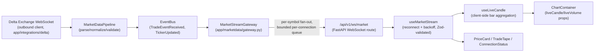
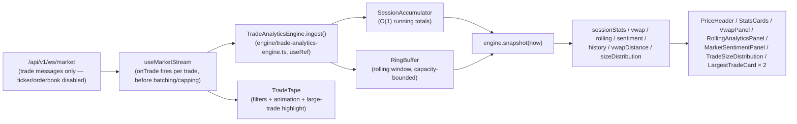

```mermaid
flowchart LR
    A["Delta ob_updates channel
(snapshot + incremental diffs)"] --> B["MarketDataPipeline
(normalizes to OrderBookEvent)"]
    B --> C["EventBus
(OrderBookUpdated)"]
    C --> D["OrderBookAggregator
(app/marketdata/orderbook.py)
replaces on snapshot, merges on diff"]
    D --> E["MarketStreamGateway
(reads the aggregator's current book)"]
    E -->|"sorted, top-100/side,
per-symbol fan-out"| F["/api/v1/ws/market"]
    F --> G["useMarketStream
(latestOrderBook — reused from Live Market)"]
    G --> H["computeDepthRows / computeSpread
(order-book-depth.ts, pure)"]
    H --> I["OrderBookTable × 2 / SpreadPanel"]
```

# Frontend

## Purpose

Documents the Next.js dashboard in `apps/dashboard`: its stack, routing,
feature-module pattern, API client conventions, and the reusable candlestick
chart module. Read this alongside
[`docs/architecture/EngineeringStandards.md`](docs/architecture/EngineeringStandards.md)
(general coding conventions) and [`docs/api/API.md`](docs/api/API.md) (the
backend surface the frontend consumes).

## Status

Active — `apps/dashboard` implements Health, Markets, History (with a
candlestick chart), Live Market (resolved market selection, real-time
price/chart/trade tape, and an operational connection panel), Order Book
(live depth tables, spread, and cumulative-depth visualization), and Trade
Analytics (live trade tape, session/rolling statistics, and VWAP).
Dashboard, Research, and Settings remain placeholders.

## Stack

Next.js 15 (App Router, typed routes) · React 19 · TypeScript (strict) ·
Material UI v7 (dark-only theme, CSS variables) · TanStack Query (server
state/polling) · Zustand (local UI state) · Axios (API client) · Zod
(runtime validation of every API response) · TradingView lightweight-charts
(candlestick charting) · Vitest + Testing Library (tests).

## Routing

All real pages live under the `(dashboard)` route group
(`src/app/(dashboard)/`), wrapped by `AppShell` (sidebar + top bar,
`src/components/layout/`). `/` redirects to `/dashboard`.

| Route            | Status                                                                       |
| ---------------- | ---------------------------------------------------------------------------- |
| `/health`        | Implemented — platform/DB/bus/state health, polled REST                      |
| `/markets`       | Implemented — filterable/sortable market table + detail panel                |
| `/history`       | Implemented — historical candle browser, **Chart** and **Table** tabs        |
| `/live-market`   | Implemented — real-time price, chart, and trade tape (see below)             |
| `/orderbook`     | Implemented — live depth tables, spread, and depth selector (see below)      |
| `/trades`        | Implemented — Live Trade Analytics Dashboard (see below)                     |
| `/replay`        | Implemented — Historical Market Replay Engine (see below)                    |
| `/indicators`    | Implemented — Technical Indicators calculator + chart overlays               |
| `/features`      | Implemented — Feature Engineering dataset workbench (see below)              |
| `/validation`    | Implemented — Dataset Validation & Quality Engine workbench (see below)      |
| `/ml/training`   | Implemented — Machine Learning Training Framework dashboard (see below)      |
| `/ml/evaluation` | Implemented — Model Evaluation & Benchmarking comparison surface (see below) |
| `/ml/predict`    | Implemented — Live Prediction Service (see below)                            |
| `/dashboard`     | Placeholder                                                                  |
| `/research`      | Placeholder                                                                  |
| `/settings`      | Placeholder                                                                  |

## Feature module pattern

Each implemented feature lives in `src/features/<name>/`: a
`<name>-page.tsx` client component alongside `components/`, `hooks/`, and
`lib/` subfolders, with tests co-located as `*.test.ts(x)`. Business logic
stays in `src/features/`; shared, cross-feature plumbing lives in
`src/lib/` and
`src/components/`.

## API layer

A single Axios instance (`src/lib/api/client.ts`) talks to `services/api`
at `NEXT_PUBLIC_API_URL`. Every typed fetch function
(`src/lib/api/market.ts`, `system.ts`) immediately validates the response
against a Zod schema (`src/types/api/`) — an API response is never trusted
as typed without also being runtime-checked. New API client functions must
follow this pattern; do not add a second HTTP client or bypass schema
validation.

## Chart module

`src/components/chart/` is a reusable module that renders historical OHLCV
data as a candlestick chart with TradingView's **lightweight-charts** — the
only chart library used in this codebase. It has no dependency on the
History feature and can be dropped into any future page.

### Component hierarchy

```text
ChartContainer                 data fetching, loading/empty/error states
├── ChartToolbar                fit-content button, candle count/truncation note
│   ├── MarketSelector           (only rendered in "standalone" mode)
│   └── TimeframeSelector        (only rendered in "standalone" mode)
├── CandlestickChart            imperative lightweight-charts wrapper (React.memo)
└── ChartLegend                 OHLCV + timestamp readout
```

`data-adapter.ts` (pure functions) and `hooks/use-chart-candles.ts` (data
fetching) sit alongside these components but render nothing themselves.
`chart-theme.ts` derives every lightweight-charts color/option from the
active MUI theme — the chart does not introduce a second theming system.

### Data flow



```mermaid
flowchart LR
    A["GET /api/v1/markets/{symbol}/candles\n(existing endpoint, paginated)"] --> B["useChartCandles\n(hooks/use-chart-candles.ts)"]
    B -->|"paginates dir=desc,\nreverses to ascending,\ncaps at MAX_CHART_CANDLES"| C["Candle[]\n(string OHLCV, ISO timestamps)"]
    C --> D["toChartSeries\n(data-adapter.ts)"]
    D -->|"drops invalid/duplicate points,\nUTCTimestamp seconds,\nnumeric OHLCV"| E["CandlestickData[] + HistogramData[]"]
    E --> F["CandlestickChart\n(lightweight-charts)"]
    F -->|"onCrosshairMove"| G["ChartLegend"]
```

`ChartContainer` **reuses** the existing `services/api` candle endpoint —
it does not call a new or duplicate endpoint. A chart needs the full range
in one shot rather than one UI page at a time, so `useChartCandles`
transparently paginates `GET /markets/{symbol}/candles` (whose backend page
size caps at 1000 — `candles_max_limit` in `services/api/app/core/config.py`)
into as many requests as needed, always requesting newest-first
(`dir=desc`) and reversing the merged result, so a truncated fetch keeps
the _most recent_ candles rather than the oldest.

### Integrating with an existing filter UI (History page)

The History page (`src/features/history/history-page.tsx`) already has a
market/timeframe/date-range form (`HistoryForm`) reused by both its table
and its new **Chart** tab — `ChartContainer` is rendered with
`symbol`/`timeframe`/`start`/`end` taken directly from the page's existing
query state and renders **no selector UI of its own** there
(`ChartToolbar`'s `markets`/`availableTimeframes`/`onSymbolChange`/
`onTimeframeChange` props are simply omitted). This is deliberate: the task
that added this chart required reusing the History explorer's filters
rather than building a second, parallel set. `MarketSelector` and
`TimeframeSelector` still exist and are exported for a future page that
embeds the chart **without** an existing filter UI to reuse — pass
`markets`/`availableTimeframes` + their `onChange` handlers to
`ChartToolbar` (or `ChartContainer`) to opt into that "standalone" mode.

### Connection panel

`ConnectionStatus` reports every dependency the live view has, not just the
socket: **Backend API** (status + measured latency from `/system/health`),
**WebSocket** (this browser's own connection — only the client knows it),
**Historical Sync** (age of `last_ingestion_at`, flagged past 15 minutes),
**Market State** (state-manager status + symbols tracked), **Last
Message**, **Reconnect Attempts**, and **Latency**. The system queries are
the same ones the Health page already uses, so the panel costs no new
endpoint and shares their cache.

Latency is the round-trip time of the stream's _own_ heartbeat
(`ping`→`pong`), not a REST timing — it measures the path the live data
actually travels.

### Empty states

`MarketDataNotice` replaces a bare "waiting for live data…" with the three
things a user needs to act: which precondition is missing (stored candles,
live feed, or just the first tick), whether the socket is even connected
(including "dropped, reconnecting automatically"), when the last message
arrived — and a Retry that refetches markets, metrics, stats and candles.
It renders nothing once the market is ready and a price has arrived, so a
healthy dashboard carries no notice at all.

Values that aren't known render as **"Unavailable"**, never as `—` or `0`:
a quantitative reader has to be able to tell "nothing arrived" from "the
value is zero". 24h high/low/volume carry a tooltip saying they are derived
from candles this platform has stored, not from the exchange ticker, since
they read low if candle sync has fallen behind.

### Performance considerations

- **Fetch cap**: `MAX_CHART_CANDLES` (10,000, in `hooks/use-chart-candles.ts`)
  bounds network/memory cost for a single render. Raise it there — after
  profiling shows it's actually insufficient — rather than adding a new
  endpoint; the pagination logic already scales to it.
- **No React re-renders for data pushes**: `CandlestickChart` is
  `React.memo`-wrapped and talks to lightweight-charts imperatively via
  `useEffect`s keyed on `[candlesticks, volume]`/`[theme]`/
  `[fitContentToken]` — a parent re-render that doesn't change those
  values never touches the chart. `ChartContainer` memoizes the adapter
  output (`useMemo` on `[candles, theme colors]`) so array identity is
  stable across unrelated re-renders.
- **Rendering, not fetching, is what needs to stay smooth at 10,000+
  candles** — lightweight-charts virtualizes its own canvas rendering, so
  the practical ceiling is network/JSON-parse cost for the paginated
  fetch, not chart draw performance.

### Error handling

`ChartContainer` covers: no market/timeframe selected yet (prompt), first
page loading (skeleton), an API failure at any page (`Alert` + retry,
reusing `ApiError.message` the same way the History table does), an empty
range (`Alert`, info), and unexpected data — `data-adapter.ts` drops any
candle with a non-finite OHLCV field, an unparseable timestamp, or a
timestamp duplicating one already seen, rather than feeding `NaN`/garbage
into the chart. An `invalid_timeframe` (or any other) domain error from the
backend surfaces through the same generic API-failure path — there's no
separate UI for it since the timeframe list a user can pick from already
comes from the live `/timeframes` endpoint.

### Extension points for indicators

Out of scope for this module (see `DECISIONS.md`/`PROJECT.md` for the
platform's broader AI/prediction roadmap), but the seams are:

- **`ChartContainer`** already isolates data-fetching from rendering — an
  indicator that needs its own series (e.g. a moving average) would fetch
  in a sibling hook and pass another `LineData[]`/`HistogramData[]` array
  into a new prop on `CandlestickChart`, which would call
  `chart.addSeries(LineSeries, …)` once (in the mount effect) and
  `series.setData(...)` in the existing data-push effect — no change to
  the candlestick/volume series.
- **`data-adapter.ts`** is the single place OHLCV strings become chart-ready
  numbers; a derived indicator (e.g. an SMA computed client-side) would be
  a new pure function here, tested the same way as `toChartSeries`.
- **`ChartToolbar`** has room for additional controls (e.g. an indicator
  picker) alongside the existing fit-content button.

## Live Market Dashboard

`/live-market` (`src/features/live-market/`) is a real-time monitoring page
for one symbol: current price, a live-updating candlestick chart, and a
trade tape, all sourced from the backend's own streaming gateway —
**never** a direct connection to Delta Exchange. That constraint is
architectural, not just a style preference: before this feature, the
backend had no server-to-browser push channel at all (see `docs/api/API.md`
history and the now-superseded "Known Limitations" note in `CLAUDE.md`), so
building this page required adding one —
`GET/WS /api/v1/ws/market` in `services/api/app/api/v1/endpoints/market_stream.py`,
backed by `app/marketdata/gateway.py`'s `MarketStreamGateway`. The gateway
subscribes to the same in-process event bus (`TradeEventReceived`,
`TickerUpdated`) the existing pipeline already publishes to, and fans each
event out to every browser connection subscribed to that symbol over a
per-connection bounded queue (a slow browser client drops messages and is
counted, never blocks other clients or the publisher).

### Streaming flow



Protocol (JSON text frames, both directions) is documented in full at the
top of `market_stream.py`; the frontend's matching Zod schemas live in
`src/types/api/market-stream.ts`. A client must send `{"action":
"subscribe", "symbols": [...]}` to receive anything — nothing is
auto-subscribed on connect — and gets an immediate `snapshot` message (the
gateway's own read of `MarketStateManager`) so the UI isn't blank on a
quiet market while it waits for the next live event.

**Timestamp format matters here, and it broke once.** Every `event_time`
the gateway emits must end in a literal `Z`, matching the REST layer's own
`field_serializer` convention (`app/schemas/market_data.py`), because the
frontend's `z.string().datetime()` schemas accept only that literal suffix
by default — not the `+00:00` a bare Python `datetime.isoformat()`
produces. That exact mismatch once caused every trade/ticker/snapshot frame
to fail validation and be silently dropped, while heartbeat pongs (no
timestamp) kept the connection looking healthy the whole time. Fixed in
`_isoformat_utc` (`app/marketdata/gateway.py`); pinned by tests on both
sides so it can't regress silently again (`test_gateway.py`'s
`TestWireTimestampFormat`, `src/types/api/market-stream.test.ts`).

### Component hierarchy

```text
LiveMarketPage                 resolves symbol/timeframe; owns nothing else
├── ConnectionStatus           backend API, WebSocket, historical sync, market
│                              state, last message, reconnects, heartbeat latency
├── (fallback alert)           shown when resolution moved off a requested market
├── MarketDataNotice           why data is missing, and a retry — only when it is
├── PriceCard                  price/24h change (WS) + 24h high/low/volume,
│                              last trade time, last candle time (REST poll)
├── ChartContainer             reused from the chart module, in "standalone" mode
│   └── (MarketSelector / TimeframeSelector render inside its ChartToolbar)
└── TradeTape                  newest-first, capped, coloured by aggressor side
```

`PriceCard`, `TradeTape`, `ConnectionStatus` and `MarketDataNotice` are all
`React.memo`-wrapped, so a tick that only changes the trade list doesn't
re-render the connection panel.

`ChartContainer`/`CandlestickChart`/`MarketSelector`/`TimeframeSelector` are
the exact same components the History page's Chart tab uses (see "Chart
module" above) — nothing here is a copy. Live Market is precisely the
"standalone" scenario that pattern was built for: there's no pre-existing
filter form to reuse, so `ChartContainer` is given `markets`/
`availableTimeframes`/`onSymbolChange`/`onTimeframeChange` and renders its
own selectors.

### Market selection, validation and fallback

Of the ~225 markets in `/markets`, only the handful the backend actually
tracks (`DELTA_MARKET_SYMBOLS`, `BTCUSD,ETHUSD` by default) have any
candles or a live feed behind them; the rest are catalogue rows. Picking
the first market in the list therefore opened the dashboard on something
like `1000BONKUSD` with every panel empty. Selection is now _resolved_
rather than assumed, by `hooks/use-research-market.ts` over the pure rules
in `lib/market-selection.ts`:

1. **Candidate order** (`buildCandidateSymbols`): the symbol requested in
   the URL (`?symbol=`) → the symbol remembered from the last visit →
   `ETHUSD`, the primary research market → whatever the backend is
   currently streaming → any other active market. Unknown and inactive
   symbols are dropped, and the list is capped at `MAX_CANDIDATES` (6)
   because each candidate costs one timeframes probe.
2. **Validation** (`assessMarket`): a market is _ready_ when it has stored
   candles (`/markets/{symbol}/timeframes` is non-empty) **and** the
   backend is streaming it (`state_latest_prices` from `/system/metrics`
   lists it). Latest-price presence is reported separately from live
   support, because "untracked symbol" and "tracked but no tick yet" are
   different problems with different fixes.
3. **Fallback** (`selectResearchMarket`): first ready candidate → else the
   first with candles → else the first candidate. That last tier is
   deliberate: an operator running with the live feed disabled should still
   get a usable historical view instead of an empty page, so a market is
   never rejected outright — the gaps surface as `blockers` in the empty
   state instead.

Candidates are probed with `useQueries` under the same query key
`useTimeframes` uses, so a probe and the chart's own timeframe fetch share
one cache entry rather than duplicating the request.

When resolution moves away from an explicitly requested market, the page
says so ("1000BONKUSD has no research data … showing ETHUSD instead")
rather than silently substituting. The notice is captured in state at the
moment of the switch, because the URL is immediately rewritten to the
market that was actually resolved.

**Persistence**: the resolved symbol and timeframe are written to the URL
(`use-live-market-url-state.ts`, `router.replace` so market-flipping
doesn't fill the history stack) and mirrored into `localStorage`
(`lib/remembered-market.ts`, every access guarded — storage throws in
private-mode browsers). The URL is the shareable source of truth; storage
is the cross-visit fallback when the page is opened with no search params.

**Timeframe** resolution (`lib/timeframe-preference.ts`) follows the same
shape — explicit selection → URL → remembered → finest available — and
ignores any candidate the current symbol has no candles for, so a
remembered `4h` can't blank the chart on a market that only stores `1m`.

### One symbol across every widget

`ConnectionStatus`, `PriceCard`, `ChartContainer` and `TradeTape` all read
the single resolved `symbol`. Two things enforce that they can never drift
apart: `useMarketStream` clears its data synchronously when `symbol`
changes (showing the previous market's price under the new market's name
for even one frame would be a correctness bug), and it **discards any frame
whose `symbol` field doesn't match the subscription** — a message still in
flight when the user switches markets cannot be folded into the new one.

### Live candle synthesis (no backend candle-aggregation pipeline exists)

The backend has no real-time candle-close detection — `CandleClosed` bus
events are reserved for a future milestone (see
`app/events/example_events.py`); the only way historical candles reach the
database today is the periodic REST-based `CandleSyncScheduler`, not the
live tick stream. So "append new candles in real time" is implemented
entirely client-side: `use-live-candle.ts` folds each streamed trade into
the currently-forming bar (`lib/aggregate-live-candle.ts`, pure and
unit-tested), bucketing by the selected timeframe. That forming bar is
pushed into `CandlestickChart` via its `liveCandle`/`liveVolume` props,
which call lightweight-charts' `series.update()` — an O(1) append/replace
of the last bar — instead of `setData()`, satisfying "avoid full chart
re-renders" directly through the library's own incremental-update API.
The forming bar is **seeded from the last historical candle** so history
loads first and the live bar continues it rather than restarting: a trade
inside the seed's own bucket extends that bar (instead of a fresh
one-trade bar replacing it at the same timestamp), and a trade in a later
bucket opens at the seed's close rather than gapping. Once candle sync
produces a _newer_ historical bar, it supersedes the locally-synthesized
one. The seed is read through a ref, so a historical refetch — which
produces a new object every time — never re-runs the fold and
double-counts a trade.

`CandlestickChart` also refuses any `update()` whose time precedes the
newest point already in the series. That is reachable in normal operation
(a historical refetch landing while a forming bar for an earlier bucket is
still on screen) and lightweight-charts throws on it, so the update is
dropped rather than crashing the page.

### Why 24h high/low/volume are polled, not pushed

`PriceCard`'s current price and 24h change come from the live ticker
(`price_change_24h` was already on the domain `TickerEvent` model — no
backend change needed for that field). 24h high/low/volume reuse the
_existing_ `/markets/{symbol}/candles/stats` REST endpoint instead
(`use-price-stats.ts`, polled every 60s — the same polling pattern the
Health page already uses at 10s), because: (a) it needed no new backend
work at all, and (b) a rolling 24h aggregate has no reason to be
millisecond-fresh the way a live trade price does. Total volume isn't a
field the endpoint returns directly, so it's derived as `average_volume ×
total_candles` (mathematically the sum) rather than adding a field to a
response shape three other features already depend on.

### The trade tape's "Side" column

Trades carry a real aggressor side: `buy` means the taker lifted the offer,
`sell` means the taker hit the bid. `TradeTape` colors each row by that
value.

This corrects an earlier assumption. The backend normalizer used to
hard-code `side="unknown"` on the belief that Delta's public feed didn't
expose taker side, and the tape coloured rows by price direction as a
proxy. In fact the compact `trades` channel carries an `r` field the
normalizer was discarding, and it is the _buyer's role_ in the fill.
Verified against the exchange rather than assumed: 55 fills captured
simultaneously from the compact `trades` channel and the verbose
`all_trades` channel (which spells out `buyer_role`/`seller_role`) agreed
on every single one — `r="t"` ⇔ `buyer_role="taker"` (an aggressive buy),
`r="m"` ⇔ `buyer_role="maker"` (an aggressive sell), with no
counterexamples. Anything other than those two values still degrades to
`unknown` rather than being coerced into a side.

### Connection panel

`ConnectionStatus` reports every dependency the live view has, not just the
socket: **Backend API** (status + measured latency from `/system/health`),
**WebSocket** (this browser's own connection — only the client knows it),
**Historical Sync** (age of `last_ingestion_at`, flagged past 15 minutes),
**Market State** (state-manager status + symbols tracked), **Last
Message**, **Reconnect Attempts**, and **Latency**. The system queries are
the same ones the Health page already uses, so the panel costs no new
endpoint and shares their cache.

Latency is the round-trip time of the stream's _own_ heartbeat
(`ping`→`pong`), not a REST timing — it measures the path the live data
actually travels.

### Empty states

`MarketDataNotice` replaces a bare "waiting for live data…" with the three
things a user needs to act: which precondition is missing (stored candles,
live feed, or just the first tick), whether the socket is even connected
(including "dropped, reconnecting automatically"), when the last message
arrived — and a Retry that refetches markets, metrics, stats and candles.
It renders nothing once the market is ready and a price has arrived, so a
healthy dashboard carries no notice at all.

Values that aren't known render as **"Unavailable"**, never as `—` or `0`:
a quantitative reader has to be able to tell "nothing arrived" from "the
value is zero". 24h high/low/volume carry a tooltip saying they are derived
from candles this platform has stored, not from the exchange ticker, since
they read low if candle sync has fallen behind.

### Performance considerations

- **Batched stream commits**: incoming frames are buffered and committed to
  React state at most once per animation frame (`requestAnimationFrame`)
  rather than one `setState` per message. A busy market prints many trades
  per second, and a commit per print would re-render the price card, chart
  and tape on every one; batching to the paint cycle keeps a whole burst
  within one frame down to a single commit, self-limits to the display's
  own refresh rate, and pauses entirely while the tab is backgrounded (rAF
  callbacks don't run for hidden tabs). A burst of 20 prints landing as one
  commit is asserted in `use-market-stream.test.ts`, which also confirms
  the scheduling call is `requestAnimationFrame` itself (not a fixed
  timer) and that a pending frame is cancelled on unmount. This was
  originally a fixed 100ms `setTimeout`; switched to rAF during the Order
  Book viewer's performance pass — see FRONTEND.md § "Live Order Book
  Viewer → Performance considerations" for the full reasoning, which
  applies to this page too since they share the hook.
- **Per-consumer channel tracking**: `useMarketStream`'s `channels` option
  (`{ trades, ticker, orderBook }`, all on by default here) lets a caller
  that doesn't need every message type opt out — a message on a disabled
  channel is dropped before it touches the pending buffer or schedules a
  commit. The Live Market Dashboard tracks everything (it uses all three),
  but the Order Book viewer disables trades/ticker entirely; see that
  page's docs for why this mattered in practice.
- **No new WebSocket per re-render**: `useMarketStream`'s connection
  lifecycle lives in a single `useEffect` keyed on `[symbol, streamUrl]`.
  A symbol change tears down and reopens the connection deliberately;
  nothing else re-rendering the page does. `maxTrades` and `channels` are
  both read through refs precisely so changing either can't force a
  reconnect.
- **Memoized widgets**: the four panels are `React.memo`-wrapped and the
  page passes memoized `liveCandle`/`liveVolume` objects, so an update that
  changes only one of them doesn't re-render the rest.
- **Reconnect backoff**: exponential, `1s × 2^attempt` capped at 30s, mirroring
  the backend's own `DeltaWebSocketClient` reconnect strategy conceptually
  (see `services/api/app/ws/connection.py`) without sharing code — one is a
  Python outbound client, the other a browser `WebSocket`.
- **Bounded trade tape**: `useMarketStream`'s `maxTrades` option caps both
  the buffer and the rendered list (default 100) — high-frequency streams
  can't grow either unbounded. The cap is shown in the tape's header so it
  isn't a mystery why the list stops.
- **Chart updates stay O(1) per tick**: see "Live candle synthesis" above —
  this is what actually keeps a fast-ticking market smooth, not React-level
  memoization alone.
- **Backend fan-out never blocks on a slow client**: each browser
  connection's outbound queue is bounded (`MarketStreamGateway`); a full
  queue drops the message and increments a metric instead of backing up
  the event bus's publish path for every other connection.

## Live Order Book Viewer

`/orderbook` (`src/features/order-book/`) is a live depth-table view for
one symbol — synchronized bid/ask tables with cumulative-depth bars, a
spread summary, and a depth selector (10/25/50/100 levels) — sourced from
the same backend gateway the Live Market Dashboard uses.

### Why this needed a new backend component, not just a new endpoint

The event bus already carried order-book data (`OrderBookUpdated` /
`OrderBookEvent`) before this feature — the Delta pipeline normalizes
`ob_l1`/`ob_l2`/`ob_updates` channel messages into it, and
`MarketStateManager` already stored the latest one per symbol. But
`MarketStateManager`'s own docstring is explicit that it does _not_
reconstruct a coherent order book — "order book reconstruction from
seq/checksum is a consumer concern" — and Delta's live `ob_updates`
channel is a snapshot **followed by incremental diffs of only the changed
price levels** (`action: "update"`, where a `size: 0` level means "remove
it," not "size is now zero"). Storing the latest message verbatim, as the
state manager does, would replace the whole reconstructed book with just
the handful of levels in the most recent diff on every tick — a real,
verified defect: `ob_l1` alone was observed firing ~10 times/second with
only the top bid/ask level, which would have wiped a multi-thousand-level
book down to one level ten times a second had it been relayed naively.

The fix was a new backend component,
`services/api/app/marketdata/orderbook.py`'s `OrderBookAggregator` — the
missing "consumer" the state manager's docstring pointed at. It subscribes
to the same `OrderBookUpdated` bus event, replaces the book on a snapshot,
and merges diffs (upsert non-zero sizes, drop zero-size levels) on an
update, deliberately ignoring `kind == "l1"` events since they'd corrupt
the reconstructed depth the same way. `MarketStreamGateway` was extended
to read the aggregator's current top-100-per-side view (not the raw bus
event) on every update and relay it as a new `orderbook` message type —
`services/api/app/api/v1/endpoints/market_stream.py`'s protocol docstring
has the exact wire shape. No new WebSocket endpoint was added; this is the
same `/api/v1/ws/market` gateway, extended.

### Streaming flow



### Reuse over duplication

This feature deliberately shares infrastructure with the Live Market
Dashboard rather than standing up parallel plumbing:

- **`useMarketStream`** (`src/features/live-market/hooks/`) is the exact
  same hook, extended with a `latestOrderBook` field rather than forked —
  it already owns the one WebSocket connection/reconnect/batching
  lifecycle this page needs, for the same gateway and the same per-symbol
  subscription model. This page passes `maxTrades: 0` since it has no
  trade tape.
- **`MarketSelector`** (`src/components/chart/market-selector.tsx`) is
  reused as-is, the same "standalone" component the chart module exports.
- **`ConnectionStatus`** (`src/features/live-market/components/`) is
  imported directly rather than copied — it already reports every
  dependency this page has too (backend API, WebSocket, historical sync,
  market state, last message, reconnects, heartbeat latency).
- **`buildCandidateSymbols`** (`src/features/live-market/lib/market-selection.ts`)
  is reused for candidate _ordering_ (URL → remembered → `ETHUSD` →
  live-tracked → any active), but **not** the Live Market Dashboard's
  candle-aware readiness/fallback machinery (`assessMarket`/
  `selectResearchMarket`) — an order book has no notion of stored candles,
  so `hooks/use-order-book-market.ts` implements its own, simpler
  readiness rule (is the symbol in `/system/metrics`'s
  `state_latest_prices`?) on top of the shared ordering policy. Forcing
  the candle-aware version would have gated an order-book-ready market on
  an irrelevant check.
- **`remembered-market.ts`** (`src/features/live-market/lib/`) is reused
  as-is — the "last market I was looking at" preference is shared across
  Live Market and Order Book by design, not a coupling accident.

One deliberate behavioral difference from Live Market: an **explicitly
requested** symbol (`?symbol=` present right now) is always honoured
verbatim here, even if it turns out to be untracked — `OrderBookEmptyState`
explains why rather than the page silently substituting a different
market. A merely _remembered_ symbol from a previous visit gets no such
guarantee and falls back to a live-tracked candidate if it's stale.

### Component hierarchy

```text
OrderBookPage                  resolves symbol; owns the depth selection
├── ConnectionStatus           reused from Live Market, unmodified
├── MarketSelector             reused from the chart module
├── DepthSelector               10/25/50/100, same ToggleButtonGroup pattern
│                              as the chart module's TimeframeSelector
├── OrderBookEmptyState        untracked / no snapshot yet / empty book
├── SpreadPanel                 best bid/ask, spread, spread %, mid price
└── OrderBookTable × 2           "bids" and "asks" — one component, mirrored
```

`OrderBookTable` is one `React.memo`-wrapped component parameterized by
`side`, not two near-duplicate components — sort order, bar-growth edge,
and color are the only differences and all three already follow from
`side`.

### Depth visualization

Each row's cumulative `total` (running sum of size from the best price
outward) and a `depthRatio` (that row's total as a fraction of the
deepest visible row) are computed once per update in
`lib/order-book-depth.ts`'s `computeDepthRows` — pure, unit-tested, and
re-sliced (not re-sorted: the gateway already sorts) whenever the depth
selector changes. The bar itself is a CSS `linear-gradient` background on
the table row, not an extra absolutely-positioned element — bids grow
from the right edge, asks from the left, so the two tables read as a
mirrored pair when placed side by side.

### Why spread/mid-price can go entirely `Unavailable`

`computeSpread` requires _both_ sides to have at least one level; a
one-sided book (e.g. momentarily during a resync) reports every field —
best bid, best ask, spread, spread %, mid price — that depends on the
missing side as `Unavailable`, never a misleading zero spread synthesized
from a partial book.

### Performance considerations

This page went through a dedicated optimization pass after the initial
implementation, once it was flagged as functionally complete but not yet
production-ready for high-frequency streaming. The concrete findings and
fixes:

**Finding: the page re-rendered on every trade and ticker tick, not just
order-book ticks.** `useMarketStream` is one hook shared with the Live
Market Dashboard, and subscribing to a symbol means the gateway sends
trade, ticker, _and_ order-book messages together — there's no
server-side channel filter. Before this pass, every trade print (the
highest-frequency message type observed against the real feed) still
pushed into an internal buffer and triggered a commit, even though this
page never reads `latestTrade`/`latestTicker`/`trades` at all. Fixed with
a new `channels` option on `useMarketStream` (`{ trades, ticker,
orderBook }`, all on by default for the Live Market Dashboard): a message
on a disabled channel is dropped before it touches the pending buffer _or_
schedules a commit — no array push, no new object reference, no
`setState`. This page passes `channels: { trades: false, ticker: false,
orderBook: true }`. `lastMessageAt` is scoped to the channels an instance
actually tracks as a direct consequence (documented on the option itself)
— flushing purely to bump a timestamp nobody reads would be the very
re-render this option exists to prevent; a heartbeat pong (every 15s)
still bounds how stale it can get.

**Finding: batching was on a fixed 100ms timer, not tied to the browser's
own paint cycle.** `useMarketStream` used to coalesce updates via
`setTimeout(flush, 100)`. Switched to `requestAnimationFrame`: a burst of
messages within one frame still coalesces into a single commit exactly as
before, but the commit now lands right before the browser's next paint
(never wasted between frames), the effective rate self-limits to the
display's own refresh rate rather than an arbitrary interval, and —
without any extra code — the entire pipeline pauses itself whenever the
tab is backgrounded, since browsers don't run rAF callbacks for hidden
tabs. This is a real, verified CPU saving for a tab left open in the
background, not just a smoothness tweak.

**Finding: no row-level memoization — every row re-rendered on every
update, even unaffected ones.** `computeDepthRows` legitimately returns a
brand-new array of brand-new row objects on every call (the book really
did change), so a plain `OrderBookTable` mapping `rows` inline gave React
no way to skip re-rendering (and re-diffing three `<TableCell>`s' worth of
formatting calls) for a row whose values hadn't actually moved. Fixed by
extracting `OrderBookRow` as its own component wrapped in
`React.memo(OrderBookRowInner, orderBookRowPropsAreEqual)`, where the
comparator (exported, unit-tested directly in
`order-book-table.test.tsx`) compares the four values that reach the DOM
— `price`, `size`, `total`, `depthRatio` — **by value**, not by object
reference. This is the mechanism behind "only changed price levels
update": a row above the point of change in the book, or every row on the
side of the book the update didn't touch (the gateway always resends both
sides together — see below), now genuinely skips re-rendering, keyed
stably by `row.price` (a level's natural, unique identity) so React
matches the right row across updates regardless of it being a new object.
One caveat inherent to the feature, not fixable by memoization: cumulative
`total` is a running sum from the best price outward, so a change at
price level _N_ still invalidates every row below it — no memoization
scheme can avoid that without changing what "cumulative depth" means.

- **No second WebSocket connection**: reusing `useMarketStream` means this
  page still gets the Live Market Dashboard's reconnect backoff and
  symbol-filtering for free — see FRONTEND.md § "Live Market Dashboard →
  Performance considerations" for those details, unchanged by this pass.
- **Backend does the sort and the depth cap**: `OrderBookAggregator`
  maintains the full book internally (bounded by the market's own price
  granularity — a few thousand levels, trivial memory) but the gateway
  only ever relays the top 100 per side
  (`app/marketdata/gateway.py`'s `_ORDERBOOK_DEPTH`), and always resends
  **both** sides on any update (it doesn't track which side changed) —
  the frontend never re-sorts (the backend's order is trusted verbatim;
  `lib/order-book-depth.test.ts` pins this by asserting on unsorted mock
  input) and never receives more than a client could ever choose to
  display.
- **Depth-selector changes never refetch**: switching 10/25/50/100 just
  re-slices the already-received `latestOrderBook` array
  (`computeDepthRows`), a synchronous, memoized (`useMemo`) operation with
  no network round-trip. Note that a depth change _does_ legitimately
  re-render every row — `depthRatio` is normalized against the deepest row
  in the new slice, so the denominator itself changes for every row; this
  is real, necessary work, not something left unoptimized.
- **Memoized panels and callbacks**: `SpreadPanel`, `OrderBookTable`, and
  `OrderBookEmptyState` are all `React.memo`-wrapped, the page passes
  memoized `bidRows`/`askRows`/`spread` (`useMemo` keyed on the raw levels
  and selected depth) and memoized `handleSymbolChange`/`handleRetry`
  (`useCallback`), and `EMPTY_LEVELS`/`ORDER_BOOK_CHANNELS` are stable
  module-level constants rather than fresh literals on every render — so
  an unrelated re-render (e.g. the connection panel's clock tick) never
  cascades into recomputing or re-rendering the tables.
- **No unbounded growth**: nothing in this page's state accumulates over
  time. `latestOrderBook` is _replaced_, never appended to; the disabled
  `trades` channel means the trade buffer stays permanently empty rather
  than growing and being trimmed; the backend's `OrderBookAggregator`
  is bounded by the market's own distinct price count, not by how long the
  connection has been open. A multi-hour session should show flat memory,
  though verifying that empirically requires a real browser session this
  environment has no way to drive (see "Known scalability limits" below).

### Error handling

`OrderBookEmptyState` covers: an untracked market (explicitly requested or
not), no snapshot received yet (split into "connected, just quiet" vs.
"reconnecting" vs. "not connected") with a retry, and a genuinely empty
reconstructed book (both sides empty — a valid, if unusual, state,
distinct from "no book yet"). An invalid payload (fails
`LiveOrderBookDataSchema`) is dropped by `useMarketStream`'s existing
Zod-validation gate — the same silent-drop-and-keep-the-old-value
behavior as every other message type on this gateway, verified with a
malformed `orderbook` frame in `order-book-page.test.tsx`.

### Extension points

- **Depth beyond 100**: raise `_ORDERBOOK_DEPTH` in
  `app/marketdata/gateway.py` and `DEPTH_OPTIONS` in
  `lib/order-book-depth.ts` together — both already scale to it, this is a
  constant change, not a redesign.
- **Sequence/checksum validation**: `OrderBookAggregator` trusts stream
  order and does not validate Delta's per-message sequence number or
  checksum (`cs`) — documented, not fixed, in its module docstring. A
  dropped connection self-heals (resubscribe always re-triggers a fresh
  snapshot); a gap _within_ a connected session would not be caught today.
- **A combined center-book view**: the two-table layout was chosen to
  match the task's explicit "two synchronized tables" requirement; nothing
  about `computeDepthRows`/`computeSpread` assumes two separate tables — a
  future single merged-ladder view could reuse both unchanged.

### Known scalability limits

- **No per-connection channel filtering on the wire.** The `channels`
  option (above) is a frontend-only filter — the backend still sends
  trade and ticker frames to every subscriber of a symbol regardless of
  what any given browser tab actually tracks, so the _network_ cost of an
  unused channel isn't eliminated, only the client-side processing/render
  cost of it. Fixing the wire cost too would need a gateway protocol
  change (e.g. a `channels` field on the `subscribe` action) — a
  reasonable next step if profiling ever shows inbound bandwidth, not
  render cost, as the bottleneck.
- **Row memoization's benefit shrinks for changes near the best price.**
  Because `total` is a cumulative running sum, a change to the
  best-priced level invalidates every row below it in the same slice — on
  a very actively-traded book where changes cluster at the top, most rows
  in a 100-level view may still re-render on a given tick. The two
  documented full wins are: a row above wherever the change occurred, and
  the entire opposite side of the book when only one side actually moved.
- **No empirical, multi-hour browser verification.** This optimization
  pass was verified by (a) unit-testing the actual mechanisms directly —
  the `React.memo` comparator, the `requestAnimationFrame` scheduling, and
  the channel-gating behavior — and (b) code-level inspection confirming
  no state accumulates over time (see "Performance considerations"
  above), rather than by driving a real browser for 15+ minutes and
  watching DevTools' Performance/Memory panels, since no browser
  automation tool is available in this environment. The reasoning is
  sound and the mechanisms are directly tested, but a real long-running
  session (React DevTools Profiler flame graphs, an actual heap snapshot
  diff) has not been captured and would be the natural next validation
  step before a production rollout at real trading-desk scale.

## Live Trade Analytics Dashboard

`/trades` (`src/features/trades/`) is a quantitative research workstation
for the executed trades of one symbol: a primary price band (current price,
session high/low, distance from VWAP, live trades-per-second), order-flow
analytics (market sentiment, buy/sell pressure gauges, rolling per-minute
figures with sparkline trends, a trade size distribution), session and
rolling (1m/5m/15m) VWAP, session-wide buy/sell statistics with dedicated
Largest Trade cards, and a live trade tape (Trade Value column,
incoming-row animation, unusually-large-trade highlight, zebra striping,
sticky header and timestamp column, Buy/Sell/All + minimum-size filters,
and CSV export of the visible rows) — all derived from the same `trade`
messages the backend gateway already relays, never a new data source or a
new connection type. Everything shown is a rule-based transformation of
data this platform already computes (a threshold table over an existing
imbalance figure, a fixed multiplier over an existing average) —
deliberately not AI, a model, or a trading signal; see "Market sentiment is
a label, not a prediction" below.

### Information hierarchy

A quant-UI review (2026-08-23) restructured the page around descending
visual weight, replacing a flat run of same-weight `Paper`s separated by
rules — which gave a reader no entry point and spent a lot of vertical
space on separators:

1. **`PriceHeader`** — the primary band. Current price at the top of the
   type scale (coloured by the last trade's aggressor side), with session
   high/low, distance from VWAP, and a live activity indicator beside it.
   Its top border turns green while trades are actually printing, so a
   frozen feed looks frozen rather than pulsing reassuringly at a stale
   number.
2. **`Section`s** — Order Flow, VWAP, Session Statistics, Connection. Each
   is one bordered surface with its heading and scope subtitle built in,
   wired as `<section aria-labelledby>` so a screen reader can navigate the
   page by landmark. Related metrics read as one block, and the gap
   _between_ sections (rather than a rule plus two margins) separates them.
3. **The trade tape** — filters, export, and table, last because it is
   detail rather than summary.

Panels that used to render their own `Paper` (`StatsCards`, `VwapPanel`,
`RollingAnalyticsPanel`, `MarketSentimentPanel`) now render bare tiles and
let their `Section` supply the single border, so the page no longer nests
borders inside borders.

### Contextual help on every metric

Every metric carries an Info button (`components/metric-info.tsx`) whose
tooltip answers four questions in a fixed order — what it is, why it
matters, how it's calculated (where that isn't self-evident), and how to
read a typical value. All copy lives in one dictionary,
`lib/metric-help.ts`, so a metric appearing in two panels cannot drift into
two different explanations; a test asserts every entry is complete, written
as full sentences, and short enough for a tooltip.

The affordance is a real `IconButton`, not a decorative icon: it is in the
tab order, MUI opens its tooltip on focus as well as hover, and its
`aria-label` names the metric ("About Session VWAP") rather than repeating
a bare "info button" a dozen times down the page. The icon itself is
`aria-hidden`, and `enterTouchDelay={0}` makes it usable where there is no
hover state at all.

### Trade Analytics Engine

A follow-up quant-UI/performance review (2026-08-23) moved every
calculation behind a single framework-agnostic class,
`engine/trade-analytics-engine.ts`'s `TradeAnalyticsEngine`, so
`hooks/use-trade-analytics.ts` — and every component below it — only ever
consumes already-computed state:

- **`ingest(trade)`** folds one trade into the session accumulator and the
  rolling window. **`snapshot(nowMs)`** computes everything derived from
  current state — session stats, VWAP, rolling analytics, sentiment, and
  the sparkline history — in one call.
- The hook owns exactly one engine instance per mount (in a `useRef`),
  discarded and rebuilt on a symbol change, and does nothing else with
  trade data itself: `onTrade` calls `engine.ingest`, and a `useMemo` calls
  `engine.snapshot`. No component, and no other hook code, calls a pure
  calculation function or touches an accumulator directly.
- Being plain TypeScript with no React import, the engine is unit-tested
  directly (`trade-analytics-engine.test.ts`) with no rendering, timers, or
  React Testing Library involved — see `TESTING.md`.

### Reuse over duplication

This is the third page built on the `/api/v1/ws/market` gateway, and the
third time market resolution and the connection panel were needed — rather
than a third implementation of either:

- **`useMarketStream`** is reused via a new wrapper hook,
  `hooks/use-trade-analytics.ts`, with `channels: { trades: true, ticker:
false, orderBook: false }` — this page never reads ticker or order-book
  data, so both are dropped by the gateway-agnostic channel option before
  they touch a buffer or schedule a commit (see "Live Order Book Viewer →
  Performance considerations" for why that option exists).
- **`useLiveTrackedMarket`** and **`useSymbolUrlState`** — originally
  written for the Order Book viewer as `useOrderBookMarket`/
  `useOrderBookUrlState` — were promoted to `src/features/live-market/hooks/`
  and renamed once this page needed the exact same behavior, rather than
  becoming a third copy-paste. Both are genuinely name-appropriate now:
  neither is order-book-specific, and both are reused here unmodified.
- **`ConnectionStatus`**, **`MarketSelector`**, and **`remembered-market.ts`**
  are imported directly, exactly as the Order Book viewer already does.
- **`TradeTape`** (from the Live Market Dashboard) is reused, extended with
  an optional `showTradeValue` prop (default `false`, so the Live Market
  Dashboard's existing four-column tape is unchanged) rather than forked
  into a near-duplicate component.
- **`StatTile`** (`src/components/stat-tile.tsx`) is a new shared
  component, extracted once a _third_ page needed the same "label + big
  value" tile the Live Market price card and the Order Book spread panel
  had each implemented locally. The existing two call sites were left
  as-is (no regression risk taken for a pure refactor); new stat displays
  should use the shared component going forward.
- **Depth/rolling-window math has no backend dependency**: everything here
  is computed client-side from the trade stream the platform already
  relays — no new endpoint, no new bus event, no backend change of any
  kind was needed for this feature.

### Why the analytics can't be derived from the trade tape's own array

`useMarketStream`'s `trades` array exists for _display_ and is capped at
`maxTrades` (the tape's configurable row limit — 25 to 200 here via
`MaxRowsSelector`). A 15-minute rolling VWAP, or a session-wide statistic
that must never forget a trade's contribution, cannot be correctly derived
from an array that intentionally forgets old entries once it's full. Two
things make this page's numbers exact regardless of the tape's cap:

- **`onTrade`**, a new option on `useMarketStream` (see its own docstring):
  called synchronously for every genuine trade message that passes the
  symbol/channel filters, _before_ rAF batching or the `maxTrades` cap
  apply. `use-trade-analytics.ts` folds each one into two `useRef`-held
  accumulators that the tape's own capping never touches.
- **A session accumulator** (`lib/session-stats.ts`) — O(1) running sums
  (buy/sell/total volume and notional, count, largest trade) folded in one
  trade at a time. It holds a handful of numbers, not a list, so it can't
  grow unbounded regardless of how long the session runs — a deliberate
  design choice, not an afterthought, given the Order Book performance
  pass's lesson about unnecessary re-renders and unbounded state earlier
  in this project.
- **A rolling window backed by a `RingBuffer`** (`lib/ring-buffer.ts`,
  used by the engine at a fixed 20,000-entry capacity — generously above
  any real market's plausible 15-minute trade count). `RingBuffer.push` is
  O(1) and never copies existing entries, unlike the array-based
  `[...records, trade].slice()` approach this replaced, which re-copied
  the whole buffer on every single trade. Because the buffer is
  capacity-bounded rather than time-bounded, every window calculation
  (`computeVwapSet`, `computeRollingAnalytics` in `lib/rolling-window.ts`)
  filters by timestamp at _read_ time via a binary search over the
  buffer's time-sorted contents (O(log n), not the O(n) `.filter()` this
  replaced) — a trade merely being _retained_ can never leak into a
  window it has actually aged out of. 1m/5m/15m VWAP and the "per minute"
  rolling analytics are cheap re-filters of that one buffer, not three
  separately-maintained ones.
- **A separate, much smaller metric-history ring buffer**
  (`lib/metric-history.ts`, 150 entries, sampled at most once every 2
  seconds) feeds the sparklines below — a trail of already-computed
  rolling figures over time, not raw trades. It piggybacks on the same
  `snapshot()` calls the hook already makes rather than running a second
  timer.

### Data flow



### Component hierarchy

```text
TradesPage                     resolves symbol; owns max-rows/side/min-size filter state
├── MarketSelector             reused from the chart module
├── MaxRowsSelector             25/50/100/200, same ToggleButtonGroup pattern
│                              as the Order Book's DepthSelector
├── PriceHeader                 PRIMARY BAND — current price, session high/low,
│                              distance from VWAP, live trades/second
├── TradeAnalyticsEmptyState   untracked / no trade yet / reconnecting
├── Section "Order Flow"
│   ├── MarketSentimentPanel    sentiment chip + buy/sell pressure gauge
│   ├── RollingAnalyticsPanel   trades/min, volume/min, avg size — each with
│   │                          a sparkline — plus buy/sell imbalance
│   └── TradeSizeDistribution   5-bucket histogram, relative to window average
├── Section "VWAP"
│   └── VwapPanel               session + 1m/5m/15m VWAP, 1m VWAP sparkline
├── Section "Session Statistics"
│   ├── StatsCards              buy/sell/total volume, ratio + pressure bar,
│   │                          avg size, trade count
│   └── LargestTradeCard × 2     session and last-minute, each showing
│                              Time/Side/Price/Quantity/Value explicitly
├── Section "Connection"
│   └── ConnectionStatus        reused from Live Market, unmodified
├── TradeTapeFilters             Buy/Sell/All toggle, minimum-size field,
│                              "showing N of M" readout, CSV export
│                              (display-only — never touches the engine)
└── TradeTape                   reused from Live Market, showTradeValue,
                                largeTradeThreshold, virtualize, stable keys
```

Every metric-bearing component above renders a `MetricInfo` button beside
its label — see "Contextual help on every metric".

### Recomputation cadence

The engine's `snapshot()` recomputes only when `stream.lastTradeAt`
changes (a new trade genuinely arrived) or on a 1-second wall-clock tick
(`useNow`, already used elsewhere in this codebase for the same purpose) —
the latter is what lets the rolling window and sparklines visibly age out
during a quiet market instead of freezing on stale data. Every panel
component (`StatsCards`, `VwapPanel`, `RollingAnalyticsPanel`,
`MarketSentimentPanel`, `LargestTradeCard`, `Sparkline`,
`BuySellPressureBar`) is `React.memo`-wrapped, so a re-render triggered by
one recomputed slice of the snapshot does not touch a sibling whose own
props are unchanged (React's shallow prop comparison short-circuits it).

### Sparklines are plain, dependency-free SVG

`components/sparkline.tsx`'s `Sparkline` renders one `<path>` from a
`(number | null)[]`, memoized on that array's reference — deliberately not
a `lightweight-charts` instance. That library is the right tool for the
full candlestick chart elsewhere in this codebase; recreating it per stat
tile would be actively wasteful for a few dozen points. A plain SVG
re-render on new data _is_ the "incremental update" a sparkline needs:
there is no persistent chart-engine instance to tear down, so the usual
"don't recreate the chart" concern for a heavier library doesn't apply
here in the first place. Points are spaced by index, not by real time
gaps — the right simplification when "is it trending up or down" matters
far more than exact spacing.

### Market sentiment is a label, not a prediction

`lib/sentiment.ts`'s `deriveSentiment` is a fixed threshold table
(`±0.5` "strongly" one-sided, `±0.15` a mild lean, otherwise neutral) over
`RollingAnalytics.buySellImbalance` — a number this dashboard already
computed for the imbalance stat tile. It classifies what already happened
in the trailing minute; it recommends nothing and predicts nothing about
what happens next, so it is not AI, a model, or a trading signal.
`MarketSentimentPanel` pairs the resulting chip with `BuySellPressureBar`
(also reused by `StatsCards` at the session level) — a compact split bar
showing buy volume's share vs. sell volume's, a proportional-width
alternative to reading "Buy/Sell Ratio" as a bare number.

### Trade tape: stable keys, animation, highlighting, and filters

- **Stable per-trade row identity**: `TradeTape` previously keyed rows by
  `${event_time}-${index}`. Since `trades` is newest-first and a new trade
  is unshifted onto the front, _every_ existing row's index — and
  therefore its key — changed on _every_ new trade, so React discarded and
  remounted the entire table body each time. `useTradeKeys` (in
  `trade-tape.tsx`) fixes this by assigning each trade object a stable id
  the first time it's seen, in a `WeakMap` keyed by object identity (every
  trade the socket delivers is a distinct object, created once and never
  mutated — see `use-market-stream.ts`). Only a genuinely new trade now
  mounts a fresh row; the `WeakMap` needs no manual cleanup, since entries
  for trades that fall out of `maxTrades` are reclaimed once nothing else
  references them.
- **Enter animation**: a new row plays a brief highlight-fade
  (`@keyframes tradeRowEnter`, 900ms) — which only fires correctly _because_
  of the stable-key fix above (a CSS animation on mount fires once per
  mount, and now only the truly new row mounts).
- **Large-trade highlight**: `TradeTape`'s new `largeTradeThreshold` prop
  (a notional value) tints a qualifying row and adds a "Large" marker.
  `TradesPage` computes it as the session average trade notional
  (`SessionStats.avgTradeValue`) times a fixed multiplier
  (`lib/trade-highlight.ts`'s `LARGE_TRADE_MULTIPLIER = 5`) — both props
  default to `undefined`/off, so the Live Market Dashboard's tape is
  unchanged.
- **Buy/Sell/All and minimum-size filters** (`components/trade-tape-filters.tsx`):
  filter the tape's _display_ only. `TradesPage` filters `analytics.trades`
  before passing it to `TradeTape`; the underlying session/rolling
  accumulators inside the engine keep seeing every trade regardless of
  what the user is currently filtering for, so switching filters can never
  make a statistic look like it lost data. A "showing N of M rows" readout
  makes that distinction visible, so a filtered tape is never mistaken for
  a market that went quiet. When no filter is active the page hands back
  the _same array reference_, letting the memoized `TradeTape` skip
  re-rendering entirely.
- **Memoized rows**: each row is its own `React.memo` component. Its props
  are all primitives except `trade`, which is a stable, never-mutated
  object, so React's default shallow comparison is exactly right — no
  custom comparator needed (unlike the Order Book's rows, whose props are
  recomputed numbers).
- **Zebra striping by stable key, not by index**: striping from the array
  index looked obvious and was measurably wrong. Prepending a trade shifts
  every index by one, flipping the stripe prop for _every_ row and forcing
  a full re-render on each trade — measured at 101 row renders per trade.
  Striping from the row's stable per-trade key instead keeps rows'
  props unchanged, cutting that to 1. The trade-off: a filtered-out or
  capped-off trade leaves a gap in the key sequence, which can put two
  same-shade rows together. A cosmetic imperfection in a filtered view is
  a fair price for not re-rendering a hundred rows several times a second.
- **Sticky header and sticky timestamp column**: the header uses MUI's
  `stickyHeader`; the Time cell is `position: sticky; left: 0` so the one
  column that identifies a row survives horizontal scroll on a narrow
  viewport. Sticky cells restate their row's effective background as a
  solid colour, or rows scrolling beneath would show through them.
- **Virtualization** (opt-in via `virtualize`, and only above
  `VIRTUALIZE_THRESHOLD = 60` rows): renders only the rows near the
  viewport, replacing the rest with two spacer rows that reserve their
  exact height so the scrollbar behaves normally. The spacers are
  `aria-hidden`, so assistive tech — and `getAllByRole('row')` — see only
  real trades, while `aria-rowcount` still announces the true total. Off by
  default, so the Live Market Dashboard's short tape is unchanged.

### Performance verification and its limits

Three layers, in increasing distance from the real thing:

1. **Render-cost assertions** (`trade-tape.render.test.tsx`) — the
   "profile rendering, eliminate unnecessary re-renders" work expressed as
   a regression guard rather than a one-off profiler session nothing would
   keep honest. Every row render calls the shared `formatDecimal` a fixed
   number of times, so spying on that formatter yields an exact count of
   _how many rows actually re-rendered_ — something neither the DOM nor
   Testing Library exposes, since React reuses DOM nodes whether or not a
   component body re-ran. The suite pins: one row render when a trade is
   prepended to a 100-row tape (not 101), zero when the parent re-renders
   with identical props, one when a threshold change newly flags a single
   row, and a bounded window when virtualized. The zebra-striping bug above
   was found by this test, not by inspection.
2. **A sustained-load stress test**
   (`engine/trade-analytics-engine.stress.test.ts`) simulates a
   ~30-minute, ~12,000-trade session by feeding synthetic timestamps to the
   engine in a tight loop (no real waiting) and asserts `ingest`+`snapshot`
   cost stays roughly flat across the session rather than growing — the
   property that would have caught the pre-ring-buffer implementation's
   O(n) per-trade cost.
3. **What is still not verified**: this environment has no browser
   automation, so nothing here measures real paint timing or heap growth
   over a genuinely long live session. Layers 1 and 2 establish that
   neither the computational core nor the render path _can_ degrade with
   session length; an actual multi-hour soak in a browser remains
   outstanding, and is stated as outstanding rather than assumed away.

### Cleanup

Every subscription and timer on this page is owned by a hook that tears it
down: `useMarketStream` closes its socket, stops reconnecting, and cancels
any pending animation frame on unmount (covered by its own tests, plus one
at the `useTradeAnalytics` level for the composed behaviour); `useNow`
clears its interval; the engine holds no timer at all, sampling instead on
the recompute calls the hook already makes. The tape's `WeakMap` of row
keys needs no cleanup by construction.

### VWAP is "since this page connected," not the exchange's trading session

Same limitation as the Live Market Dashboard's synthesized candle: the
platform stores OHLCV candles, not a historical trade log, so there is no
way to reconstruct VWAP from the start of the exchange's own trading
session. "Session VWAP" here means "volume-weighted average of every
trade this browser tab has observed since subscribing" — documented on
the stat's own tooltip, not left as an unstated assumption.

### The "largest trade" is by notional value, not by quantity

`LargestTradeCard` (used once for the session-wide figure and once for
the trailing one-minute figure) defines "largest" as the trade with the
highest `price × quantity` (see `TradeRecord.value`, `lib/trade-record.ts`),
since a large quantity of a cheap asset and a small quantity of an
expensive one aren't comparable by quantity alone — notional value is what
matters for market-impact analysis. Each card shows Time, Side, Price,
Quantity, and Value explicitly, rather than the single value-plus-caption
`StatTile` `StatsCards`/`RollingAnalyticsPanel` used before this dashboard's
quant-UI review.

### Trade size distribution is bucketed relative to the window average

`lib/size-distribution.ts` buckets the last minute's trades by size as a
_multiple of that minute's own average_ (`<0.5×`, `0.5–1×`, `1–2×`,
`2–5×`, `≥5×`) rather than by absolute quantity. Relative bucketing is what
makes the panel readable across wildly different markets with no
per-symbol configuration: "most trades under half the average, with a thin
5×+ tail" means the same thing on a $2 asset and a $70,000 one, whereas
fixed absolute buckets would be meaningless on one of them. A test pins
that scale-invariance directly.

It exists because the average trade size alone hides the shape of the
flow — the ≥5× bucket is exactly what pulls that average around, and it is
drawn in the warning colour for that reason. Bars are scaled against the
tallest bucket rather than against 100%, so the shape stays legible when
every bucket holds a small share.

### Accessibility

- **Keyboard**: every control is a real button or input — the Info
  affordances, side filters, minimum-size field, row-cap toggles, market
  selector, and CSV export are all in the tab order, and MUI opens
  tooltips on focus as well as hover.
- **Structure**: each `Section` is a `<section aria-labelledby>` landmark;
  the tape's column headers carry `scope="col"` and the table carries
  `aria-rowcount` (correct even while virtualized).
- **Announcements**: metric panels are `role="status"` regions with names
  (`"ETHUSD price summary"`, `"Trade statistics"`, `"Rolling analytics
(last minute)"`). Bars and gauges are `role="meter"` with
  `aria-valuenow`/`aria-valuetext`, so the size-distribution histogram
  announces both a percentage and a raw count ("10% of trades, 1 of 10")
  rather than a bare number. Decorative elements — the activity pulse dot,
  the virtualization spacer rows, the info glyphs — are `aria-hidden`.
- **Contrast**: figures use the theme's `success.main` / `error.main` /
  `warning.main` against the dark `background.paper`, and colour is never
  the only channel: the sentiment chip carries a text label, VWAP distance
  carries an explicit sign, and large trades carry a "Large" text marker
  alongside their tint.

### Error handling

`TradeAnalyticsEmptyState` covers: an untracked market (explicitly
requested or not), no trade printed yet (split into "connected, just
quiet" vs. "reconnecting" vs. "not connected") with a retry, mirroring the
Order Book viewer's `OrderBookEmptyState` in shape but with trade-specific
copy (the two aren't merged, for the same reason `OrderBookEmptyState`
wasn't merged with `MarketDataNotice`). An invalid trade payload (fails
`LiveTradeDataSchema`) is dropped by `useMarketStream`'s existing
Zod-validation gate before it ever reaches `onTrade` — the same
silent-drop-and-keep-the-old-value behavior as every other message type on
this gateway.

### Extension points

- **Depth/rolling windows beyond what's here**: `MASTER_WINDOW_MS` in
  `lib/rolling-window.ts` is the only constant governing how far back the
  buffer reaches; a longer rolling window (e.g. 30m/1h) is a constant
  change, not a redesign. The `RingBuffer`'s capacity
  (`ROLLING_WINDOW_CAPACITY` in `engine/trade-analytics-engine.ts`, 20,000)
  would need to grow alongside it — it must always comfortably exceed the
  most trades a real market could produce within the new window, or the
  oldest still-relevant trades would be silently overwritten before their
  window naturally expired.
- **Reconstructing the true exchange trading-session VWAP** would need a
  backend historical trade log — out of scope today (see "VWAP is 'since
  this page connected'" above) and would be a backend project of its own,
  not a frontend change.

## Historical Market Replay Engine

`/replay` (`src/features/replay/`) lets a researcher configure a market,
timeframe, and date range, load every candle in that range up front, and
then step or auto-play through them — Play/Pause/Resume/Stop/Restart/Next/
Previous, six speed multipliers (0.25x–10x), a seekable timeline with
jump-to-start/end, keyboard shortcuts, and a status panel showing replay
time, position, and an estimated completion — reusing the platform's
existing candlestick chart module rather than a second chart
implementation. Everything replayed comes from the existing read-only
`GET /markets/{symbol}/candles` REST endpoint; **no backend change was
made or needed** — see "Backend API evaluation" below for why.

A follow-up senior-level review (2026-08-23) restructured the page's
visual hierarchy, added the richer status panel, keyboard shortcuts, and a
centralized `ReplayClock` synchronization primitive (see "The Replay
Clock" below) that future modules will subscribe to instead of each
re-deriving replay position independently — and, in the course of that
work, found and fixed a real correctness gap where seeking directly onto
the last candle left replay `paused` instead of `completed` (see "Replay
state machine" below).

### Why only candles are replayed

`services/api/app/models/` was read directly (not assumed) while designing
this feature: it defines exactly three persisted tables — `Exchange`,
`Market`, `Candle`. There is no historical tick-level trade log and no
historical order-book snapshot store anywhere in the backend. This is the
same limitation the Live Trade Analytics dashboard's "Session VWAP" caption
already discloses (`docs/domain/MarketDataDomain.md` confirms only OHLCV
is stored), just encountered again here from the replay side.

Given that, this feature replays exactly the data the backend actually
persisted — OHLCV candles — rather than synthesizing fake individual
trades from candle closes to make the page _look_ like it replays tick
data. A fabricated trade print that renders identically to a real one is
the wrong trade-off for a research tool whose entire value proposition is
trustworthy historical data. `extension-points.ts` documents the exact
seam a future historical trade log or order-book snapshot store would
plug into — `HistoricalTradeSource`/`HistoricalOrderBookSource` interfaces,
unused today, shaped so `TradeTape` and the Order Book viewer's existing
components would need no changes to render replayed data of either kind
once a backend source exists. The same file also documents the seam for
future technical indicators, AI prediction playback, and paper trading —
see "Extension points" below.

### Backend API evaluation

Existing `GET /markets/{symbol}/candles` (`docs/api/API.md`) already
supports everything a replay session needs: a symbol, a timeframe, a
`start`/`end` range, and offset-based pagination up to
`candles_max_limit` (1,000) per page. Loading an entire session up front —
rather than requesting one candle at a time as replay advances — needs
nothing beyond walking that pagination, which `fetchAllCandles`
(`src/lib/api/paginate-candles.ts`) already did for the History page's
CSV/JSON export. That function was promoted from
`history/components/export-buttons.tsx` (previously a private, unexported
helper there) into this shared location once Replay needed the identical
"fetch every page of a query" behavior, rather than a second
implementation — `export-buttons.tsx` was updated to import the shared
version, and both call sites are covered by tests. No new endpoint, no
new bus event, and no backend code change of any kind was required.

### Replay state machine

`engine/replay-state-machine.ts`'s `replayReducer` is a pure function —
no React, no timers, no data fetching — over seven phases:

```text
idle → loading → paused ⇄ playing → completed
                    ↕                  ↓
                 seeking ←—————————————┘
                    ↓
                  error (from loading, or a retry from error)
```

- **`idle`** — nothing configured yet.
- **`loading`** — a session's candles are being fetched.
- **`paused`** — loaded, not advancing; the entry point after a successful
  load, and where `PREVIOUS`/`NEXT`/seeking are valid.
- **`playing`** — the scheduler is auto-advancing one candle per tick.
- **`seeking`** — genuinely transient: `useReplayEngine`'s `seekToIndex`/
  `seekToProgress` dispatch `SEEK_START` immediately followed by
  `SEEK_COMPLETE` in the same call, so React's automatic batching means it
  is never actually painted — but it is a real, dispatched, unit-tested
  state, not a cosmetic label, satisfying the state list as specified
  rather than approximating it.
- **`completed`** — the last candle has been reached, whether by playing
  to the end, stepping to it manually, or seeking directly onto it (a fix
  from this feature's most recent review: `SEEK_COMPLETE` previously only
  checked the target index against `NEXT`/`TICK`'s own end-of-session
  logic, not its own — landing exactly on the last candle via a seek, or
  a jump-to-end, left the phase `paused` with nothing left to advance to.
  the `atEnd` check inside `SEEK_COMPLETE` now applies the same rule
  regardless of which action reached the last candle).
- **`error`** — the load failed, or resolved to zero candles (an "empty
  replay" is treated as an error state with an explanatory message, not a
  silently-blank chart). A retry reuses the same request id rather than a
  fresh `LOAD_START`, which is why `LOAD_SUCCESS`/`LOAD_ERROR` are accepted
  from `error` as well as `loading` — a real bug caught by this feature's
  own integration test, where a retry that actually succeeded never left
  the error phase until that guard was widened.

Every transition is exhaustively unit-tested (`replay-state-machine.test.ts`,
47 tests) with no rendering, no timers, and no mounted component — this is
what "keep replay logic independent from UI" means concretely here. An
action invalid for the current phase is a no-op (returns the same state
reference) rather than throwing, since a race between a disabled button and
a phase change must never crash a research session.

### Event scheduling

`engine/replay-scheduler.ts`'s `ReplayScheduler` is a small framework-
agnostic class driving a self-rescheduling `setTimeout` chain (chosen over
`setInterval` so a speed change can rewrite the pending wait rather than
tearing down and recreating a running interval, and so a browser hiccup can
never let two ticks queue back-to-back the way a fast `setInterval` can).
`useReplayEngine` owns exactly one instance per mount in a `useRef`, starts
it whenever `phase === 'playing'`, and stops it — via the effect's own
cleanup — for every other phase and on unmount, so nothing keeps ticking
after the page navigates away.

**Replay tick semantics** (a deliberate design decision, stated explicitly
since nothing in the requirements defines it): one candle advances every
`BASE_TICK_MS` (1 second) at 1x, scaled by the speed multiplier — 100ms at
10x, 4 seconds at 0.25x. This is a playback-pacing rate, not a wall-clock
simulation of market time: replaying 24 hours of 1-minute candles at "1x"
takes minutes, not 24 hours, the same way scrubbing a video at 1x isn't
tied to the video's own frame rate. A 1-minute candle and a 1-day candle
both advance once per `BASE_TICK_MS` at a given speed.

**Changing speed never restarts replay**: `ReplayScheduler.setIntervalMs`
rewrites the pending timer's interval in place; `useReplayEngine`'s speed
effect calls it whenever `speed` changes, and `SET_SPEED` in the reducer
only ever updates the `speed` field, never `currentIndex` or `phase` —
verified directly by a reducer test and an integration test that changes
speed mid-session and asserts the candle position is unaffected.

### The Replay Clock — centralized synchronization

`engine/replay-clock.ts`'s `ReplayClock` is the single source every
replay-synchronized module reads "what is replay doing right now" from,
rather than each deriving its own notion of position from `currentIndex`/
`revealEpoch` independently. `useReplayEngine` owns one instance per mount
and, after every dispatch, broadcasts one `ReplayClockTick` — phase,
index, the candle itself, its timestamp, speed, and whether this tick is a
discontinuity (mirrors `revealEpoch` bumping) — through it. This
deliberately mirrors the backend's own broker-free in-process `EventBus`
(`services/api/app/events/bus.py`): one publisher, many independent
subscribers, and a listener that throws is isolated (logged, never
allowed to stop the remaining subscribers from being notified) rather than
breaking the fan-out — the same guarantee the bus gives its handlers,
applied here as a synchronous try/catch per listener instead of that bus's
`asyncio.Task`-per-handler mechanism.

`hooks/use-replay-clock.ts`'s `useReplayClockTick(clock)` is how a React
component reads it — built on `useSyncExternalStore` (the React-idiomatic
way to read an external store that publishes its own updates, correct
under concurrent rendering, rather than a hand-rolled `useEffect` +
`useState` mirror) instead of subscribing manually. `ReplayPage` calls it
once, `useReplayClockTick(engine.clock)`, and passes the resulting tick to
`ReplayChart` — the reducer remains the sole source of truth for replay
state; the clock is purely a fan-out of its result, and `ReplayChart`
reading from the clock instead of from `engine.currentIndex`/
`engine.revealEpoch` directly is what makes the synchronization guarantee
real today, not just documented for later.

A future Trade Tape/Order Book/indicator/AI-prediction/paper-trading/
backtesting module (`extension-points.ts`) would call
`useReplayClockTick(engine.clock)` with that exact same instance — not a
new clock, not a second position-tracking mechanism — guaranteeing it can
never drift out of sync with what the chart is showing, by construction
rather than by convention.

### Keyboard shortcuts

`hooks/use-replay-keyboard-shortcuts.ts` attaches one global `keydown`
listener (on `window`, so a shortcut works regardless of which part of the
page has focus, the way a media player's shortcuts typically are) while a
session is loaded: **Space** toggles play/pause (or restarts from zero if
`completed` — the same `PLAY`-vs-`RESUME` distinction `ReplayControls`'
own toggle button already makes); **→**/**←** step one candle forward/
back; **Home**/**End** jump to the first/last loaded candle; **+**/**-**
step through `REPLAY_SPEEDS` (`fasterSpeed`/`slowerSpeed`, new pure
helpers alongside the existing speed table). Every shortcut's tooltip in
`ReplayControls`/`ReplayTimeline` names the key, and the Controls
section's header carries a small keyboard-icon tooltip listing all of them
together, so the shortcuts are discoverable rather than a hidden feature.

Shortcuts are skipped — the listener checks, not just disables — while
focus is in a text field (including the config form's date/time inputs),
a contentEditable region, or the timeline `Slider`'s thumb, which MUI
already makes independently arrow-key-adjustable; without that guard,
Space would toggle playback while typing a date, and the global Left/
Right handlers would fight the focused slider's own.

### Time synchronization / chart sync

`hooks/use-replay-chart-sync.ts` turns a clock tick into exactly the props
`CandlestickChart` (`src/components/chart/candlestick-chart.tsx`) already
accepts — no new chart implementation, and that component was not
modified. This mirrors the Live Market Dashboard's own established split:

- **`candlesticks`/`volume`** — a seeded historical baseline, pushed via a
  full `setData()` only when it changes reference.
- **`liveCandle`/`liveVolume`** — the one bar currently being revealed,
  pushed via `series.update()`.

The engine exposes a `revealEpoch` counter that increments only on a
_discontinuous_ jump — seek, previous, restart, stop — and is left
untouched by a plain forward `NEXT`/`TICK`. The chart-sync hook reseeds
(`candlesticks` gets a new array reference, triggering `setData()`) only
when `revealEpoch` changes; every candle revealed between reseeds is
pushed through `liveCandle` alone. This is not an optimization detail —
it's why a session can auto-play through thousands of candles calling
`series.update()` once each without ever calling `setData()` again after
the initial seed, which is what the reducer's own `revealEpoch` field is
in service of. `revealEpoch` bumps precisely where `lightweight-charts`'
`update()` genuinely cannot help — it can only append a bar newer than
everything already drawn or replace the single most recent one, never
remove already-drawn history, which any backward or jump move requires.

A dedicated test suite proves this end-to-end through the _real_
`CandlestickChart` component (`replay-chart.test.tsx`, mocking only
`lightweight-charts` itself): a forward step calls `series.update()`
without a second `setData()`, while a restart calls `setData()` again.

### Component hierarchy

```text
ReplayPage                    owns the loaded config; wires the data hook, the engine hook, and
│                             the keyboard-shortcuts hook together; reads engine.clock via
│                             useReplayClockTick for the chart
├── ReplayConfigForm           market/timeframe/start/end, react-hook-form + Zod, same
│                             pattern as HistoryForm adapted to datetime-local inputs
│                             (React.memo — see "Performance" below)
├── ReplayStatus                phase chip, replay time, current/loaded/remaining candles,
│                             speed, estimated completion (StatTile grid), error/retry,
│                             truncation notice
├── ReplayChart                 reuses CandlestickChart + ChartLegend via useReplayChartSync,
│                             reading its position from a ReplayClockTick
├── ReplayControls               Play/Resume/Pause/Stop/Restart/Next/Previous (grouped, with
│                             the primary Play/Pause sized up) + a divider + a labelled speed
│                             ToggleButtonGroup, every button individually tooltipped
└── ReplayTimeline               start/current/end labels, elapsed/remaining duration,
                                progress %, seek slider (live percentage on drag), jump ±20
                                candles, and jump-to-start/end
```

### Performance

Loading is O(pages), not O(candles) round-trips: an entire session (up to
`MAX_REPLAY_CANDLES` = 20,000 — generous headroom over 24h of 1-minute
candles, 1,440) is fetched once via `fetchAllCandles`'s pagination, then
held in memory for the whole session — no further network request as
replay advances. Stepping forward is O(1) per candle (a `useMemo` keyed on
`currentIndex`/`candleCount`, a scheduler tick, and one `series.update()`
call — no `setData()`, no re-fetch). `ReplayControls`/`ReplayTimeline`/
`ReplayStatus`/`ReplayChart`/`ReplayConfigForm` are all `React.memo`-
wrapped, so a tick that only changes `currentIndex` re-renders `ReplayChart`
and the timeline/status panel's progress text, not the control buttons' or
config form's own internals. `MAX_REPLAY_CANDLES` being exceeded is
surfaced as a `truncated` notice (`ReplayStatus`) rather than silently
replaying a shorter session than requested.

**A real regression this review found and fixed**: `ReplayConfigForm` had
no `React.memo` wrapper at all. Since `ReplayPage` re-renders on every
playback tick (`engine.currentIndex` lives there), every tick was re-
running the entire config form — a fresh `useForm`/`useMarkets`/
`useTimeframes` cycle for a component whose own props never change during
playback. `replay-page.render.test.tsx` proves the fix precisely rather
than by inference: it spies on `useTimeframes` (called unconditionally in
the form's render body) and asserts the call count does not grow across
several ticks — a `React.memo` bailout means React does not invoke the
component function at all, so it does not call that hook again either.
Removing the `memo` wrapper was verified to make this test fail
immediately (11 calls expected vs. 17 observed after three ticks), so the
test is a genuine regression guard, not a check that would pass either
way.

### Error handling

`ReplayStatus` covers: invalid dates (caught by the config form's Zod
schema before any request is made — end must be after start and not in the
future), an empty result set (zero candles for the given configuration,
surfaced as the `error` phase with an explanatory message rather than a
blank chart), a failed request (network/backend unavailable, with a Retry
action wired to the underlying query's `refetch`), and a truncated session
(the range exceeded `MAX_REPLAY_CANDLES`, shown as a warning alongside
whatever did load rather than blocking the page). A market/timeframe/range
change while a session is active tears down and reloads cleanly — the
engine's `requestId`-keyed effect resets every accumulator, the same
pattern `useTradeAnalytics` uses for a symbol change.

### Extension points

None of the following are implemented — see `extension-points.ts` for the
concrete (currently unused) interfaces each of these would plug into,
chosen so none of them require re-architecting `useReplayEngine`,
`useReplayChartSync`, or (new in this review) the `ReplayClock`. Every
interface below carries a `clock: ReplayClock` field: a future module
would call `useReplayClockTick(engine.clock)` with the exact same instance
`ReplayChart` already reads, rather than re-deriving its own notion of
"where is replay right now" — which is what guarantees it can never drift
out of sync with the chart, by construction rather than by convention.

- **Technical indicators** (`ReplayIndicatorInput`): would consume the
  clock plus `revealedCandles` (the exact candles shown so far,
  `candles.slice(0, currentIndex + 1)`) — never the full loaded set — so
  an indicator can never peek at future candles it hasn't been "shown" yet
  during replay.
- **AI prediction playback** (`ReplayPredictionInput`): the same clock and
  revealed-candles view, plus the actual next candle exposed only once
  replay has advanced past it, so a prediction made at a point in time can
  be graded against what actually happened next. This platform has no
  prediction model to plug in yet (`PROJECT.md`).
- **Paper trading** (`ReplayPaperTradingInput`): would consume the clock
  (for the current candle, the simulated execution price) plus the
  engine's own `pause`/`resume`, so a simulated order can pause replay
  while open rather than introducing a second, competing playback
  mechanism.
- **Backtesting** (`ReplayBacktestInput`): the clock plus every candle
  revealed so far — a backtest run subscribing here gets the same "never
  see the future" guarantee the indicator/prediction interfaces document,
  for free, since it reads from the identical source.
- **Historical trade replay** (`ReplayTradeSyncInput`) / **historical
  order-book replay** (`ReplayOrderBookSyncInput`): both also carry the
  clock; blocked on a real backend historical trade log / order-book
  snapshot store existing at all, not on anything in this frontend
  architecture — see "Why only candles are replayed" above.

## Technical Indicators

`/indicators` (`src/features/indicators/`) is a research interface for the
backend's Technical Indicator Engine (see [`ARCHITECTURE.md`](ARCHITECTURE.md)
§ "Technical Indicator Engine"): pick a market, timeframe, and indicator,
fill in its parameters, and get back a summarized, charted, and tabulated
result — with the research context (what it measures, how to read it)
built into the page rather than left to external documentation.

### The parameter form is generated, not written

This page contains **no per-indicator functional code**. It does not know
that SMA has a `period`, that RSI's minimum is 2, or that both accept a
`source` of open/high/low/close.

`GET /api/v1/indicators` publishes each parameter's type, label,
description, default, required-ness, inclusive bounds, and permitted
choices; `ParameterForm` renders fields straight from that. A numeric spec
becomes a `type="number"` input carrying its own `min`/`max`; a spec with
`choices` becomes a `<Select>` listing exactly those options.

That is the frontend half of the engine's extensibility guarantee:
registering a new indicator on the backend makes it appear here — in the
right category, with a correct, constrained form — with **no frontend
change**. `parameter-form.test.tsx` pins this by rendering arbitrary specs
the codebase has never seen.

### The indicator knowledge base — a separate, purely additive layer

`lib/indicator-knowledge.ts` is deliberately **not** part of the above
contract. It is frontend-only research content — purpose, mathematical
intuition, formula, advantages/limitations, use cases, interpretation,
methodology reference, recommended parameter values, chart configuration,
and (where an indicator has an established convention) a signal
classifier — keyed by indicator name, curated today for `sma`, `ema`, and
`rsi`.

The reason it has to be separate: the engine is explicitly designed to
grow toward hundreds of indicators, and curated research content can only
ever cover a fraction of them. `getIndicatorKnowledge()` therefore never
returns undefined — an indicator with no curated entry gets an honest
generic fallback built from its own catalogue `description` (a purpose
statement, a plain "not yet documented" for the formula/advantages/
limitations, a trend-direction-based signal instead of indicator-specific
thresholds), so a future indicator's Information Panel, Results Summary,
and Chart all render something true rather than blank or broken.
`indicator-knowledge.test.ts` pins this fallback explicitly, alongside the
curated content for each shipped indicator.

### Component hierarchy

```text
IndicatorsPage                     owns market/timeframe/indicator selection, form state, and rerun wiring
├── FieldInfo (x3)                  ⓘ tooltip beside Market / Timeframe / Indicator
├── IndicatorInfoPanel              collapsible research card, keyed by indicator (purpose, formula, ...)
├── ParameterForm                   fields generated from the published specs
│   └── FieldInfo / recommended chips   per-parameter tooltip + common-value chips from the knowledge base
├── ResultsPanel                    not-yet-requested / loading / error / results
│   └── IndicatorResults
│       ├── ResultSummary            latest/previous/change/trend/signal per series
│       ├── IndicatorChart           dependency-free SVG line/oscillator visualization
│       └── values table             newest-first, FieldInfo on stat tiles and the table heading
├── ExportMenu                      Section action slot — CSV/JSON/copy values/copy request (once a result exists)
├── IndicatorMetadataCard           sidebar: category, output type, complexity, cache status, ...
└── RecentCalculationsPanel         sidebar: last 10 calculations (localStorage), one-click rerun
```

Laid out as a two-column `Grid` (`size={{ xs: 12, lg: 8 }}` for the main
column, `{ xs: 12, lg: 4 }}` for the sidebar) — the same wide-primary/
narrow-sidebar convention the Markets page already uses for its own
list/detail split. The configuration/research/results flow sits on the
left, engine metadata and recent-calculation history on the right,
stacking to a single column below the `lg` breakpoint.

### Tooltip system

Every fixed field (Market, Timeframe, Indicator, Warmup Candles, Candles
Analyzed, Calculation Time, Cache Status, Latest Value, the Results Table)
carries a ⓘ affordance via `FieldInfo`, sourced from one dictionary
(`lib/field-help.ts`) so no two places on the page can explain the same
field differently. Every parameter field carries the same affordance via
an inline `InfoTooltip`, sourced from the knowledge base's per-parameter
hint when curated, falling back to the backend's own `description`
otherwise.

This is not a new pattern: it is the Trade Analytics dashboard's
`MetricInfo` (`ⓘ` + accessible tooltip, opens on hover _and_ keyboard
focus, `enterTouchDelay={0}` for touch) generalized. The rendering and
accessibility contract was promoted out of `MetricInfo` into a shared
`src/components/info-tooltip.tsx` once a second feature needed the
identical affordance for a different dictionary of things to explain —
`MetricInfo` itself now delegates to it, unchanged from the outside, so
its existing tests kept passing without modification.

### Indicator Information Panel

`IndicatorInfoPanel` replaces the previous one-line description with a
collapsible (`Accordion`) research card: category, purpose, mathematical
intuition, a plain-text formula, recommended parameter values, advantages,
limitations, typical use cases, common interpretation, and — when curated
— a methodology reference (e.g. Wilder's 1978 book for RSI). Expanded by
default each time a different indicator is selected (`key={selected.name}`
resets its internal state), collapsible via the same `Accordion` this
codebase would reach for anywhere else — no bespoke disclosure widget, so
`aria-expanded` and keyboard activation come for free.

### Visualization strategy — reusing the Sparkline's math, not a second chart engine

`IndicatorChart` renders the computed series as a small SVG line (or, for
an oscillator like RSI, a bounded plot with reference lines at 30/50/70).
It is explicitly **not** a second `lightweight-charts` instance and does
not overlay onto the candlestick chart module — the response has no price
series to overlay against in the first place, only the indicator's own
output.

The domain/path math (`computeDomain`, `buildLinePath`, `yForValue`) was
promoted out of the Trade Analytics `Sparkline` into
`src/lib/svg-line-path.ts` once `IndicatorChart` needed the identical "plot
these values against a shared domain" calculation, extended for multiple
series sharing one y-scale and for a fixed domain plus reference lines.
`Sparkline` itself was refactored to call the shared functions with no
change to its external behavior — its existing test suite (and the Trade
Analytics dashboard that uses it) kept passing unmodified.

Chart shape (line vs. oscillator, fixed domain, reference lines) comes
from the knowledge base's `ChartConfig`, never from a switch on the
indicator's name — a future multi-series indicator (MACD, Bollinger Bands)
plots correctly here the moment it declares a config, no component change.

### Result Summary — latest, previous, change, trend, and signal

`lib/result-analysis.ts`'s `summarizeSeries` is a pure function (19 unit
tests) reducing one output series to what a researcher checks first:
latest and previous non-null values, absolute and percentage change, trend
direction, and a Bullish/Bearish/Neutral signal. The signal comes from the
indicator's own `classifySignal` when the knowledge base defines one
(RSI: above 70 is bearish/overbought, below 30 is bullish/oversold,
regardless of which direction it is currently moving), or a generic
trend-direction fallback otherwise (rising reads bullish, falling reads
bearish) — so every indicator gets a signal, curated thresholds or not.

### Researcher export utilities

`ExportMenu` sits in the Results section's header action slot (only once a
result exists) with four actions, each a thin wrapper over a pure builder
in `lib/export.ts`: **Export CSV** / **Export JSON** (via the shared
`downloadBlob`, promoted out of the History page's export buttons once
this page needed the identical download-a-blob behavior), **Copy Values**
(tab-separated, newest first, for pasting into a spreadsheet), and **Copy
API Request** — the literal REST URL for the calculation on screen,
assembled client-side with no request made, so what's copied always
matches what the page actually sent.

### Recent Calculations

A per-browser convenience list (`use-recent-calculations.ts`,
`lib/recent-calculations.ts`), capped at 10 entries and persisted to
`localStorage` — the same category of state this codebase's Zustand store
is reserved for (a remembered UI preference, not data that must be shared
or durable), which is why this stays a plain localStorage-backed hook
rather than expanding that store's scope. Every successful calculation is
recorded from the **response's own echoed symbol/indicator/timeframe/
parameters** (the fully-resolved values, defaults included) rather than
the form's local state, so a rerun reproduces exactly what ran even if the
form has since changed. An identical rerun moves the existing entry to the
top instead of duplicating it; storage reads/writes tolerate a missing,
corrupted, or throwing `Storage` (private browsing, quota, disabled site
data) without ever surfacing an error to the researcher.

One-click rerun sets the calculation `request` directly (bypassing client
validation — a previously-succeeded configuration is already known-good)
while the visible form fields catch up on the next render via the same
reseed effect that runs when an indicator is switched.

### Calculation is explicit, not reactive

`useIndicatorCalculation` is gated on a request object that only
`handleCalculate` (or a recent-calculation rerun) builds. A calculation is
a real backend query — it reads candles — so firing on every keystroke
would send four requests while a researcher types a period of `200`.
`retry: false` for the same reason the Replay engine uses it: this
endpoint's failures are overwhelmingly deterministic (an out-of-range
parameter, too little data, an unknown symbol), so retrying only delays a
message that will not change.

Client-side validation (`lib/parameter-values.ts`) mirrors the backend's
rules to give an immediate, field-anchored error instead of a round-trip —
explicitly a convenience, never the enforcement boundary. The backend
revalidates everything, because a UI check is trivially bypassed.

One subtlety worth its comment in the code: an omitted optional parameter
is sent as **absent**, not as an empty string. The backend applies the
declared default for a missing key but would reject `""` as an invalid
int — so `toRequestParams` drops blanks rather than forwarding them.

Switching indicators reseeds the form from the new indicator's defaults
rather than carrying the previous values over: SMA defaults `period` to 20
and RSI to 14, and silently calculating an RSI(20) the researcher never
asked for is exactly the plausible-but-wrong outcome this platform's
conventions exist to prevent.

### Accessibility

- Every ⓘ affordance is a real `IconButton` with an explicit `aria-label`
  naming what it explains, opens on keyboard focus as well as hover
  (`enterTouchDelay={0}` for touch), and is wired to its tooltip body via
  `aria-describedby` — the same contract `MetricInfo` already established,
  now shared via `InfoTooltip`.
- The Information Panel is a real `Accordion`: `aria-expanded` and
  keyboard activation (Enter/Space on its header) come from MUI, not a
  hand-rolled disclosure.
- `IndicatorChart` and the results summary/table carry `role="img"` (with
  a label naming every series) and `role="status"`/`aria-label`
  respectively, so a screen reader announces what changed without reading
  raw SVG or a bare grid of numbers.
- Every color-coded signal (Bullish/Bearish/Neutral, the RSI reference
  bands) pairs its color with text — a `Chip` label or a legend caption —
  never color alone.
- Every interactive element (selectors, parameter inputs, chips, menu
  items, the export button, recent-calculation rows) is a native
  focusable element (`TextField`, `Chip onClick`, `ListItemButton`,
  `MenuItem`), so keyboard navigation and MUI's default focus-visible
  ring apply with no custom wiring.

### Chart overlays onto the candlestick module

Originally scoped out of the Technical Indicator Engine task (the
calculation response's shape — a `timestamps` array with every series
aligned index-for-index against it — was chosen specifically so this would
be a later addition, not a rework). That later addition is the **Indicator
Management & Chart Overlay System**, covered in full in its own section
below. `IndicatorChart` remains this page's own lightweight, standalone
visualization and is unaffected by it.

## Indicator Management & Chart Overlay System

Infrastructure for running _several_ indicators as simultaneous chart
overlays — searchable, addable, configurable, removable — without the chart
architecture changing as more indicators are registered. Full backend and
data-flow detail lives in [`ARCHITECTURE.md`](ARCHITECTURE.md) § "Indicator
Management & Chart Overlay System"; this section covers the frontend
module, `src/features/indicator-overlays/`.

### Module layout

```text
src/features/indicator-overlays/
├── store/
│   └── use-overlay-store.ts        Zustand + sessionStorage — see "State management" below
├── hooks/
│   ├── use-overlay-calculations.ts  batches enabled overlays into one TanStack Query
│   └── use-chart-overlays.ts        composes the above + a memoizing series cache into chart-ready input
├── lib/
│   ├── overlay-series.ts            batch response → per-overlay LineData[] + calc metadata, plus the memoizing cache
│   ├── overlay-export.ts            CSV/JSON/clipboard builders for the current overlay set
│   ├── categorize.ts                groups the catalogue by a canonical category taxonomy
│   └── search-indicators.ts         name/label/category/alias/description search matcher
├── components/
│   ├── indicator-panel.tsx          search, category groups, add, remove, enable/disable, configure
│   ├── indicator-legend.tsx         Name / Parameters / Visibility / Remove / reorder / export, store-driven
│   ├── overlay-color-swatch.tsx     shared color picker (auto rotation + manual override)
│   └── overlay-export-menu.tsx      CSV / JSON / copy-to-clipboard for the overlay set
└── index.ts                         barrel export
```

Everything here is indicator-agnostic — none of these files import a
specific indicator name — which is what lets a newly-registered backend
indicator become an overlay with no frontend change beyond the catalogue it
already reads from `useIndicatorCatalog`.

### Indicator Panel

`IndicatorPanel` (`components/indicator-panel.tsx`) has no indicator-specific
code of its own: it reuses `useIndicatorCatalog` (the same catalogue fetch
`/indicators` already performs — not a second one) and `ParameterForm` (the
same parameter-form component `/indicators` already renders). Its own
contribution is purely the management surface:

- **Search** — `matchesIndicatorSearch` (`lib/search-indicators.ts`) matches
  name, label, category, every declared alias
  (`Indicator.aliases`), and the description — not label/name/category
  alone — so "MA" finds the SMA/EMA/WMA family and a researcher who only
  remembers what an indicator _does_ can find it by description. No
  separate search endpoint; this runs client-side over the already-fetched
  catalogue.
- **Available Indicators** — an `Accordion` (a genuine, literal
  `defaultExpanded` — deriving it from `overlays.length` was tried first and
  reverted; MUI warns when an uncontrolled `Accordion`'s default changes
  after mount, and `overlays.length` changes constantly by design) whose
  contents are grouped by category (`groupIndicatorsByCategory`,
  `lib/categorize.ts`) under `ListSubheader`s in a fixed order — Trend,
  Momentum, Volatility, Volume, Oscillators, Statistical, then any
  uncurated category — with an "Added" `Chip` for indicators already
  overlaid. Extracted into a separate `AvailableIndicatorsList` component
  with three flat early returns (loading / no matches / grouped list) to
  avoid a `no-nested-ternary` lint violation; the loading state renders
  `Skeleton` rows rather than plain text, and the no-match state offers a
  one-click "Clear search". Each row carries an `InfoTooltip` built by
  `toTooltipSections` (`features/indicators/lib/indicator-knowledge.ts`) —
  Purpose, Formula, Interpretation, Typical Parameters, Advantages,
  Limitations, and Common Use Cases, reusing the exact same curated
  `IndicatorKnowledge` the standalone `/indicators` page's
  `IndicatorInfoPanel` already renders, just in a denser hover/focus form.
- **Add** — click the row or its icon button; `useOverlayStore.addOverlay`
  seeds default parameter values from the indicator's own published specs
  (`defaultValuesFor`, reused from `/indicators`).
- **Configure** — expands a `ParameterForm` bound to local draft state; a
  parameter change is validated locally (`validateValues`) and committed to
  the store — and therefore sent to the chart — only once the whole draft
  passes validation, so an in-progress edit never flashes a broken chart
  series.
- **Color** — each overlay row's color dot is an `OverlayColorSwatch`
  (shared with the legend): click it to pick a manual color from
  `overlayColorPalette` or reset to the automatic rotation, via the store's
  `setOverlayColor(id, color | null)`.
- **Remove / enable-disable** — call the store directly; a disabled overlay
  is dropped from the next batch request entirely (see "Fetching" below),
  not fetched-and-hidden.

### Indicator Legend

`IndicatorLegend` (`components/indicator-legend.tsx`) renders Name, resolved
Parameters, a Visibility toggle, and a Remove action per overlay — plus
color customization, reordering, and calculation-detail/export affordances
— reading straight from the overlay store — deliberately independent of the
panel, so either surface's remove/toggle/color action is sufficient on its
own and the legend can be reused wherever an overlay list needs to be shown
without the full management UI.

- **Reorder** — each row is HTML5-draggable, and also carries "Move up"/
  "Move down" icon buttons (disabled at the respective end of the list) for
  keyboard-only users, since drag-and-drop alone would exclude them. Both
  paths call the store's `moveOverlayToIndex(id, toIndex)`. Render order —
  both the legend's own list order and the chart's line paint order — is
  this array's order, full stop (see "Overlay Engine" below for how the
  chart honors a reorder).
- **Calculation details** — an `InfoTooltip` per row surfaces Calculation
  Time, Cache Status, Dataset Size, Warmup Period, Engine Version, and
  Source Price, sourced from that overlay's `OverlayChartSeries.meta`
  (populated in `toOverlaySeries` from the batch response's expanded
  metadata — see `ARCHITECTURE.md` § "Indicator Management & Chart Overlay
  System — Production-Readiness Review"). A per-row `CircularProgress`
  appears while a batch recalculation is in flight; a failed overlay shows
  an "Error" label (tooltip-explained) instead of being silently dropped.
- **Export** — `OverlayExportMenu` (CSV / JSON / copy-to-clipboard for the
  whole current overlay set) appears once the page supplies a `symbol` and
  `timeframe`; see `lib/overlay-export.ts`.

### Overlay Engine (chart integration)

`CandlestickChart` (`src/components/chart/candlestick-chart.tsx`) — the same
primitive History, Live Market, and Replay already render — gained one new
optional prop, `overlays?: OverlaySeriesInput[]` (`{id, label, color, data}`),
and one reconciliation `useEffect` keyed on it. Two refs track live state:
a `Map<string, ISeriesApi<'Line'>>` of created series and a parallel
`Map<string, LineData[]>` of each series' last-pushed data, both keyed by
overlay `id`:

- a new id → `chart.addSeries(LineSeries, ...)`;
- a disappeared id → `chart.removeSeries()`, then dropped from both maps;
- an existing id whose `data` array **reference** is unchanged from last
  time → no `setData()` call at all — this is the "avoid unnecessary
  redraws" mechanism, and is asserted directly by a test rather than merely
  implied (`does not re-push an overlay whose data reference is unchanged`,
  in `candlestick-chart.test.tsx`);
- a color/label change on an existing series goes through
  `series.applyOptions()`, never a recreation.

A **pure reorder** (the same set of overlay ids as last time, just in a
different sequence — the Indicator Legend's drag-and-drop/up-down actions)
is detected separately and handled by recreating every series in the new
order: lightweight-charts paints series in the order they were _added_ to
the chart, so there is no other way to make paint order follow the legend's
order. This is the one case where a redraw is unavoidable; an unrelated
add/remove/toggle still only touches the series that actually changed.
Verified in `candlestick-chart.test.tsx`
(`recreates every series in the new order when overlays are reordered...`).

`ChartContainer` and `ReplayChart` both forward the same `overlays` prop
straight through — no duplicate reconciliation logic exists at either
level.

### Fetching: one batched request per chart

`useOverlayCalculations` calls the batch endpoint (`calculateIndicatorBatch`,
`src/lib/api/indicators.ts`) with only the **enabled** overlays, sorted by
`id` before being folded into the TanStack Query key — reordering the
overlay list must never change the cache key. Disabling and re-enabling an
overlay re-issues one batch request, which either serves instantly from the
backend's own `IndicatorCache` or triggers one fresh calculation.

`useChartOverlays` composes this with `createOverlaySeriesCache()`
(`lib/overlay-series.ts`) — one instance per mounted chart, created once via
`useRef` — instead of calling the underlying `toOverlaySeries` directly.
`toOverlaySeries` itself is unchanged and still fully unit-tested on its
own; the cache wraps it with a `Map<overlayId, {result, color, series}>` so
an overlay whose batch-result **object reference** and resolved color are
both unchanged from the previous call returns the exact same
`OverlayChartSeries` — `data` array included — rather than a new one. This
matters because TanStack Query's default structural sharing already keeps
an _unchanged_ result's reference stable across refetches when its content
is deep-equal; without this cache, every overlay's `data` would still get a
new array reference on every refetch regardless (defeating
`CandlestickChart`'s reference-equality redraw-skip), even though the
engine itself never recomputed the unaffected indicator. With it, "only
modified indicators are recalculated" (engine/cache layer) and "only
modified overlays are redrawn" (chart layer) hold end-to-end. The cache
prunes a disabled/removed overlay's entry immediately, so it never grows
across a long session.

`toOverlaySeries` converts the batch response into
`{id, label, color, data, ok, error, meta}` per overlay: a `null` (warmup)
value is dropped from the plotted series rather than plotted as zero, a
failed or missing-from-the-response item is reported as `{ok: false,
error}` rather than plotted, `meta` carries the expanded calculation
metadata the Legend/Panel display (see above), and colors are resolved via
`resolveOverlayColor` (`src/components/chart/overlay-colors.ts` — an
override-aware wrapper around the original `overlayColor` rotation, itself
promoted from `IndicatorChart`'s previously-inline color logic) so every
overlay's line, legend swatch, and panel swatch always agree.

### Replay compatibility

`ReplayChart` accepts the identical `overlays` prop and slices each
overlay's `data` to `tick.index + 1` inside a `useMemo`, mirroring exactly
how `useReplayChartSync` already reveals `candles`: an overlay is computed
once over the whole loaded session and only _revealed_ progressively as the
replay clock advances, so it can never show a value from beyond the current
replay position. Verified directly in `replay-chart.test.tsx` (a dedicated
`describe('ReplayChart — overlay reveal (replay compatibility)', ...)`
block): reveals only up to the current index, reveals more as the tick
advances, and reveals multiple overlays independently. `overlays` defaults
to `[]`, so this is fully backward compatible with the existing Replay page,
which does not yet pass any.

### Where this is wired in today

`HistoryPage` is the integration point: the Indicator Panel is rendered
alongside the existing Stats/Quality/Performance cards, `useChartOverlays`
feeds `ChartContainer`'s `overlays` prop, and the Legend renders under the
chart view. Verified end-to-end in `history-page.test.tsx` ("adds an
indicator overlay via the panel and shows it on the chart and in the
legend"): adding an overlay from the panel triggers the batch request,
creates a line series on the reused chart, and appears in the legend; the
Replay and Live Market charts accept the same `overlays` prop (proven by
their own tests) but are not yet wired to the panel/store — a future
extension, not an engine change.

## Feature Engineering

`/features` (`src/features/feature-engineering/`) is the workbench for
turning stored market data into model-ready datasets: pick a market,
timeframe and range, choose features, build, inspect, export. Backend
design lives in [`ARCHITECTURE.md`](ARCHITECTURE.md) § "Feature Engineering
Engine"; the AI-pipeline context is in [`docs/ai/AI.md`](docs/ai/AI.md).

### Module layout

```text
src/features/feature-engineering/
├── hooks/use-feature-data.ts        catalogue query + build/export mutations
├── lib/feature-selection.ts         selection state, grouping, cell formatting (pure)
├── store/use-recent-features-store.ts  session-scoped "recently used" (Zustand)
├── components/
│   ├── dataset-form.tsx             market / timeframe / range / max rows
│   ├── feature-selector.tsx         search, category filter, keyboard nav, recently used
│   ├── dataset-preview-table.tsx    virtualized matrix, with per-column dtype tooltips
│   ├── dataset-info-card.tsx        identity/reproducibility (Dataset ID, versions, shape)
│   ├── dataset-summary.tsx          quality report: row accounting, warmup, failures, cache tint
│   ├── dataset-export.tsx           CSV / JSON download
│   ├── feature-analysis-panel.tsx   one "Analyze" action driving correlation + statistics together
│   ├── feature-correlation-matrix.tsx  Pearson heatmap over the built dataset's numeric columns
│   ├── feature-statistics-panel.tsx    per-column count/null/mean/std/min/max over the full dataset
│   └── feature-lineage-panel.tsx    dependency graph as grouped chips, not a drawn graph
└── feature-engineering-page.tsx     composition root
```

### Nothing here knows about any specific feature

The selector, every parameter input, and every column header are rendered
from the catalogue response. Registering a generator on the backend adds it
to this page — correctly constrained and documented — with **no frontend
change**, which is the frontend half of the extensibility guarantee.

That is achieved by reuse, not by re-implementation:

- **`ParameterForm`** is imported unchanged from the Technical Indicators
  feature module. The backend publishes feature parameters using the same
  `ParameterSpec` type it publishes indicator parameters with, so the same
  component renders both, and `validateValues` performs the same
  client-side check.
- **`useMarkets` / `useTimeframes`** come from the History module rather
  than being re-declared. "Which timeframes does this market have candles
  for" is answered once for the whole app; two copies would double the
  requests and could disagree.
- **`resolveRange` / `RANGE_PRESET_LABELS`** likewise: what "Last 7 Days"
  means is defined in one place.
- **`groupByCategory`** (`src/lib/group-by-category.ts`) was promoted out
  of the Indicator Panel's own `categorize.ts` once this page needed the
  identical mechanism over a different taxonomy. Both now share the
  grouping, ordering, and title-cased fallback; only the taxonomy differs.
  The fallback is load-bearing — a brand-new backend category must render
  as a readable section rather than vanish.

`DatasetForm` deliberately does _not_ use react-hook-form + Zod like
`HistoryForm`. That form validates six interdependent fields including a
cross-field date rule; this one has three whose only rule is "all present",
so submit is simply disabled until a valid request can be produced — less
machinery and a clearer affordance.

### Building is an explicit action

The dataset is built on a "Build Dataset" press, never reactively as the
form changes, and `useBuildDataset` is a **mutation** rather than a query
despite reading data. It is a deliberate, potentially expensive computation
with a large response; modelling it as a query would let TanStack Query
refetch it on remount and on key changes, re-running heavy work nobody
asked for, and firing it on every checkbox tick would make the page
unusable for exactly the researchers it serves.

### Preview versus export

The preview requests `preview_rows: 200` so the browser can render it. The
export does not — `exportFeatureDataset` strips `preview_rows` at the call
site and fetches the complete dataset from the backend, which is also the
only place that can attach the pipeline and feature versions the file needs
to be reproducible. Serializing the on-screen preview instead would ship a
silently truncated training set, so the distinction is surfaced in the UI
too: a truncated preview is labelled, states "Showing N of M rows", and
says outright that exports contain everything.

An export failure is shown inline rather than swallowed — a button that
appears to do nothing is indistinguishable from a browser blocking the
download.

### Making dropped rows legible

Warmup trimming is the single most confusing thing about a feature dataset:
you ask for 500 rows and get 451. `DatasetSummary` therefore states the
count, the cause, and the _specific feature_ responsible ("SMA needs 50
candles before its first value") rather than leaving it to be inferred from
a row count that looks wrong. `null` cells render as an em dash so a gap is
visibly a gap, and each column header carries its `dtype` — a researcher
needs to know whether a column is continuous or categorical before deciding
how to model it.

### Versioning, lineage, correlation, cache, and statistics

A second pass extended the built dataset with read-only research tooling —
see `ARCHITECTURE.md` § "Feature Engineering Engine — Versioning, Lineage,
Correlation, Cache, and Statistics" for the backend half. Every piece here
is additive: no existing component's props changed shape, and the new
panels only render once there is something real to show.

**Versioning was already there — it just wasn't visible enough.** Each
generator has always carried a version string; `DatasetSummary`'s per-
feature chips already showed it. Nothing new was built for this — the
work was confirming the data was already flowing and leaving it in place
rather than inventing a second, parallel "version panel."

**Cache visibility, not a cache UI.** `DatasetSummary`'s feature chips now
wrap in a `Tooltip` reporting `<execution_time_ms> ms · cache <status>`,
and tint green when the backend reports `cache_status: "hit"`. There is no
separate cache dashboard — a researcher only needs to know "was this
recomputed or reused" at the point where they're already looking at the
feature, not in a new place they'd have to think to check.

**One "Analyze" action, not two.** `FeatureAnalysisPanel` fires
`useComputeCorrelation` and `useComputeStatistics` together behind a single
button, because a researcher who wants a correlation matrix over a dataset
almost always wants its column statistics in the same breath, and the two
results share nothing that would justify separate triggers. Both are
`useMutation`s (matching `useBuildDataset`'s precedent above) — explicit,
potentially expensive, user-initiated, not something to refetch on
remount. The button reads "Analyze" the first time and "Re-analyze" once a
result exists; either mutation's error surfaces inline via `Alert` rather
than silently leaving the other panel populated and one missing.

**The correlation matrix is a coloured `Table`, not a charting library.**
`FeatureCorrelationMatrix` renders a plain MUI `Table` with each cell's
background tinted green or red by the sign and magnitude of its Pearson
coefficient (`cellColor`) — matching this codebase's established
precedent of small on-page visualizations built from `sx` rather than a
drawing dependency (`DatasetPreviewTable`'s split-label coloring is the
same idea). It renders nothing when the dataset has fewer than two numeric
columns, the same "gracefully absent" convention the Evaluation Engine's
ROC/PR charts use — an empty state here would be noise, not information.

**`FeatureStatisticsPanel` is not `ColumnStatsPopover`.** The preview table
already has a per-column stats popover, but it only ever summarizes the
`preview_rows: 200` rows rendered on screen. `FeatureStatisticsPanel`
summarizes the complete built dataset the backend computed statistics
over — same population-variance formula as the popover
(`compute_dataset_statistics` mirrors `computeColumnStats` deliberately, so
the two never disagree for a shared column), just over every row rather
than a truncated preview. Both are kept, because they answer different
questions: "what does the visible sample look like" versus "what does the
dataset actually look like."

**`FeatureLineagePanel` renders chips, not a node-link diagram.** This
codebase has no graph-drawing library, and the dependency graph is
genuinely edgeless today — no shipped generator declares a dependency on
another — so building an interactive graph visualization for a graph with
zero edges would be speculative complexity with nothing to show. Instead
each node lists its Depends-on and Used-by chips (empty groups render a
plain "no dependency" note rather than nothing, so the absence itself is
legible) plus one sentence stating the computed topological order. The
panel renders nothing when the catalogue itself has no features.

### Production hardening: identity, quality, search, and scale

A hardening pass added researcher-facing polish without changing any
existing component's contract or duplicating logic that already exists
elsewhere in the app — see `ARCHITECTURE.md` § "Feature Engineering Engine
— Production Hardening" for the backend half of this work (dataset
versioning and the quality report this section's UI reads from).

**Two cards instead of one, matching the backend's own split.**
`DatasetInfoCard` (new) is identity and reproducibility — Dataset ID,
Pipeline Version, Market, Timeframe, Rows, Columns, Generation Time, each
with an `InfoTooltip` explaining the term. `DatasetSummary` (extended, not
replaced) stays the trustworthiness report — it now also shows duplicate
timestamps, missing candles, an info alert listing any column that still
contains nulls, and a warning alert listing any feature that failed to
generate (name + the backend's actionable error detail) — reading directly
off the dataset's `quality` object. Splitting them mirrors why the backend
keeps `FeatureDataset`'s provenance fields separate from its `quality`
report: "what is this" and "can I trust it" are different questions with
different audiences.

**Search, category filter, and keyboard navigation on `FeatureSelector`.**
`matchesCatalogSearch` (`src/lib/search-catalog.ts`, new) is the Indicator
Panel's own name/label/category/aliases/description matcher
(`matchesIndicatorSearch`) promoted to a shared module once the feature
selector needed the identical logic — `search-indicators.ts` now delegates
to it rather than keeping a second copy. The category filter is a real MUI
`Select` with a visible `label="Category"`; an `aria-label` alone on a
`Select` with no visible label resolves to an empty accessible name in
practice (MUI still points `aria-labelledby` at a label element that
doesn't exist, which wins over `aria-label`), so every select in this
codebase — Market, Timeframe, Range, and now Category — carries a real
visible label. Keyboard navigation is roving-focus, not a new dependency: a
single `onKeyDown` on the list reads `data-feature-name` off
`document.activeElement`, locates it in the currently-filtered visible
list, and moves focus to the next/previous checkbox.

**Recently-used features**, session-scoped, via
`use-recent-features-store.ts` (new Zustand store): `persist` +
`createJSONStorage(() => sessionStorage)`, mirroring
`use-overlay-store.ts`'s established session-scoped pattern exactly (not
`localStorage` — the requirement is "this session," not indefinite
persistence). `recordUsed(name)` moves an existing entry to the front
rather than duplicating it, capped at 8; a small "Recently used" chip row
above the catalogue only renders once at least one feature has been
toggled on.

**Virtualized preview table, no new dependency.** `DatasetPreviewTable` was
rewritten to window its rendered rows by scroll position rather than
mounting the whole dataset: fixed `ROW_HEIGHT` (33px), a fixed scroll
viewport height, and an overscan margin on each side of the visible window,
with two blank spacer `<TableRow>`s standing in for everything above and
below so the scrollbar's size and position stay correct without every row
existing in the DOM. This is what keeps a 100,000+ row dataset's preview
exactly as responsive as a 100-row one, verified by a test asserting fewer
than 200 `<tr>` elements ever mount for a 100,000-row dataset and that
scrolling changes which window is rendered. The component is wrapped in
`memo()` so an unrelated parent re-render doesn't force a re-window.

**Feature details on demand.** Selecting a feature (not only configuring
one with parameters) now also expands a details panel showing its full
description, its warmup requirement, and its declared dependencies — each
with an `InfoTooltip` — so a researcher can see what a feature actually
needs without leaving the selector.

**Favorites, per-category expand/collapse, and bulk selection — added for
the Dataset Validation usability pass, and shared by both `FeatureSelector`
callers (`/features` and `/validation`) for free.** `use-favorite-features-
store.ts` is deliberately the one Zustand store in this feature area that
persists to `localStorage`, not `sessionStorage` — a favorite is a
long-lived, deliberate marking a researcher wants to survive tomorrow, the
opposite of "recent," which means "this session" by definition. A star
`IconButton` per row toggles it, and a "Favorites" quick-pick chip row
renders beside "Recently used," sharing one `QuickPickRow` sub-component
rather than a second copy of the same chip-rendering logic. Each category
group's `ListSubheader` gained its own expand/collapse chevron (`Collapse`,
`unmountOnExit`), plus toolbar-level "Expand All"/"Collapse All" buttons;
the roving keyboard-navigation list was updated to compute its visible-row
order from the _expanded_ groups only, so Arrow-key navigation never lands
on a row that is not currently rendered. "Select All"/"Clear All" reuse the
existing per-feature `onToggle` callback — calling it once per feature that
needs to change state — rather than requiring `FeatureSelector`'s public
props to grow a bulk-selection API; "Select All" respects the active
search/category filter (it only selects what's currently visible), while
"Clear All" clears every selection regardless of filter, matching the
common expectation that a full reset should not depend on what happens to
be on screen. Each row also now shows its generator's version, category,
and produced-column count (`v1.0.0 · trend · 1 column`) — all read from the
catalogue response already fetched for the row, never a new request.

**Testing.** `feature-analysis-panel.test.tsx`, `feature-correlation-
matrix.test.tsx`, `feature-statistics-panel.test.tsx`, and `feature-
lineage-panel.test.tsx` each cover their component in isolation (the empty
states, the two-mutations-fire-together behaviour, error surfacing, chip
rendering for both the edgeless and connected graph cases). `feature-
engineering-page.test.tsx`'s API mock was extended with
`fetchFeatureLineage` / `computeFeatureCorrelation` / `computeFeature-
Statistics` so the page's unconditional `useFeatureLineage()` call doesn't
break its 23 existing tests.

## Dataset Validation

`/validation` (`src/features/dataset-validation/`) is the mandatory
quality-gate workbench: pick a market, timeframe, range, and features —
the same selection a dataset build uses — run the validation engine's full
rule suite over the resulting dataset, and inspect the structured report.
Backend design lives in [`ARCHITECTURE.md`](ARCHITECTURE.md) § "Dataset
Validation & Quality Engine"; the API surface is in
[`docs/api/API.md`](docs/api/API.md) § "Dataset validation".

A usability pass (this section's second half, below "Module layout")
targeted the page at professional quantitative researchers working with
large feature sets: a searchable, checkbox-driven Required Columns
selector in place of free text, curated rule/issue knowledge, a filterable
report, richer summary cards with a derived Quality Score, and presets —
**with no change to the validation engine itself**: every addition here
reuses the existing `POST /features/validate` request shape, the existing
`GET /validation/rules` catalogue, and the existing report schema. Nothing
in `app/dataset_validation/` changed to support any of it.

### Module layout

```text
src/features/dataset-validation/
├── hooks/use-dataset-validation.ts        rule-catalogue query + validate mutation
├── lib/
│   ├── report-filename.ts                 pure filename builder for the report download
│   ├── resolve-required-columns.ts        Feature Registry metadata → column options + presets
│   ├── quality-score.ts                   the derived Quality Score heuristic
│   └── rule-knowledge.ts                  curated "why it matters"/"example failure"/suggested-fix content
├── store/use-recent-columns-store.ts      session-scoped "recently used" required columns
├── components/
│   ├── validation-summary-cards.tsx       pass/fail, size/shape metrics, Quality Score, per-category breakdown
│   ├── validation-report-panel.tsx        search + severity/category filters + expand-all + export-issues
│   ├── validation-issue-list.tsx          renders an already-filtered issue array, one row per issue
│   ├── validation-statistics.tsx          dataset id, rows/columns, rules run, duration
│   ├── validation-rule-catalog.tsx        GET /validation/rules, grouped by category, expandable
│   ├── validation-report-download.tsx     JSON download of the full report already in hand
│   ├── required-columns-selector.tsx      searchable multi-select, grouped, with chips
│   └── required-column-presets.tsx        one-click starting points for both features and columns
└── dataset-validation-page.tsx            composition root
```

### Nothing here duplicates the Feature Engineering page's own dataset selection

`DatasetForm` and `FeatureSelector` are imported **unchanged** from
`src/features/feature-engineering/`, not redeclared. The backend makes this
possible: `POST /markets/{symbol}/features/validate`'s body is a
`FeatureDatasetRequest` _subclass_ (`DatasetValidationRequest`) adding only
`required_columns` and `rules` — so the exact same market/timeframe/range/
feature-selection controls that build a dataset also validate one, and a
second, near-identical selection UI was never needed. `FeatureSelector`'s
own Favorites/expand-collapse/select-all/bulk-clear additions (see
"Feature Engineering" above) came from this same usability pass and are
shared by both callers automatically.

`DatasetForm` gained two optional props to make this reuse possible without
a fork: `submitLabel`/`busyLabel` (defaulted to the original "Build
Dataset"/"Building…" text, so the Feature Engineering page — its only other
caller — is unaffected), letting this page say "Run Validation"/
"Validating…" for the identical form and action.

`toDatasetRange` (converting the form's range preset or custom start/end
into the API's half-open UTC bounds) was promoted out of the Feature
Engineering page's own local `toRange` into `src/lib/resolve-dataset-
range.ts` once this page needed the identical conversion — the same
"promote on second use" pattern this codebase already applies repeatedly
(`group-by-category.ts`, `search-catalog.ts`). Both pages now import one
function; neither defines its own copy of what "Last 7 Days" means.

### Tooltips on every configurable field

Every field `DatasetForm` renders (Market, Timeframe, Range, Start, End,
Max rows) now carries an `InfoTooltip` explaining its Purpose, Expected
values, Validation rules, and a worked Example — plus Required Columns and
Features on this page itself. The tooltip is placed as a **sibling** of
each field (a small `FieldTooltip` wrapper), never inside the field's own
MUI `label` prop: nesting an interactive icon button inside a `<label>`
element is a known accessibility trap (a screen reader can double-announce
or mis-associate it), so every field's existing `label`/`aria-label`/
`helperText` — and every pre-existing test that queries by them — stays
completely unchanged. `DatasetForm` gained its own dedicated test file
(`dataset-form.test.tsx`) specifically to pin that a tooltip never changes
how an existing field is found.

### Required Columns: a searchable, grouped multi-select, not free text

`RequiredColumnsSelector` replaces the original comma-separated text field
with an MUI `Autocomplete` (`multiple`, `freeSolo`, checkboxes,
`groupBy`) — the same component `DatasetForm`'s own Market field already
uses, so this follows the existing design system rather than introducing a
new selection widget. `freeSolo` stays on deliberately: a researcher can
still type an arbitrary column name the resolver doesn't know about, which
matters because requiring a column from a feature that isn't currently
selected is exactly the scenario a validation gate exists to catch.

The option list is **Feature Registry metadata, not a second data
source**: `resolveRequiredColumnOptions` (`lib/resolve-required-
columns.ts`) walks the already-fetched feature catalogue's `outputs`
templates (e.g. `"sma_{period}"`) and resolves each `{param}` placeholder
against that feature's _actual selected parameters_ when it's part of the
current selection, or its published defaults otherwise — mirroring, on the
frontend, exactly how the backend names a column, without a second backend
call. Options are grouped into five fixed buckets mapped from each
feature's backend `category` (Raw Market Data, Technical Indicators,
Candle Features, Statistical Features, and a Future Features catch-all for
any category this map doesn't yet recognize — the same graceful-fallback
guarantee `groupByCategory` already gives the Feature Selector). Select
All, Clear All, a live selected-count, and a session-scoped "Recently
used" quick-pick row (`use-recent-columns-store.ts`, the same `persist` +
`sessionStorage` pattern as recently-used features) round out the control.

### Presets seed both the feature selection and the required columns

`RequiredColumnPresets` offers five one-click starting points — Raw Market
Data, OHLCV Only, Trend Indicators, AI Basic Features, and Full Dataset —
each resolved live against the fetched catalogue (`resolvePresetFeatures`),
never a hardcoded feature list. Applying one sets both `selections` (the
matched features, each seeded with its own published defaults via the
existing `defaultParamsFor`) and `requiredColumns` (every column those
features would produce) in one action; a researcher can still add, remove,
or reconfigure anything afterward, since a preset is a starting point, not
a locked configuration.

### Rule catalogue: expandable, with curated "why it matters" content

`ValidationRuleCatalog` still reads `GET /validation/rules` and groups by
category, but each rule now expands (a `Collapse`, mirroring the Feature
Selector's own per-feature details panel) to reveal curated "Why it
matters" and "Example failure" content from `lib/rule-knowledge.ts` —
frontend-only editorial content, deliberately separate from the backend's
`ValidationRuleMetadata`, mirroring `indicator-knowledge.ts`'s exact
curated-content-plus-honest-fallback pattern: a rule this module hasn't
curated yet still renders a complete panel, one that says plainly "Not yet
documented for this rule" rather than fabricating an explanation.

### The Validation Report: one filterable panel, not two fixed lists

The former separate "Errors"/"Warnings" sections are now one
`ValidationReportPanel`: full-text search (rule, code, message, column),
an independently-toggleable severity filter (error/warning/info — any
combination), a category filter, and bulk Expand All/Collapse All
alongside each issue's own expand toggle. `ValidationIssueList` was
correspondingly simplified to a pure renderer — it takes an
**already-filtered** `issues` array (no `severity` prop of its own
anymore) — since search/severity/category filtering all now live one
level up, in the panel, computed through a single `useMemo` so typing in
the search box or toggling a chip never re-filters more than once per
change.

Each issue row shows its rule, severity, category, and message at a
glance, with a **Copy Issue** button (`navigator.clipboard.writeText`,
gracefully no-op if clipboard access is unavailable) and, on expand,
Affected Column, Affected Row, and a **Suggested Fix** — curated per issue
`code` (not `rule`, since one rule can emit more than one distinct code —
`required_columns` alone emits both `missing_required_column` and
`missing_declared_column`) via `suggestedFixFor` in `rule-knowledge.ts`.
"Export Issues" downloads only the _currently filtered_ issues as a
separate, narrower JSON artifact than the full report
`ValidationReportDownload` already offers.

### Summary cards: dataset shape, rule execution, and a derived Quality Score

`ValidationSummaryCards` gained a second row of metrics — Dataset Size
(rows × columns), Rows, Columns, Features (sourced from the page's own
selection count, not the report, since validating a dataset doesn't
require knowing how many features built it), Rules Executed, and
Validation Time — alongside the existing Result/Errors/Warnings/Info cards
and per-category breakdown. **Quality Score** (`lib/quality-score.ts`) is
a deliberately simple, frontend-only heuristic — 100 minus 15 per error
and 5 per warning, floored at 0 — for scanning many datasets quickly; its
own tooltip says plainly that it is not a scientific metric, since the
validation engine's actual contract is the pass/fail verdict plus the
issue list (see `ARCHITECTURE.md` § "Dataset Validation & Quality Engine"
on why severity is three-tier rather than a single blended score).

### Report download needs no second backend request

`ValidationReportDownload` serializes the `ValidationReport` object already
returned by the validation call, as-is, to a JSON `Blob` via the shared
`downloadBlob` (`src/lib/download-file.ts`) — unlike the Feature
Engineering page's dataset export, which must re-fetch the complete,
untruncated dataset from the backend because the on-screen preview is
deliberately capped. A validation report is never truncated in the first
place, so what's on screen already _is_ the complete report.

### Empty state: what, how, and an example

Before anything has been validated, the page shows a `GettingStarted`
panel explaining what the engine checks, the four steps to run it, and a
worked example (apply a preset, pick a market/timeframe/range, run
validation) — replacing the earlier single-sentence placeholder.

## ML Dataset Builder

`/ml-datasets` (`src/features/ml-datasets/`) is the workbench for the only
supported path to a training-ready dataset: pick a market, timeframe,
range, and features (model inputs) plus one or more prediction targets
(labels), set a chronological train/validation/test split, build, and
inspect the result. Backend design lives in
[`ARCHITECTURE.md`](ARCHITECTURE.md) § "ML Dataset Builder"; the API
surface is in [`docs/api/API.md`](docs/api/API.md) § "ML dataset builder".
A top-level route (`/ml-datasets`, not the nested `/dashboard/ml/datasets`
path) for the same reason `/features` and `/validation` are top-level:
every other page in the `(dashboard)` route group lives there.

A second UX/reproducibility pass turned this page from a dataset
_generator_ into a workbench — richer configuration, metadata, preview
inspection, and a configuration-portability story — with **no backend
change**: every addition below still goes through the exact same
`MLDatasetRequest`/`MLDatasetResponse` shape the original build already
used.

```text
src/features/ml-datasets/
├── hooks/use-ml-dataset-data.ts     target-catalogue query + build/export mutations
├── lib/
│   ├── target-selection.ts         target-side counterpart to feature-selection.ts
│   ├── split-ratios.ts             client-side split-ratio validation (mirrors the backend's tolerance)
│   ├── target-type.ts              value_type → Classification/Regression label; horizon range text
│   ├── horizon-presets.ts          preset horizon values (1/2/3/5/10/20/50) + the "Custom…" sentinel
│   ├── export-format.ts           EXPORT_FORMAT_OPTIONS (data, not hardcoded buttons) + approximate size estimate
│   ├── data-range-text.ts          human-readable rendering of the submitted date range
│   └── dataset-config.ts           DatasetConfig type + Zod schema — serialize/parse for Copy/Import
├── components/
│   ├── target-selector.tsx           searchable multi-select of prediction targets
│   ├── horizon-preset-select.tsx     preset dropdown + "Custom…" numeric field, for one target's horizon
│   ├── split-config-form.tsx         train/validation/test ratio inputs
│   ├── split-timeline.tsx            proportional, chronologically-ordered split visualization
│   ├── ml-dataset-info-card.tsx      identity/versioning chain
│   ├── ml-dataset-summary.tsx        overview + warmup/horizon row-drop counts + target failures
│   ├── ml-dataset-metadata-panel.tsx dedicated "what produced this file" card
│   ├── dataset-config-actions.tsx    Copy Configuration / Import Configuration
│   ├── export-summary-dialog.tsx     rows/columns/target/split/format/approx-size confirmation before export
│   └── ml-dataset-export.tsx         CSV/JSON export, gated behind the summary dialog above
└── ml-datasets-page.tsx              composition root
```

**Reuses, rather than redeclares, three existing UIs.** `DatasetForm` and
`FeatureSelector` are imported unchanged from `feature-engineering/` — the
identical market/timeframe/range/feature-selection controls that build a
plain feature dataset also build an ML dataset, since `MLDatasetRequest` is
a `FeatureDatasetRequest` subclass. `ValidationSummaryCards` and
`ValidationReportPanel` are imported unchanged from `dataset-validation/` —
the embedded validation verdict on an `MLDatasetResponse` is the exact same
`ValidationReport` shape either page already renders, so a second
rendering component would only drift from the first.

**`DatasetPreviewTable` (shared with Feature Engineering) gained four more
optional capabilities, still without being forked.** On top of its
existing `targetColumns`/`splitLabels` props (badges label columns;
renders a trailing "Split" column), it now offers a column search box, a
column-visibility menu (hidden columns reset whenever the dataset's column
list itself changes shape, so a hide never survives into an unrelated
rebuild), a sticky first (Timestamp) column so a wide matrix's row context
never scrolls out of view, and — for every numeric column — a small
statistics icon opening `ColumnStatsPopover` (min/max/mean/std/null count,
via the new `feature-engineering/lib/column-stats.ts`; the popover says
explicitly when the figures are scoped to only the rendered preview rows).
All of this benefits `/features` and `/validation` too, since all three
pages render the same component. `FeatureSelector` similarly gained
per-category Select All/Clear buttons alongside its existing global ones.

**Target selection is now a searchable multi-select, not a fixed checkbox
list.** `TargetSelector` uses `Autocomplete` (the same widget
`RequiredColumnsSelector` already uses in Dataset Validation), with each
option showing the target's problem type (Classification/Regression,
derived from `value_type` by `lib/target-type.ts`'s
`targetProblemTypeLabel`), description, output-column templates, and
horizon compatibility range (`horizonRangeText`). Each selected target
renders its own card below the search box with its output columns and a
**`HorizonPresetSelect`** in place of a bare numeric field for the
`horizon` parameter — a dropdown of common values (1/2/3/5/10/20/50
candles) plus a "Custom…" option that reveals a numeric field. This is
display-only: every value it produces is still validated against the
backend-published `horizon` `ParameterSpec` via the same `validateValues`
gate every other parameter field in this codebase uses, and is committed
through the identical `onParamsChange` callback — the preset UI cannot
introduce a value the backend would reject that the old numeric field
couldn't already produce.

**`SplitConfigForm` gained a `SplitTimeline`** — a horizontal bar showing
train/validation/test as proportional, chronologically-ordered segments
(train, then validation, then test, left to right — visually reinforcing
"never shuffled"), a percentage under each ratio field, and, once a
dataset has been built at least once, an estimated row count per split
computed client-side from the last build's `meta.total_rows` (no second
backend call). The three ratio fields themselves are unchanged — still
0–1 fractions, still gated by `validateSplitRatios` — and that validation
still deliberately permits a zero validation or test ratio, matching
`ChronologicalSplitter`'s own tested backend behavior; this pass did not
tighten the rule to "every split must be greater than zero," since doing
so would reject a configuration the backend explicitly supports.

**`MLDatasetMetadataPanel`** (new) is a dedicated "what produced this
file, and where did it come from" card — dataset UUID, feature pipeline
version, source market/timeframe/date-range, generated timestamp, target
generator(s), the (currently singular) splitter name, and the supported
export formats — deliberately separate from `MLDatasetInfoCard`
(versioning, for reproducibility) and `MLDatasetSummary` (quality/trust),
so identity fields aren't duplicated across three panels. Its "Validation
Report ID" field is honestly the embedded `ValidationReport`'s own
`dataset_id`, since the validation engine has no independent report-ID
concept — stated as such rather than fabricating a field the backend
doesn't have.

**`DatasetConfigActions`** (new) is the reproducibility control:
"Copy Configuration" serializes the current market, timeframe, range,
feature selections, target selections, and split ratios as one JSON
object (`lib/dataset-config.ts`'s `serializeDatasetConfig`) to the
clipboard, degrading silently if clipboard access is unavailable — the
same graceful-fallback convention `validation-issue-list.tsx`'s Copy Issue
button already established. "Import Configuration" opens a paste dialog;
the pasted text is parsed and validated against a Zod schema
(`parseDatasetConfig`, returning a discriminated result rather than
throwing, since a hand-edited or corrupted paste is an expected input
here) and, only once valid, replaces the page's form and selection state.
Import never builds anything on its own — the researcher still presses
"Build ML Dataset" themselves afterward, exactly as if they had configured
it by hand; this keeps the import path from becoming a second,
un-audited way to trigger a build.

**Export now confirms before downloading.** Clicking CSV or JSON opens
`ExportSummaryDialog` — rows, columns, target columns, split ratios,
format, and an approximate file size explicitly labeled as an estimate
(`lib/export-format.ts`) — rather than downloading immediately; the
actual download only starts once the dialog's own "Export" button is
pressed. Both the dialog and `MLDatasetExport`'s own buttons are rendered
from `EXPORT_FORMAT_OPTIONS` (data, not two hardcoded components), so a
future export format needs no redesign of either.

## Experiment Management

`/experiments` and `/experiments/[id]` (`src/features/experiments/`) are
the frontend for the Experiment Management System — the platform's first
dynamic route and its first page built around genuinely persistent,
full-CRUD backend state rather than a computed-on-demand build. Backend
design lives in [`ARCHITECTURE.md`](ARCHITECTURE.md) § "Experiment
Management System"; the API surface is in
[`docs/api/API.md`](docs/api/API.md) § "Experiment management".

```text
src/features/experiments/
├── hooks/use-experiments-data.ts       list/detail queries + create/update/delete/metric/artifact mutations
├── lib/experiment-status.ts            status → color/label mapping
├── components/
│   ├── experiment-status-chip.tsx      a colored Chip per status
│   ├── experiment-filters-bar.tsx      search/status/tag filter controls
│   ├── experiments-table.tsx           sortable, paginated list (TableSortLabel + TablePagination)
│   ├── create-experiment-dialog.tsx    register a new experiment
│   ├── experiment-metadata-panel.tsx   read-only reproducibility fields + an editable status select
│   ├── experiment-notes-card.tsx       view/edit-toggle free-form notes
│   ├── experiment-tags-editor.tsx      an always-live tag editor
│   ├── experiment-metrics-table.tsx    the Metrics entity's table + an inline add form
│   ├── experiment-artifacts-list.tsx   the Artifact Reference entity's list + an inline add form
│   └── delete-experiment-dialog.tsx    a confirm-before-delete dialog
├── experiments-page.tsx                list page composition root
└── experiment-detail-page.tsx          detail page composition root
```

**The list page reuses `TableSortLabel`/`TablePagination` outright** from
`history/components/candles-table.tsx`'s own established pattern, rather
than inventing a second sortable/paginated table shape — server-side sort
(clicking a column header calls the backend's own whitelisted `sort`/`dir`
query params) and limit/offset pagination both mirror the History page's
candle table exactly.

**The detail page's mutations all go straight through the backend, with
no client-side draft state beyond what's actively being edited.** Changing
the status `<select>`, saving notes, or committing a tag change each fire
an immediate `PATCH /experiments/{id}` and invalidate the same TanStack
Query cache key family every other mutation on this page uses — there is
no "save all changes" button collecting several edits into one request,
since each field is independently meaningful the moment it changes (a
status transition, in particular, is the experiment's own lifecycle, not
a draft).

**Notes toggles between view and edit; Tags stays always-editable.** A
note is a paragraph a researcher reads far more often than they edit, so
`ExperimentNotesCard` defaults to a read view with an Edit affordance. A
tag is a short, low-stakes label added or removed in passing, so
`ExperimentTagsEditor` — like the create dialog's own tag input — is
always a live `Autocomplete` with no separate edit mode.

**Metadata is deliberately read-only except status.** Dataset version,
feature set, target configuration, and split configuration describe what
was actually built and run; editing them after the fact would misrepresent
the experiment's own reproducibility record. Status is the one field this
panel lets a researcher change, since a status transition is the
experiment lifecycle itself (see `AI.md` § "Experiment Management").

**Testing.** `experiments-page.test.tsx` and `experiment-detail-page.test.tsx`
cover both composition roots end to end (search/filter/sort, create,
status/notes/tags edits, metric/artifact add and delete, and the
delete-experiment confirm flow) against a mocked API client; each
interactive component (`experiment-filters-bar`, `experiment-notes-card`,
`experiment-metrics-table`, `experiment-artifacts-list`,
`delete-experiment-dialog`) additionally has its own focused unit test.
See `docs/testing/TESTING.md` § "Testing the Experiment Management System
(frontend)" for the full inventory, including the MUI `Select`/`aria-labelledby`
query-scoping gotchas this suite ran into and how each was resolved.

## Machine Learning Training Framework

`/ml/training` (`src/features/ml-training/`) is the frontend for the
Machine Learning Training Framework — an "ML Operations dashboard" over
the Training Job CRUD + lifecycle API, layered directly on top of
Experiment Management. Backend design lives in
[`ARCHITECTURE.md`](ARCHITECTURE.md) § "Machine Learning Training
Framework"; the API surface is in [`docs/api/API.md`](docs/api/API.md) §
"Machine Learning Training Framework". No backend change was needed to
build this page — the UX pass described below is entirely a frontend
enhancement over the framework's existing CRUD/lifecycle surface.

```text
src/features/ml-training/
├── hooks/use-training-jobs-data.ts        list/detail (polls while running)/catalogue queries + create/run/cancel/delete mutations
├── lib/
│   ├── training-job-status.ts             status → color/label, and the six-stage STAGE_ORDER (single source of truth)
│   ├── training-job-help.ts               every InfoTooltip's copy, so wording never drifts between two places it appears
│   └── hyperparameter-specs.ts            the five known hyperparameters' defaults, bounds, and validation
├── components/
│   ├── training-job-status-chip.tsx       a colored, tooltip-explained Chip per status
│   ├── training-job-filters-bar.tsx       experiment/status filter controls
│   ├── training-jobs-table.tsx            sortable, paginated list (TableSortLabel + TablePagination), Status column tooltip-legend
│   ├── create-training-job-dialog.tsx     register a new job: Experiment/Dataset Version/Model Type comboboxes, live summary, hyperparameters
│   ├── training-summary-panel.tsx         live, read-only preview of exactly what the job being created will train for
│   ├── hyperparameter-editor.tsx          five validated numeric fields (known params) + a generic key/value list (custom params)
│   ├── training-job-detail-dialog.tsx     status monitor + logs + result summary + lifecycle actions
│   ├── training-job-stage-timeline.tsx    the 8-step pipeline checklist (Pending → … → Completed)
│   └── training-job-logs-panel.tsx        searchable, collapsible log trail with copy/download
└── ml-training-page.tsx                    list page composition root
```

**The Run action's mutation resolves almost immediately, not once training
finishes.** `POST /training-jobs/{id}/run` used to block for the whole
pipeline; it now validates and transitions the job to `running`
synchronously, then executes in the background (see `ARCHITECTURE.md` §
"Machine Learning Training Framework"). This required **no frontend logic
change**: `useTrainingJob`'s existing 3s poll while `status === "running"`
was already what showed pipeline progress (the run response itself was
never treated as the final state), and `useRunTrainingJob`'s `onSuccess`
already just invalidates the job query rather than reading the mutation's
own response body. Only the "Running" status legend's copy
(`training-job-help.ts`) changed, from describing a blocking call to
describing the background task and its one real limitation (it does not
survive a server restart).

`EmptyStateNotice` and `ConfirmActionDialog` are both shared components
(`src/components/empty-state-notice.tsx`, `src/components/
confirm-action-dialog.tsx`), promoted out of this feature once Dataset
History and, later, the Model Evaluation & Benchmarking page each needed
the identical "there's nothing to show yet" / "are you sure" pattern — not
a second local copy per feature.

**Every configurable field carries an `InfoTooltip`** (the same ⓘ
component `experiments`/`ml-datasets`/`indicators` already use), explaining
what it is, why it matters, acceptable values, and where the value comes
from — content centralized in `lib/training-job-help.ts` so the create
dialog and the detail dialog's status legend never drift out of sync with
each other. `TRAINING_STATUS_HELP`/`TRAINING_STATUS_LEGEND` document all
five lifecycle states (`pending`/`running`/`completed`/`failed`/
`cancelled`) once, reused by the status chip's own tooltip, the detail
dialog's legend, and the table's Status column header.

**Experiment, Dataset Version, and Model Type are all searchable
comboboxes**, not plain `<select>`s. Experiment and Model Type are MUI
`Autocomplete`s over `GET /experiments` and `GET /training-jobs/models`
respectively (search, keyboard navigation, and a built-in clear button all
come from `Autocomplete` itself); Dataset Version is a `freeSolo`
`Autocomplete` whose suggestions are every distinct `dataset_version`
already recorded across every experiment — letting a researcher reuse a
known dataset citation by search, while still allowing an arbitrary
override, since the ML Dataset Builder persists no dataset registry to
select from authoritatively (see `app/training/base.py`'s `TrainingDataset`
docstring).

**Selecting an experiment auto-populates Dataset Version, Target, Feature
Set, and Split Configuration.** The dialog fetches the experiment's full
record via `useExperiment` (`features/experiments/hooks/
use-experiments-data.ts` — the exact same hook the Experiment detail page
itself uses, not a second copy) the moment it's selected. Dataset Version
is the one field a researcher may then override — switching experiments
again does not clobber a hand-edited override, tracked via a
`datasetVersionTouched` bit. Target/Feature Set/Split Configuration are
never editable here, mirroring `ExperimentMetadataPanel`'s own "these
describe what was actually built and run" read-only stance; `TrainingSummaryPanel`
reuses that panel's own `describeFeatureSet`/`describeTargetConfig`/
`describeSplitConfig`/`describePredictionHorizon` helpers (exported from
`experiments/components/experiment-metadata-panel.tsx`) rather than
redefining "how a feature set reads as text" a second time.

**The Training Summary Panel is a live preview, not a separate confirm
step.** It re-renders on every keystroke/selection, showing Experiment,
Dataset Version, Target, Model, Split, Feature Count, and Prediction
Horizon pulled straight from the form's own state — plus two fields that
are honestly reported as unavailable rather than fabricated: **Estimated
Dataset Size** ("Not tracked" — the ML Dataset Builder persists no row
counts against a `dataset_version` citation) and **Validation Status**
("Unknown" — this platform persists no per-dataset-version validated flag;
a link to `/validation` is offered instead of a fake pass/fail badge). A
warning `Chip` (not a blank cell) marks anything still missing.

**Hyperparameters are five validated, defaulted numeric fields, plus a
free-form list for anything else.** `epochs`, `learning_rate`,
`batch_size`, `random_seed`, and `validation_frequency` — the parameters a
real model adapter is expected to read — get dedicated `TextField
type="number"` inputs pre-filled with sensible defaults, bounds-checked
inline (`validateHyperparameterValue`), and tooltipped; a blank field is
omitted from the payload rather than sent as `0`. Anything else is a
"custom parameter," entered the same generic key/value way the original
implementation worked, with a numeric/boolean coercion pass
(`coerceHyperparameterValue`) — a custom name colliding with a known field
is rejected with an inline warning rather than silently overwritten.

**Validation is proactive, not just a disabled button.** Every reason a
submission would fail today (no experiment, no dataset version, no model
type, or an invalid hyperparameter) is listed in a warning `Alert` the
moment the dialog opens, updating live as fields are filled — "explain why"
rather than leaving a researcher to guess why Create is greyed out. Each
of the three comboboxes also renders its own empty-state notice
(`EmptyStateNotice`) when there is nothing to select: no experiments exist
(→ Create an Experiment, linking to `/experiments`), no experiment has
ever recorded a dataset citation (→ Build a dataset, linking to
`/ml-datasets`), or no model adapter is registered (a backend-only fix,
so no link — see `app/training/adapters/`). The jobs table shows the same
distinction at the list level: "no experiments exist yet" versus "no jobs
match this filter."

**The status chip became an 8-step timeline.** `TrainingJobStageTimeline`
walks `Pending → Dataset Validation → Dataset Loaded → Model Initialized →
Training → Saving Results → Experiment Updated → Completed` — the exact
six pipeline stages `app/training/pipeline.py` executes, framed by the
job's own start and completion. It derives every step's state (done /
active / error / cancelled / pending) purely from the two fields the old
plain chip already read (`status`, `current_stage`) — richer _rendering_ of
existing data, not new backend state. A failed job shows the failing stage
with an error mark and leaves everything after it un-attempted, rather
than implying progress that never happened.

**Logs gained search, copy, download, collapse, and explicit timestamps.**
`TrainingJobLogsPanel` renders each line's wall-clock time, a level `Chip`,
and a stage `Chip` (labels sourced from the same `STAGE_ORDER` the
timeline uses); a search box filters the visible trail; Copy
(`navigator.clipboard.writeText`) and Download (`downloadBlob`, the same
helper `history`/`indicators` export use for CSV/JSON) always act on the
_full_, unfiltered trail, not just what search happens to be showing; the
panel auto-scrolls to the newest line while `status === "running"`.

**Every lifecycle action that can't be undone goes through
`ConfirmActionDialog` first** — Delete Job and Cancel Job each open a
confirm step (mirroring `experiments/components/delete-experiment-dialog.tsx`'s
own shape, generalized so both actions share one implementation) before
the mutation actually fires.

**Accessibility**: every `InfoTooltip` is a real, keyboard-focusable
`IconButton` with an explicit `aria-label` (the shared component's own
contract — see `components/info-tooltip.tsx`); the stage timeline is a
semantic `<ol>`/`<li>` list with `aria-current="step"` on the active step;
the log panel is `role="log"` with `aria-live="polite"` so new lines are
announced while a job is running; every icon-only button (delete, cancel,
copy, download, collapse/expand) carries a descriptive `aria-label` rather
than relying on its icon alone.

**Testing.** Every new/changed component has its own focused test:
`hyperparameter-editor.test.tsx` (known-field validation and defaults,
custom-parameter add/remove/collision), `training-job-stage-timeline.test.tsx`
(every one of the eight steps always renders; the correct step is marked
active/error per status; `aria-current` placement), `training-job-logs-panel.test.tsx`
(search filtering, copy, download-disabled-when-empty, collapse/expand),
`training-summary-panel.test.tsx` (warning chips when fields are missing;
correct values once an experiment is selected), `confirm-action-dialog.test.tsx`,
`empty-state-notice.test.tsx`, and `experiment-metadata-panel.test.tsx`
(the newly-exported `describe*` helpers, including the new
`describePredictionHorizon`). `ml-training-page.test.tsx` covers the whole
page end to end: listing/filtering/sorting, the create dialog's
auto-population, live summary, proactive validation messaging, and all
three empty states, and the detail dialog's timeline/logs/result summary
plus the confirm-then-mutate flow for both Cancel and Delete. See
`docs/testing/TESTING.md` § "Testing the Machine Learning Training
Framework (frontend)" for the full inventory, including one MUI
accessible-name gotcha this pass ran into (a required `TextField select`'s
visible asterisk becomes part of its label's text in this MUI version).

## Model Evaluation & Benchmarking Engine

`/ml/evaluation` (`src/features/ml-evaluation/`) is the frontend for the
Model Evaluation & Benchmarking Engine — a read-only comparison surface
over metrics already recorded by completed training jobs. Backend design
lives in [`ARCHITECTURE.md`](ARCHITECTURE.md) § "Model Evaluation &
Benchmarking Engine"; the API surface is in
[`docs/api/API.md`](docs/api/API.md) § "Model Evaluation & Benchmarking
Engine".

```text
src/features/ml-evaluation/
├── hooks/use-evaluation-data.ts           metric catalogue query + benchmark mutation + Benchmark History list/detail/delete
├── lib/
│   ├── model-kind.ts                      narrows a candidate's `model_kind` string to the three literals `EvaluationSummary` understands
│   └── benchmark-export.ts                CSV/JSON export builders + the `BENCHMARK_EXPORTERS` registry
├── components/
│   ├── benchmark-filters-bar.tsx          dataset version (freeSolo, suggestions from every experiment's own citation) / target column / experiment multi-select
│   ├── benchmark-comparison-table.tsx     one row per matched job, a Rank column when a metric is chosen, one column per metric (winning cell highlighted), deep links
│   ├── best-model-summary.tsx             one card per metric naming the winning model, with a direction arrow
│   ├── metric-comparison-chart.tsx        a small inline SVG bar chart per metric
│   ├── metric-selector.tsx                choose which metric ranks the comparison table
│   ├── dataset-summary-card.tsx           Dataset Version/Symbol/Timeframe/Dataset Size/Feature Count/Target Column for one candidate
│   ├── candidate-detail-dialog.tsx        one candidate's full evaluation detail — reuses `EvaluationSummary` verbatim, plus deep links and the Dataset Summary Card
│   ├── benchmark-export-menu.tsx          Export ▾ CSV/JSON, reading `BENCHMARK_EXPORTERS`
│   ├── benchmark-history-table.tsx        Benchmark History's list view — reopen/delete a past comparison
│   └── metric-catalog-panel.tsx           every registered metric, grouped by category (now an explicit column, not just a section title), as a standing reference
└── ml-evaluation-page.tsx                  page composition root
```

**A benchmark is a mutation, not a query; Benchmark History is a real,
listable resource.** `POST /evaluation/benchmark` is a request-response
comparison over data that already exists, not itself a persisted resource
with an id to fetch later — so `useBenchmark` (`hooks/use-evaluation-data.ts`)
is a TanStack Query `useMutation`, the same choice `use-training-jobs-data.ts`
already made for every non-idempotent training action; its `onSuccess`
invalidates the history list query, since a successful benchmark is now
also a new history entry. `useBenchmarkHistory`/`useBenchmarkRun` are real
`useQuery`s over `GET /evaluation/history`/`GET /evaluation/history/{id}`.
`GET /evaluation/metrics` remains fetched once via `useMetricCatalog`
(`staleTime: Infinity`, the same choice `useModelAdapters` already makes
for the model adapter catalogue: a registered metric's shape does not
change without a deploy).

**At least one filter must be given, and the request explains why if
not.** `BenchmarkFiltersBar` disables Compare until `datasetVersion`,
`targetColumn`, or at least one selected experiment is non-empty — mirroring
`POST /evaluation/benchmark`'s own `no_benchmark_target` validation, so the
same rule is enforced both before and after the network round trip. Dataset
Version is a `freeSolo` `Autocomplete` whose suggestions are every distinct
`dataset_version` already recorded across every experiment (the exact same
convention `CreateTrainingJobDialog`'s own Dataset Version field
established); Experiments is a multiple-select `Autocomplete` that narrows
an already-matching set further, never replaces the other two filters.

**The comparison table ranks by whichever metric is chosen, or falls back
to recency.** `BenchmarkComparisonTable`'s columns are the union of every
metric name present on any matched candidate (not a fixed list), so a
classifier's `roc_auc` and a regressor's `rmse` can appear side by side in
one table when a benchmark request spans both by target column rather than
dataset version. With no metric chosen in `MetricSelector`, rows sort by
`completed_at` descending; choosing one re-sorts by that metric's value
(best first, direction-aware via `best_by_metric[].higher_is_better`) and
adds a numbered "Rank" column. The winning cell per metric column (from
`best_by_metric`) stays bolded and colored regardless of the current
ranking metric, so "which model wins _this_ metric" and "how are rows
currently ordered" are never conflated.

**Every row deep-links to its Experiment, its Training Job, and (when
recorded) its downloadable Model Artifact.** The Experiment link goes to
`/experiments/{id}` (a route this platform already serves); the Training
Job link goes to `/ml/training?jobId={id}` — `MLTrainingPage` gained a
small, additive `useSearchParams` read that seeds `selectedJobId` from a
`?jobId=` query param, opening that job's _existing_ detail dialog on load
rather than this feature building a second one; the Model Artifact link
(only rendered when `model_artifact_url` is present) opens the same
`GET /training-jobs/{id}/artifacts/model_joblib` download the Artifact
Management panel itself uses, as a plain anchor — the endpoint already
sets `Content-Disposition: attachment`, so no client-side blob handling is
needed. A dynamic Next.js route href built from a template literal needs an
explicit `as Route` cast when passed through MUI's polymorphic `component`
prop (a `Link`-wrapping `IconButton`/`Button`) — plain `next/link` usage
elsewhere in this codebase infers this without a cast; the cast is only
needed for this specific MUI-wrapper combination.

**A "Details" button per row opens `CandidateDetailDialog`, which reuses
`EvaluationSummary` verbatim** — the exact component `/ml/training`'s own
job detail dialog already renders (confusion matrix, `ConfusionMatrixDetailsTable`,
`RocPrCurveCharts`, feature importance, prediction samples, model
metadata), imported across features rather than copied (the same
cross-feature-import precedent `create-training-job-dialog.tsx` already set
by importing `useExperiment` from the `experiments` feature). It's handed
the candidate's own `metrics` and `report` (the training job's
`result_summary`, returned verbatim by the benchmark API) — nothing is
recomputed on the frontend, and `RocPrCurveCharts`/`ConfusionMatrixDetailsTable`
already render nothing for a regressor or a job with no confusion-matrix
data, so "gracefully hide when unavailable" needed no new code.
`lib/model-kind.ts`'s `toModelKind` narrows a candidate's `model_kind`
string (which can be `"unknown"`, unlike `EvaluationSummary`'s own
three-literal `ModelKind` prop) before handing it over. `DatasetSummaryCard`
sits above `EvaluationSummary` in the same dialog: Dataset Version, Symbol,
Timeframe, Dataset Size, Feature Count, and Target Column, every value read
directly off the candidate — no derivation.

**Export is CSV or JSON today, and one registry entry away from a third
format.** `BenchmarkExportMenu` (mirroring
`features/indicators/components/export-menu.tsx`'s Button+Menu shape) reads
`BENCHMARK_EXPORTERS` (`lib/benchmark-export.ts`) — `{ csv: {...}, json:
{...} }`, each entry a `label` and a `build(response)` function returning
`{ content, mimeType, extension }` from the **already-fetched**
`BenchmarkResponse` (no new network request). CSV building reuses this
codebase's shared `csvLine`/`sanitizeFilenamePart` helpers (`src/lib/csv.ts`)
rather than a second escaping implementation. A future PDF exporter is one
new registry entry whose `build` returns a `Blob`-producing result — no
change to the menu component, which iterates the registry rather than
hardcoding two formats.

**Benchmark History is a real page section, not a claim the comparison
table's own sort order stands in for.** `BenchmarkHistoryTable` lists every
past comparison (`GET /evaluation/history`, paginated, most recent first)
with Reopen and Delete actions — mirroring `dataset-history-table.tsx`'s
exact shape and the same page/table ownership split (the table is
presentation-only; the page owns the delete confirmation and mutation, via
the shared `ConfirmActionDialog`). Reopening a run fetches its exact
persisted request and response (`useBenchmarkRun`) and renders it through
the _same_ comparison table/summary/chart components a live run uses — one
rendering path, not two — while also restoring the filter bar to the
request that produced it, so what's on screen and what the filters show
never disagree.

**`BestModelSummary` answers "which model performs best" directly** — one
card per metric, naming the winning model type and its value, with an
up/down arrow driven by that metric's own `higher_is_better` (never a
hardcoded assumption that bigger is always better — RMSE's arrow points
down). `MetricComparisonChart` renders one small inline SVG horizontal bar
per candidate that recorded a given metric, this codebase's established
"small on-page chart, not a charting library" approach (see
`src/lib/svg-line-path.ts`, used by the line-based charts elsewhere) — bars
scale against the largest value among the candidates shown, not a fixed
`[0, 1]` domain, since a regression metric like RMSE can exceed 1.

**`MetricCatalogPanel` is always visible, benchmark run or not** — the
same registered metric catalogue `GET /evaluation/metrics` serves, grouped
into Classification/Regression sections. Each row now shows an explicit
Category chip (previously only implicit in which section it appeared
under), a text label alongside the direction arrow ("Higher is better" /
"Lower is better", not just an icon), and whether it requires
probabilities. A future metric (a `Metric` subclass,
`app/evaluation/metrics/`) appears here with no frontend change.

**Errors are read from the API's own message, not re-derived.** A
`no_benchmark_target` (400) or `empty_benchmark` (404) response's `detail`
string is shown directly in an `Alert` — informational styling for "no
completed training jobs matched" (an expectable, not-broken outcome) versus
error styling for anything else, with a Retry action that re-runs the same
request.

**Testing.** Each component has its own test:
`benchmark-filters-bar.test.tsx` (every field renders, Compare
enable/disable logic, typing/selecting calls `onChange`, submit fires
`onSubmit`), `benchmark-comparison-table.test.tsx` (one row per candidate, a
placeholder cell for a metric missing on some candidates,
`completed_at`-descending default sort, metric-driven ranking both
directions with a Rank column, the details callback receiving the correct
row's own candidate, every deep link's `href`, and the artifact link's
presence/absence), `best-model-summary.test.tsx`, `metric-comparison-chart.test.tsx`,
`metric-selector.test.tsx` (every metric plus a None option, `onChange`
called with the right value in both directions), `dataset-summary-card.test.tsx`
(every field, and placeholders for missing ones), `candidate-detail-dialog.test.tsx`
(renders nothing with no candidate; renders the model type, deep links, and
Dataset Summary Card; omits the artifact link when none was recorded),
`benchmark-export-menu.test.tsx` (offers both formats; triggers a download,
with `URL.createObjectURL`/`HTMLAnchorElement.prototype.click` stubbed the
same way `feature-importance-panel.test.tsx` already does), `benchmark-history-table.test.tsx`
(one row per run, an empty-history message, Reopen/Delete callbacks), and
`metric-catalog-panel.test.tsx` (groups by category). `lib/benchmark-export.test.ts`
and `lib/model-kind.test.ts` cover the pure logic directly. `ml-evaluation-page.test.tsx`
covers the whole page end to end: the empty-state notice before any
comparison runs, the standing metric catalogue, a full benchmark run
rendering the comparison table and best-model summary, and the
informational (not error-styled) message for an empty benchmark result.
`ml-training-page.test.tsx` gained a case for the `?jobId=` deep link
opening the detail dialog on load, with `next/navigation`'s
`useSearchParams` mocked the same way `history-page.test.tsx` already
mocks it. See `docs/testing/TESTING.md` § "Testing the Model Evaluation &
Benchmarking Engine (frontend)" for the full inventory.

## Live Prediction Service

`/ml/predict` (`src/features/ml-predict/`) is the frontend for the Live
Prediction Service — the first usable output downstream of a saved model
artifact in this codebase. Backend design lives in
[`ARCHITECTURE.md`](ARCHITECTURE.md) § "Live Prediction Service"; the API
surface is in [`docs/api/API.md`](docs/api/API.md) § "Live Prediction
Service".

```text
src/features/ml-predict/
├── hooks/use-prediction-data.ts       run mutation + Prediction History list/detail queries
├── components/
│   ├── prediction-form.tsx            training job (completed only) / symbol / optional as-of
│   ├── prediction-result-panel.tsx    target + horizon, then predicted value, then confidence — deep links
│   └── prediction-history-table.tsx   Prediction History's list view — reopen a past prediction
└── ml-predict-page.tsx                 page composition root
```

**Running a prediction is a mutation, not a query; Prediction History is a
real, listable resource.** `POST /predictions/run` is an explicit,
potentially expensive, on-demand computation over freshly loaded candles —
never something that should silently re-run on remount — so `useRunPrediction`
(`hooks/use-prediction-data.ts`) is a TanStack Query `useMutation`, the same
choice `useBuildDataset`/`useBenchmark` already made for their own real
backend computations; its `onSuccess` invalidates the history list query,
since a successful run is also a new history entry. `usePredictionHistory`/
`usePrediction` are real `useQuery`s over `GET /predictions`/
`GET /predictions/{id}`.

**`PredictionForm` reuses the same searchable-combobox pattern
`CreateTrainingJobDialog` already uses**, filtered to completed training
jobs (`GET /training-jobs?status=completed`) — the only ones with a saved
model artifact to predict with. `GET /training-jobs`'s own list shape
doesn't record whether a job has a saved artifact (only its detail's
`result_summary` does), so this is as far as the form can narrow it
client-side; a job that completed without training on real data (e.g.
`placeholder`) still appears and is rejected with a clear, explained error
only once selected and actually run — the same "let the request explain
it" posture this platform's other forms already take for a condition their
own list endpoint can't pre-filter. Symbol reuses `useMarkets` (the same
catalogue `/markets`/`/history` already fetch); As Of is an optional
`datetime-local` input, defaulting to the latest available candle when
left blank.

**`PredictionResultPanel` never presents a bare number as fact.** Target
and horizon lead (what is actually being predicted, and how far ahead),
then the predicted value, then confidence — always rendered as an explicit
probability (e.g. "81.2% probability"), or, when this model type has none
(every regressor today), a "Not available" chip paired with an
`InfoTooltip` stating why in the API's own words
(`confidence_unavailable_reason`), never a hidden field. Every class's own
probability renders as a row of chips, the predicted class's own chip
highlighted. `actual_outcome` reads "Not graded yet" here specifically
because a prediction this panel renders was _just_ run — grading itself
exists (see `ARCHITECTURE.md` § "Prediction Grading") and runs
asynchronously later, once the target horizon actually arrives, so a
freshly-created prediction is always ungraded at the instant this panel
first shows it; `PredictionHistoryTable`'s own "Outcome" column (below) is
where an eventually-graded result actually surfaces. Deep links
to the source Experiment (`/experiments/{id}`) and Training Job
(`/ml/training?jobId={id}`) match the convention
`BenchmarkComparisonTable` already established, including the same
`as Route` cast a `next/link`-wrapping MUI `Link` needs.

**`PredictionHistoryTable` mirrors `benchmark-history-table.tsx`'s exact
shape** — a metadata-only list (symbol, target, as-of, predicted value,
confidence), most recent first, server-paginated, with a Reopen action;
there is no delete action (Prediction History has no destructive-action
requirement the way Benchmark History or Dataset History do). Reopening a
row fetches that prediction's full detail (`usePrediction`) and renders it
through the _same_ `PredictionResultPanel` a fresh run uses — one
rendering path, not two.

**An "Outcome" column shows graded vs. pending, never blank.** Pending
(`actual_outcome === null`): "Awaiting outcome — available after
`<timestamp>`", using the API's own server-computed `available_after` —
never re-derived timeframe math client-side. Graded, classification: the
real outcome plus a Correct/Incorrect glyph — the _same_
`CheckCircleIcon`/`CancelIcon` (green/red) `prediction-samples-table.tsx`
already renders for a training job's own validation samples, reused rather
than a second, differently-styled way of showing the same idea. Graded,
regression: the real outcome plus its absolute error
(`error.toFixed(4)`). Grading itself has no HTTP trigger — it runs
periodically server-side (`ARCHITECTURE.md` § "Prediction Grading") — so
this column simply reflects whatever the API's own `GET /predictions`
already returned; there is nothing for the frontend to poll or trigger.

**Errors are read from the API's own message, not re-derived.** A run
failure (`prediction_not_available`, `live_feature_reconstruction_not_supported`,
`market_not_found`, `training_feature_set_mismatch`, `empty_dataset`) shows
its `detail` string directly in an `Alert`, with no client-side
re-explanation that could drift from the backend's own wording.

**Testing.** `prediction-form.test.tsx` (only completed jobs requested,
Run Prediction stays disabled until both a job and a symbol are chosen,
submits the exact expected body with `as_of` omitted when left blank, the
empty-state notice with no completed jobs, the submitting label).
`prediction-result-panel.test.tsx` (leads with target/horizon, confidence
rendered as an explicit probability, every class's own probability chip,
states plainly when confidence is unavailable rather than hiding the
field, `actual_outcome` defaults to "Not graded yet", both deep links'
`href`s, a regressor's numeric predicted value). `prediction-history-table.test.tsx`
(one row per prediction, a dash instead of a confidence chip when null,
the reopen callback, an empty-history message, loading rows, a pending
row's "Awaiting outcome — available after …" text, a graded classification
row's Correct/Incorrect glyph in both directions, and a graded regression
row's outcome-plus-error with no correctness glyph). `ml-predict-page.test.tsx`
covers the whole page end to end: running a prediction and seeing the
result panel, a surfaced run error, and reopening a past prediction from
Prediction History. See `docs/testing/TESTING.md` § "Testing the Live
Prediction Service (frontend)" for the full inventory.

## Backtesting Engine

`/ml/backtest` (`src/features/ml-backtest/`) is the frontend for the
Backtesting Engine — given a trained model and a historical date range,
walk it one step at a time, reusing the Live Prediction Service and its
grading logic completely unmodified. Backend design lives in
[`ARCHITECTURE.md`](ARCHITECTURE.md) § "Backtesting Engine"; the API
surface is in [`docs/api/API.md`](docs/api/API.md) § "Backtesting Engine".

```text
src/features/ml-backtest/
├── hooks/use-backtest-data.ts                   run mutation + Backtest History list/detail queries
├── components/
│   ├── backtest-form.tsx                        training job (completed only) / symbol / date range / optional step
│   ├── backtest-result-panel.tsx                 status, honest truncation, step/grading counts, aggregate metrics
│   ├── backtest-history-table.tsx                Backtest History's list view — reopen a past run
│   └── backtest-prediction-detail-dialog.tsx     reopens one drill-down prediction, reusing ml-predict verbatim
└── ml-backtest-page.tsx                          page composition root
```

**Starting a backtest is a mutation, not a query; Backtest History is a
real, listable resource** — the same "explicit action, invalidate on
success" shape `useRunPrediction`/`useRunTrainingJob` already established.
`useBacktest` (a single run's own detail) polls every 3s while `status` is
`'running'`, the identical pattern `useTrainingJob` already established for
a training job's own background execution — `POST /backtests/run` itself
returns once the run is planned and started, well before the walk
finishes, so this poll is what actually shows progress from there.

**`BacktestForm` reuses `PredictionForm`'s own job/symbol selection
pattern** (completed training jobs only, the searchable `useMarkets`
symbol combobox), adding a required date range (`start`/`end`, both
`datetime-local`) and an optional `step` text field, defaulting to the
training job's own timeframe when left blank — a job that can't actually
predict (e.g. `placeholder`) still appears and is rejected with a clear,
explained error only once submitted, the same "let the request explain it"
posture `PredictionForm` already takes for the identical condition.

**`BacktestResultPanel` reuses `EvaluationSummary` verbatim for aggregate
metrics — never a second metrics display.** A status chip, symbol/timeframe/
step, and a `completed/total steps · N graded` line always lead; a
truncated run shows its own honest warning (capped step count and the
actual `effective_end`, never silently presented as the full requested
range); a failed run shows its `error_message` directly. Once `completed`,
`EvaluationSummary` renders the run's own `aggregate_metrics` with
`summary={}` — a backtest's own metrics are a flat `{name: value}` dict
with none of a full training job's confusion-matrix/feature-importance/
prediction-sample detail, and every one of that component's own
sub-sections already renders nothing when its part of `summary` is absent,
so this is real reuse, not a coincidentally-compatible call.

**The drill-down into a run's own predictions is the _same_ Prediction
History table, filtered — never a second table.** `usePredictionHistory`
(from `ml-predict/hooks/`) gained an optional `enabled` option so this
`backtest_run_id`-filtered query can be skipped entirely until a run
actually exists, rather than firing the default (live-only) request every
time; `PredictionHistoryTable` itself needed no changes at all. Reopening
one of those rows renders `PredictionResultPanel` inside
`BacktestPredictionDetailDialog`, reusing `usePrediction`/
`PredictionResultPanel` verbatim — the exact hook and component the Live
Prediction page itself uses to reopen a row — rather than a second "show
one prediction" view built for backtest rows specifically.

**`BacktestHistoryTable` mirrors `benchmark-history-table.tsx`'s exact
shape** — a metadata-only list (symbol, step, status, step progress,
created), most recent first, server-paginated, with a Reopen action; there
is no delete action (no `DELETE /backtests/{id}` exists). Reopening a row
fetches that run's full detail (`useBacktest`) and renders it through the
_same_ `BacktestResultPanel` a fresh run uses.

**Errors are read from the API's own message, not re-derived.** A run
failure (`training_job_not_found`, `live_feature_reconstruction_not_supported`,
`invalid_backtest_range`, `invalid_backtest_step`) shows its `detail`
string directly in an `Alert`, with no client-side re-explanation that
could drift from the backend's own wording. A failure that happens
_mid-walk_ (after the run was already planned and started) instead shows
up as this run's own `status: 'failed'`/`error_message` inside
`BacktestResultPanel` — not a request-level error at all, since the
`POST /backtests/run` call itself already succeeded.

**Testing.** See `docs/testing/TESTING.md` § "Testing the Backtesting
Engine (frontend)" for the full inventory.

## State management

- Server state: TanStack Query (`src/lib/query/queryClient.ts`).
- Local UI state: Zustand (`src/store/ui-store.ts` — sidebar state,
  unpersisted). A second Zustand store,
  `src/features/indicator-overlays/store/use-overlay-store.ts`, holds
  session-scoped indicator overlay configuration; unlike `ui-store.ts` it
  uses the `persist` middleware with `createJSONStorage(() => sessionStorage)`
  — `sessionStorage`, not `localStorage`, because the requirement is "the
  current session," not indefinite persistence. See "Indicator Management &
  Chart Overlay System" above. `src/features/feature-engineering/store/
use-recent-features-store.ts` and `src/features/dataset-validation/store/
use-recent-columns-store.ts` follow the identical session-scoped pattern
  for their own "recently used" lists. `src/features/feature-engineering/
store/use-favorite-features-store.ts` is the deliberate exception: it
  persists to `localStorage`, not `sessionStorage`, because a favorite is a
  long-lived marking meant to survive tomorrow — the opposite of "recent."
- The chart module keeps its own crosshair-hover state
  (`useState` in `ChartContainer`) — it is presentation-only and does not
  belong in Zustand.
- The Live Market Dashboard's connection/trade/ticker state
  (`useMarketStream`) and forming-candle state (`useLiveCandle`) are also
  plain React state, not Zustand: this state is owned by exactly one page
  instance at a time and nothing else in the app needs to read it, so a
  global store would add indirection without solving a real cross-component
  sharing problem. Zustand remains the right tool for state genuinely
  shared across the component tree (like the sidebar).

## Testing

See [`TESTING.md`](TESTING.md) for the frontend testing strategy in full;
in short, Vitest + Testing Library, with `lightweight-charts`'s `createChart`
mocked wherever `CandlestickChart` is rendered (jsdom has no real canvas 2D
context).

## Conventions

- Server components by default; `'use client'` only where interactivity is
  needed.
- All API payloads validated with Zod schemas in `src/types/api/`.
- Feature logic in `src/features/<feature>/`; cross-feature/reusable code
  in `src/components/` and `src/lib/` (the chart module lives in
  `src/components/chart/` precisely because it isn't specific to History).
