# Frontend

## Purpose

Documents the Next.js dashboard in `apps/dashboard`: its stack, routing,
feature-module pattern, API client conventions, and the reusable candlestick
chart module. Read this alongside
[`docs/architecture/EngineeringStandards.md`](docs/architecture/EngineeringStandards.md)
(general coding conventions) and [`docs/api/API.md`](docs/api/API.md) (the
backend surface the frontend consumes).

## Status

Active — `apps/dashboard` implements Health, Markets, and History (with a
candlestick chart); Dashboard, Research, Live Market, and Settings remain
placeholders.

## Stack

Next.js 15 (App Router, typed routes) · React 19 · TypeScript (strict) ·
Material UI v7 (dark-only theme, CSS variables) · TanStack Query (server
state/polling) · Zustand (local UI state) · Axios (API client) · Zod
(runtime validation of every API response) · TradingView lightweight-charts
(candlestick charting) · Vitest + Testing Library (tests).

## Routing

All real pages live under the `(dashboard)` route group
(`src/app/(dashboard)/`), wrapped by `AppShell` (sidebar + top bar,
`src/components/layout/`). `/` redirects to `/dashboard`.

| Route          | Status                                                                |
| -------------- | --------------------------------------------------------------------- |
| `/health`      | Implemented — platform/DB/bus/state health, polled REST               |
| `/markets`     | Implemented — filterable/sortable market table + detail panel         |
| `/history`     | Implemented — historical candle browser, **Chart** and **Table** tabs |
| `/dashboard`   | Placeholder                                                           |
| `/research`    | Placeholder                                                           |
| `/live-market` | Placeholder                                                           |
| `/settings`    | Placeholder                                                           |

## Feature module pattern

Each implemented feature lives in `src/features/<name>/`: a
`<name>-page.tsx` client component alongside `components/`, `hooks/`, and
`lib/` subfolders, with tests co-located as `*.test.ts(x)`. Business logic
stays in `src/features/`; shared, cross-feature plumbing lives in
`src/lib/` and
`src/components/`.

## API layer

A single Axios instance (`src/lib/api/client.ts`) talks to `services/api`
at `NEXT_PUBLIC_API_URL`. Every typed fetch function
(`src/lib/api/market.ts`, `system.ts`) immediately validates the response
against a Zod schema (`src/types/api/`) — an API response is never trusted
as typed without also being runtime-checked. New API client functions must
follow this pattern; do not add a second HTTP client or bypass schema
validation.

## Chart module

`src/components/chart/` is a reusable module that renders historical OHLCV
data as a candlestick chart with TradingView's **lightweight-charts** — the
only chart library used in this codebase. It has no dependency on the
History feature and can be dropped into any future page.

### Component hierarchy

```text
ChartContainer                 data fetching, loading/empty/error states
├── ChartToolbar                fit-content button, candle count/truncation note
│   ├── MarketSelector           (only rendered in "standalone" mode)
│   └── TimeframeSelector        (only rendered in "standalone" mode)
├── CandlestickChart            imperative lightweight-charts wrapper (React.memo)
└── ChartLegend                 OHLCV + timestamp readout
```

`data-adapter.ts` (pure functions) and `hooks/use-chart-candles.ts` (data
fetching) sit alongside these components but render nothing themselves.
`chart-theme.ts` derives every lightweight-charts color/option from the
active MUI theme — the chart does not introduce a second theming system.

### Data flow

```mermaid
flowchart LR
    A["GET /api/v1/markets/{symbol}/candles\n(existing endpoint, paginated)"] --> B["useChartCandles\n(hooks/use-chart-candles.ts)"]
    B -->|"paginates dir=desc,\nreverses to ascending,\ncaps at MAX_CHART_CANDLES"| C["Candle[]\n(string OHLCV, ISO timestamps)"]
    C --> D["toChartSeries\n(data-adapter.ts)"]
    D -->|"drops invalid/duplicate points,\nUTCTimestamp seconds,\nnumeric OHLCV"| E["CandlestickData[] + HistogramData[]"]
    E --> F["CandlestickChart\n(lightweight-charts)"]
    F -->|"onCrosshairMove"| G["ChartLegend"]
```



`ChartContainer` **reuses** the existing `services/api` candle endpoint —
it does not call a new or duplicate endpoint. A chart needs the full range
in one shot rather than one UI page at a time, so `useChartCandles`
transparently paginates `GET /markets/{symbol}/candles` (whose backend page
size caps at 1000 — `candles_max_limit` in `services/api/app/core/config.py`)
into as many requests as needed, always requesting newest-first
(`dir=desc`) and reversing the merged result, so a truncated fetch keeps
the _most recent_ candles rather than the oldest.

### Integrating with an existing filter UI (History page)

The History page (`src/features/history/history-page.tsx`) already has a
market/timeframe/date-range form (`HistoryForm`) reused by both its table
and its new **Chart** tab — `ChartContainer` is rendered with
`symbol`/`timeframe`/`start`/`end` taken directly from the page's existing
query state and renders **no selector UI of its own** there
(`ChartToolbar`'s `markets`/`availableTimeframes`/`onSymbolChange`/
`onTimeframeChange` props are simply omitted). This is deliberate: the task
that added this chart required reusing the History explorer's filters
rather than building a second, parallel set. `MarketSelector` and
`TimeframeSelector` still exist and are exported for a future page that
embeds the chart **without** an existing filter UI to reuse — pass
`markets`/`availableTimeframes` + their `onChange` handlers to
`ChartToolbar` (or `ChartContainer`) to opt into that "standalone" mode.

### Performance considerations

- **Fetch cap**: `MAX_CHART_CANDLES` (10,000, in `hooks/use-chart-candles.ts`)
  bounds network/memory cost for a single render. Raise it there — after
  profiling shows it's actually insufficient — rather than adding a new
  endpoint; the pagination logic already scales to it.
- **No React re-renders for data pushes**: `CandlestickChart` is
  `React.memo`-wrapped and talks to lightweight-charts imperatively via
  `useEffect`s keyed on `[candlesticks, volume]`/`[theme]`/
  `[fitContentToken]` — a parent re-render that doesn't change those
  values never touches the chart. `ChartContainer` memoizes the adapter
  output (`useMemo` on `[candles, theme colors]`) so array identity is
  stable across unrelated re-renders.
- **Rendering, not fetching, is what needs to stay smooth at 10,000+
  candles** — lightweight-charts virtualizes its own canvas rendering, so
  the practical ceiling is network/JSON-parse cost for the paginated
  fetch, not chart draw performance.

### Error handling

`ChartContainer` covers: no market/timeframe selected yet (prompt), first
page loading (skeleton), an API failure at any page (`Alert` + retry,
reusing `ApiError.message` the same way the History table does), an empty
range (`Alert`, info), and unexpected data — `data-adapter.ts` drops any
candle with a non-finite OHLCV field, an unparseable timestamp, or a
timestamp duplicating one already seen, rather than feeding `NaN`/garbage
into the chart. An `invalid_timeframe` (or any other) domain error from the
backend surfaces through the same generic API-failure path — there's no
separate UI for it since the timeframe list a user can pick from already
comes from the live `/timeframes` endpoint.

### Extension points for indicators

Out of scope for this module (see `DECISIONS.md`/`PROJECT.md` for the
platform's broader AI/prediction roadmap), but the seams are:

- **`ChartContainer`** already isolates data-fetching from rendering — an
  indicator that needs its own series (e.g. a moving average) would fetch
  in a sibling hook and pass another `LineData[]`/`HistogramData[]` array
  into a new prop on `CandlestickChart`, which would call
  `chart.addSeries(LineSeries, …)` once (in the mount effect) and
  `series.setData(...)` in the existing data-push effect — no change to
  the candlestick/volume series.
- **`data-adapter.ts`** is the single place OHLCV strings become chart-ready
  numbers; a derived indicator (e.g. an SMA computed client-side) would be
  a new pure function here, tested the same way as `toChartSeries`.
- **`ChartToolbar`** has room for additional controls (e.g. an indicator
  picker) alongside the existing fit-content button.

## State management

- Server state: TanStack Query (`src/lib/query/queryClient.ts`).
- Local UI state: Zustand (`src/store/ui-store.ts` — sidebar state only
  today).
- The chart module keeps its own crosshair-hover state
  (`useState` in `ChartContainer`) — it is presentation-only and does not
  belong in Zustand.

## Testing

See [`TESTING.md`](TESTING.md) for the frontend testing strategy in full;
in short, Vitest + Testing Library, with `lightweight-charts`'s `createChart`
mocked wherever `CandlestickChart` is rendered (jsdom has no real canvas 2D
context).

## Conventions

- Server components by default; `'use client'` only where interactivity is
  needed.
- All API payloads validated with Zod schemas in `src/types/api/`.
- Feature logic in `src/features/<feature>/`; cross-feature/reusable code
  in `src/components/` and `src/lib/` (the chart module lives in
  `src/components/chart/` precisely because it isn't specific to History).
