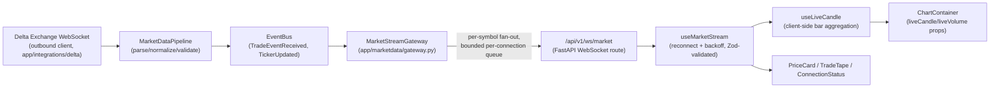

# Frontend

## Purpose

Documents the Next.js dashboard in `apps/dashboard`: its stack, routing,
feature-module pattern, API client conventions, and the reusable candlestick
chart module. Read this alongside
[`docs/architecture/EngineeringStandards.md`](docs/architecture/EngineeringStandards.md)
(general coding conventions) and [`docs/api/API.md`](docs/api/API.md) (the
backend surface the frontend consumes).

## Status

Active — `apps/dashboard` implements Health, Markets, History (with a
candlestick chart), and Live Market (resolved market selection, real-time
price/chart/trade tape, and an operational connection panel);
Dashboard, Research, and Settings remain placeholders.

## Stack

Next.js 15 (App Router, typed routes) · React 19 · TypeScript (strict) ·
Material UI v7 (dark-only theme, CSS variables) · TanStack Query (server
state/polling) · Zustand (local UI state) · Axios (API client) · Zod
(runtime validation of every API response) · TradingView lightweight-charts
(candlestick charting) · Vitest + Testing Library (tests).

## Routing

All real pages live under the `(dashboard)` route group
(`src/app/(dashboard)/`), wrapped by `AppShell` (sidebar + top bar,
`src/components/layout/`). `/` redirects to `/dashboard`.

| Route          | Status                                                                |
| -------------- | --------------------------------------------------------------------- |
| `/health`      | Implemented — platform/DB/bus/state health, polled REST               |
| `/markets`     | Implemented — filterable/sortable market table + detail panel         |
| `/history`     | Implemented — historical candle browser, **Chart** and **Table** tabs |
| `/live-market` | Implemented — real-time price, chart, and trade tape (see below)      |
| `/dashboard`   | Placeholder                                                           |
| `/research`    | Placeholder                                                           |
| `/settings`    | Placeholder                                                           |

## Feature module pattern

Each implemented feature lives in `src/features/<name>/`: a
`<name>-page.tsx` client component alongside `components/`, `hooks/`, and
`lib/` subfolders, with tests co-located as `*.test.ts(x)`. Business logic
stays in `src/features/`; shared, cross-feature plumbing lives in
`src/lib/` and
`src/components/`.

## API layer

A single Axios instance (`src/lib/api/client.ts`) talks to `services/api`
at `NEXT_PUBLIC_API_URL`. Every typed fetch function
(`src/lib/api/market.ts`, `system.ts`) immediately validates the response
against a Zod schema (`src/types/api/`) — an API response is never trusted
as typed without also being runtime-checked. New API client functions must
follow this pattern; do not add a second HTTP client or bypass schema
validation.

## Chart module

`src/components/chart/` is a reusable module that renders historical OHLCV
data as a candlestick chart with TradingView's **lightweight-charts** — the
only chart library used in this codebase. It has no dependency on the
History feature and can be dropped into any future page.

### Component hierarchy

```text
ChartContainer                 data fetching, loading/empty/error states
├── ChartToolbar                fit-content button, candle count/truncation note
│   ├── MarketSelector           (only rendered in "standalone" mode)
│   └── TimeframeSelector        (only rendered in "standalone" mode)
├── CandlestickChart            imperative lightweight-charts wrapper (React.memo)
└── ChartLegend                 OHLCV + timestamp readout
```

`data-adapter.ts` (pure functions) and `hooks/use-chart-candles.ts` (data
fetching) sit alongside these components but render nothing themselves.
`chart-theme.ts` derives every lightweight-charts color/option from the
active MUI theme — the chart does not introduce a second theming system.

### Data flow

```mermaid
flowchart LR
    A["GET /api/v1/markets/{symbol}/candles\n(existing endpoint, paginated)"] --> B["useChartCandles\n(hooks/use-chart-candles.ts)"]
    B -->|"paginates dir=desc,\nreverses to ascending,\ncaps at MAX_CHART_CANDLES"| C["Candle[]\n(string OHLCV, ISO timestamps)"]
    C --> D["toChartSeries\n(data-adapter.ts)"]
    D -->|"drops invalid/duplicate points,\nUTCTimestamp seconds,\nnumeric OHLCV"| E["CandlestickData[] + HistogramData[]"]
    E --> F["CandlestickChart\n(lightweight-charts)"]
    F -->|"onCrosshairMove"| G["ChartLegend"]
```



`ChartContainer` **reuses** the existing `services/api` candle endpoint —
it does not call a new or duplicate endpoint. A chart needs the full range
in one shot rather than one UI page at a time, so `useChartCandles`
transparently paginates `GET /markets/{symbol}/candles` (whose backend page
size caps at 1000 — `candles_max_limit` in `services/api/app/core/config.py`)
into as many requests as needed, always requesting newest-first
(`dir=desc`) and reversing the merged result, so a truncated fetch keeps
the _most recent_ candles rather than the oldest.

### Integrating with an existing filter UI (History page)

The History page (`src/features/history/history-page.tsx`) already has a
market/timeframe/date-range form (`HistoryForm`) reused by both its table
and its new **Chart** tab — `ChartContainer` is rendered with
`symbol`/`timeframe`/`start`/`end` taken directly from the page's existing
query state and renders **no selector UI of its own** there
(`ChartToolbar`'s `markets`/`availableTimeframes`/`onSymbolChange`/
`onTimeframeChange` props are simply omitted). This is deliberate: the task
that added this chart required reusing the History explorer's filters
rather than building a second, parallel set. `MarketSelector` and
`TimeframeSelector` still exist and are exported for a future page that
embeds the chart **without** an existing filter UI to reuse — pass
`markets`/`availableTimeframes` + their `onChange` handlers to
`ChartToolbar` (or `ChartContainer`) to opt into that "standalone" mode.

### Connection panel

`ConnectionStatus` reports every dependency the live view has, not just the
socket: **Backend API** (status + measured latency from `/system/health`),
**WebSocket** (this browser's own connection — only the client knows it),
**Historical Sync** (age of `last_ingestion_at`, flagged past 15 minutes),
**Market State** (state-manager status + symbols tracked), **Last
Message**, **Reconnect Attempts**, and **Latency**. The system queries are
the same ones the Health page already uses, so the panel costs no new
endpoint and shares their cache.

Latency is the round-trip time of the stream's _own_ heartbeat
(`ping`→`pong`), not a REST timing — it measures the path the live data
actually travels.

### Empty states

`MarketDataNotice` replaces a bare "waiting for live data…" with the three
things a user needs to act: which precondition is missing (stored candles,
live feed, or just the first tick), whether the socket is even connected
(including "dropped, reconnecting automatically"), when the last message
arrived — and a Retry that refetches markets, metrics, stats and candles.
It renders nothing once the market is ready and a price has arrived, so a
healthy dashboard carries no notice at all.

Values that aren't known render as **"Unavailable"**, never as `—` or `0`:
a quantitative reader has to be able to tell "nothing arrived" from "the
value is zero". 24h high/low/volume carry a tooltip saying they are derived
from candles this platform has stored, not from the exchange ticker, since
they read low if candle sync has fallen behind.

### Performance considerations

- **Fetch cap**: `MAX_CHART_CANDLES` (10,000, in `hooks/use-chart-candles.ts`)
  bounds network/memory cost for a single render. Raise it there — after
  profiling shows it's actually insufficient — rather than adding a new
  endpoint; the pagination logic already scales to it.
- **No React re-renders for data pushes**: `CandlestickChart` is
  `React.memo`-wrapped and talks to lightweight-charts imperatively via
  `useEffect`s keyed on `[candlesticks, volume]`/`[theme]`/
  `[fitContentToken]` — a parent re-render that doesn't change those
  values never touches the chart. `ChartContainer` memoizes the adapter
  output (`useMemo` on `[candles, theme colors]`) so array identity is
  stable across unrelated re-renders.
- **Rendering, not fetching, is what needs to stay smooth at 10,000+
  candles** — lightweight-charts virtualizes its own canvas rendering, so
  the practical ceiling is network/JSON-parse cost for the paginated
  fetch, not chart draw performance.

### Error handling

`ChartContainer` covers: no market/timeframe selected yet (prompt), first
page loading (skeleton), an API failure at any page (`Alert` + retry,
reusing `ApiError.message` the same way the History table does), an empty
range (`Alert`, info), and unexpected data — `data-adapter.ts` drops any
candle with a non-finite OHLCV field, an unparseable timestamp, or a
timestamp duplicating one already seen, rather than feeding `NaN`/garbage
into the chart. An `invalid_timeframe` (or any other) domain error from the
backend surfaces through the same generic API-failure path — there's no
separate UI for it since the timeframe list a user can pick from already
comes from the live `/timeframes` endpoint.

### Extension points for indicators

Out of scope for this module (see `DECISIONS.md`/`PROJECT.md` for the
platform's broader AI/prediction roadmap), but the seams are:

- **`ChartContainer`** already isolates data-fetching from rendering — an
  indicator that needs its own series (e.g. a moving average) would fetch
  in a sibling hook and pass another `LineData[]`/`HistogramData[]` array
  into a new prop on `CandlestickChart`, which would call
  `chart.addSeries(LineSeries, …)` once (in the mount effect) and
  `series.setData(...)` in the existing data-push effect — no change to
  the candlestick/volume series.
- **`data-adapter.ts`** is the single place OHLCV strings become chart-ready
  numbers; a derived indicator (e.g. an SMA computed client-side) would be
  a new pure function here, tested the same way as `toChartSeries`.
- **`ChartToolbar`** has room for additional controls (e.g. an indicator
  picker) alongside the existing fit-content button.

## Live Market Dashboard

`/live-market` (`src/features/live-market/`) is a real-time monitoring page
for one symbol: current price, a live-updating candlestick chart, and a
trade tape, all sourced from the backend's own streaming gateway —
**never** a direct connection to Delta Exchange. That constraint is
architectural, not just a style preference: before this feature, the
backend had no server-to-browser push channel at all (see `docs/api/API.md`
history and the now-superseded "Known Limitations" note in `CLAUDE.md`), so
building this page required adding one —
`GET/WS /api/v1/ws/market` in `services/api/app/api/v1/endpoints/market_stream.py`,
backed by `app/marketdata/gateway.py`'s `MarketStreamGateway`. The gateway
subscribes to the same in-process event bus (`TradeEventReceived`,
`TickerUpdated`) the existing pipeline already publishes to, and fans each
event out to every browser connection subscribed to that symbol over a
per-connection bounded queue (a slow browser client drops messages and is
counted, never blocks other clients or the publisher).

### Streaming flow



Protocol (JSON text frames, both directions) is documented in full at the
top of `market_stream.py`; the frontend's matching Zod schemas live in
`src/types/api/market-stream.ts`. A client must send `{"action":
"subscribe", "symbols": [...]}` to receive anything — nothing is
auto-subscribed on connect — and gets an immediate `snapshot` message (the
gateway's own read of `MarketStateManager`) so the UI isn't blank on a
quiet market while it waits for the next live event.

**Timestamp format matters here, and it broke once.** Every `event_time`
the gateway emits must end in a literal `Z`, matching the REST layer's own
`field_serializer` convention (`app/schemas/market_data.py`), because the
frontend's `z.string().datetime()` schemas accept only that literal suffix
by default — not the `+00:00` a bare Python `datetime.isoformat()`
produces. That exact mismatch once caused every trade/ticker/snapshot frame
to fail validation and be silently dropped, while heartbeat pongs (no
timestamp) kept the connection looking healthy the whole time. Fixed in
`_isoformat_utc` (`app/marketdata/gateway.py`); pinned by tests on both
sides so it can't regress silently again (`test_gateway.py`'s
`TestWireTimestampFormat`, `src/types/api/market-stream.test.ts`).

### Component hierarchy

```text
LiveMarketPage                 resolves symbol/timeframe; owns nothing else
├── ConnectionStatus           backend API, WebSocket, historical sync, market
│                              state, last message, reconnects, heartbeat latency
├── (fallback alert)           shown when resolution moved off a requested market
├── MarketDataNotice           why data is missing, and a retry — only when it is
├── PriceCard                  price/24h change (WS) + 24h high/low/volume,
│                              last trade time, last candle time (REST poll)
├── ChartContainer             reused from the chart module, in "standalone" mode
│   └── (MarketSelector / TimeframeSelector render inside its ChartToolbar)
└── TradeTape                  newest-first, capped, coloured by aggressor side
```

`PriceCard`, `TradeTape`, `ConnectionStatus` and `MarketDataNotice` are all
`React.memo`-wrapped, so a tick that only changes the trade list doesn't
re-render the connection panel.

`ChartContainer`/`CandlestickChart`/`MarketSelector`/`TimeframeSelector` are
the exact same components the History page's Chart tab uses (see "Chart
module" above) — nothing here is a copy. Live Market is precisely the
"standalone" scenario that pattern was built for: there's no pre-existing
filter form to reuse, so `ChartContainer` is given `markets`/
`availableTimeframes`/`onSymbolChange`/`onTimeframeChange` and renders its
own selectors.

### Market selection, validation and fallback

Of the ~225 markets in `/markets`, only the handful the backend actually
tracks (`DELTA_MARKET_SYMBOLS`, `BTCUSD,ETHUSD` by default) have any
candles or a live feed behind them; the rest are catalogue rows. Picking
the first market in the list therefore opened the dashboard on something
like `1000BONKUSD` with every panel empty. Selection is now _resolved_
rather than assumed, by `hooks/use-research-market.ts` over the pure rules
in `lib/market-selection.ts`:

1. **Candidate order** (`buildCandidateSymbols`): the symbol requested in
   the URL (`?symbol=`) → the symbol remembered from the last visit →
   `ETHUSD`, the primary research market → whatever the backend is
   currently streaming → any other active market. Unknown and inactive
   symbols are dropped, and the list is capped at `MAX_CANDIDATES` (6)
   because each candidate costs one timeframes probe.
2. **Validation** (`assessMarket`): a market is _ready_ when it has stored
   candles (`/markets/{symbol}/timeframes` is non-empty) **and** the
   backend is streaming it (`state_latest_prices` from `/system/metrics`
   lists it). Latest-price presence is reported separately from live
   support, because "untracked symbol" and "tracked but no tick yet" are
   different problems with different fixes.
3. **Fallback** (`selectResearchMarket`): first ready candidate → else the
   first with candles → else the first candidate. That last tier is
   deliberate: an operator running with the live feed disabled should still
   get a usable historical view instead of an empty page, so a market is
   never rejected outright — the gaps surface as `blockers` in the empty
   state instead.

Candidates are probed with `useQueries` under the same query key
`useTimeframes` uses, so a probe and the chart's own timeframe fetch share
one cache entry rather than duplicating the request.

When resolution moves away from an explicitly requested market, the page
says so ("1000BONKUSD has no research data … showing ETHUSD instead")
rather than silently substituting. The notice is captured in state at the
moment of the switch, because the URL is immediately rewritten to the
market that was actually resolved.

**Persistence**: the resolved symbol and timeframe are written to the URL
(`use-live-market-url-state.ts`, `router.replace` so market-flipping
doesn't fill the history stack) and mirrored into `localStorage`
(`lib/remembered-market.ts`, every access guarded — storage throws in
private-mode browsers). The URL is the shareable source of truth; storage
is the cross-visit fallback when the page is opened with no search params.

**Timeframe** resolution (`lib/timeframe-preference.ts`) follows the same
shape — explicit selection → URL → remembered → finest available — and
ignores any candidate the current symbol has no candles for, so a
remembered `4h` can't blank the chart on a market that only stores `1m`.

### One symbol across every widget

`ConnectionStatus`, `PriceCard`, `ChartContainer` and `TradeTape` all read
the single resolved `symbol`. Two things enforce that they can never drift
apart: `useMarketStream` clears its data synchronously when `symbol`
changes (showing the previous market's price under the new market's name
for even one frame would be a correctness bug), and it **discards any frame
whose `symbol` field doesn't match the subscription** — a message still in
flight when the user switches markets cannot be folded into the new one.

### Live candle synthesis (no backend candle-aggregation pipeline exists)

The backend has no real-time candle-close detection — `CandleClosed` bus
events are reserved for a future milestone (see
`app/events/example_events.py`); the only way historical candles reach the
database today is the periodic REST-based `CandleSyncScheduler`, not the
live tick stream. So "append new candles in real time" is implemented
entirely client-side: `use-live-candle.ts` folds each streamed trade into
the currently-forming bar (`lib/aggregate-live-candle.ts`, pure and
unit-tested), bucketing by the selected timeframe. That forming bar is
pushed into `CandlestickChart` via its `liveCandle`/`liveVolume` props,
which call lightweight-charts' `series.update()` — an O(1) append/replace
of the last bar — instead of `setData()`, satisfying "avoid full chart
re-renders" directly through the library's own incremental-update API.
The forming bar is **seeded from the last historical candle** so history
loads first and the live bar continues it rather than restarting: a trade
inside the seed's own bucket extends that bar (instead of a fresh
one-trade bar replacing it at the same timestamp), and a trade in a later
bucket opens at the seed's close rather than gapping. Once candle sync
produces a _newer_ historical bar, it supersedes the locally-synthesized
one. The seed is read through a ref, so a historical refetch — which
produces a new object every time — never re-runs the fold and
double-counts a trade.

`CandlestickChart` also refuses any `update()` whose time precedes the
newest point already in the series. That is reachable in normal operation
(a historical refetch landing while a forming bar for an earlier bucket is
still on screen) and lightweight-charts throws on it, so the update is
dropped rather than crashing the page.

### Why 24h high/low/volume are polled, not pushed

`PriceCard`'s current price and 24h change come from the live ticker
(`price_change_24h` was already on the domain `TickerEvent` model — no
backend change needed for that field). 24h high/low/volume reuse the
_existing_ `/markets/{symbol}/candles/stats` REST endpoint instead
(`use-price-stats.ts`, polled every 60s — the same polling pattern the
Health page already uses at 10s), because: (a) it needed no new backend
work at all, and (b) a rolling 24h aggregate has no reason to be
millisecond-fresh the way a live trade price does. Total volume isn't a
field the endpoint returns directly, so it's derived as `average_volume ×
total_candles` (mathematically the sum) rather than adding a field to a
response shape three other features already depend on.

### The trade tape's "Side" column

Trades carry a real aggressor side: `buy` means the taker lifted the offer,
`sell` means the taker hit the bid. `TradeTape` colors each row by that
value.

This corrects an earlier assumption. The backend normalizer used to
hard-code `side="unknown"` on the belief that Delta's public feed didn't
expose taker side, and the tape coloured rows by price direction as a
proxy. In fact the compact `trades` channel carries an `r` field the
normalizer was discarding, and it is the _buyer's role_ in the fill.
Verified against the exchange rather than assumed: 55 fills captured
simultaneously from the compact `trades` channel and the verbose
`all_trades` channel (which spells out `buyer_role`/`seller_role`) agreed
on every single one — `r="t"` ⇔ `buyer_role="taker"` (an aggressive buy),
`r="m"` ⇔ `buyer_role="maker"` (an aggressive sell), with no
counterexamples. Anything other than those two values still degrades to
`unknown` rather than being coerced into a side.

### Connection panel

`ConnectionStatus` reports every dependency the live view has, not just the
socket: **Backend API** (status + measured latency from `/system/health`),
**WebSocket** (this browser's own connection — only the client knows it),
**Historical Sync** (age of `last_ingestion_at`, flagged past 15 minutes),
**Market State** (state-manager status + symbols tracked), **Last
Message**, **Reconnect Attempts**, and **Latency**. The system queries are
the same ones the Health page already uses, so the panel costs no new
endpoint and shares their cache.

Latency is the round-trip time of the stream's _own_ heartbeat
(`ping`→`pong`), not a REST timing — it measures the path the live data
actually travels.

### Empty states

`MarketDataNotice` replaces a bare "waiting for live data…" with the three
things a user needs to act: which precondition is missing (stored candles,
live feed, or just the first tick), whether the socket is even connected
(including "dropped, reconnecting automatically"), when the last message
arrived — and a Retry that refetches markets, metrics, stats and candles.
It renders nothing once the market is ready and a price has arrived, so a
healthy dashboard carries no notice at all.

Values that aren't known render as **"Unavailable"**, never as `—` or `0`:
a quantitative reader has to be able to tell "nothing arrived" from "the
value is zero". 24h high/low/volume carry a tooltip saying they are derived
from candles this platform has stored, not from the exchange ticker, since
they read low if candle sync has fallen behind.

### Performance considerations

- **Batched stream commits**: incoming frames are buffered and committed to
  React state on a ~100ms interval (`FLUSH_INTERVAL_MS`) rather than one
  `setState` per message. A busy market prints many trades per second, and
  a commit per print would re-render the price card, chart and tape on
  every one; ~10 commits/second stays well under the threshold where a
  human perceives lag. A burst of 20 prints lands as one commit, which is
  asserted in `use-market-stream.test.ts`.
- **No new WebSocket per re-render**: `useMarketStream`'s connection
  lifecycle lives in a single `useEffect` keyed on `[symbol, streamUrl]`.
  A symbol change tears down and reopens the connection deliberately;
  nothing else re-rendering the page does. `maxTrades` is read through a
  ref precisely so changing it can't force a reconnect.
- **Memoized widgets**: the four panels are `React.memo`-wrapped and the
  page passes memoized `liveCandle`/`liveVolume` objects, so an update that
  changes only one of them doesn't re-render the rest.
- **Reconnect backoff**: exponential, `1s × 2^attempt` capped at 30s, mirroring
  the backend's own `DeltaWebSocketClient` reconnect strategy conceptually
  (see `services/api/app/ws/connection.py`) without sharing code — one is a
  Python outbound client, the other a browser `WebSocket`.
- **Bounded trade tape**: `useMarketStream`'s `maxTrades` option caps both
  the buffer and the rendered list (default 100) — high-frequency streams
  can't grow either unbounded. The cap is shown in the tape's header so it
  isn't a mystery why the list stops.
- **Chart updates stay O(1) per tick**: see "Live candle synthesis" above —
  this is what actually keeps a fast-ticking market smooth, not React-level
  memoization alone.
- **Backend fan-out never blocks on a slow client**: each browser
  connection's outbound queue is bounded (`MarketStreamGateway`); a full
  queue drops the message and increments a metric instead of backing up
  the event bus's publish path for every other connection.

## State management

- Server state: TanStack Query (`src/lib/query/queryClient.ts`).
- Local UI state: Zustand (`src/store/ui-store.ts` — sidebar state only
  today).
- The chart module keeps its own crosshair-hover state
  (`useState` in `ChartContainer`) — it is presentation-only and does not
  belong in Zustand.
- The Live Market Dashboard's connection/trade/ticker state
  (`useMarketStream`) and forming-candle state (`useLiveCandle`) are also
  plain React state, not Zustand: this state is owned by exactly one page
  instance at a time and nothing else in the app needs to read it, so a
  global store would add indirection without solving a real cross-component
  sharing problem. Zustand remains the right tool for state genuinely
  shared across the component tree (like the sidebar).

## Testing

See [`TESTING.md`](TESTING.md) for the frontend testing strategy in full;
in short, Vitest + Testing Library, with `lightweight-charts`'s `createChart`
mocked wherever `CandlestickChart` is rendered (jsdom has no real canvas 2D
context).

## Conventions

- Server components by default; `'use client'` only where interactivity is
  needed.
- All API payloads validated with Zod schemas in `src/types/api/`.
- Feature logic in `src/features/<feature>/`; cross-feature/reusable code
  in `src/components/` and `src/lib/` (the chart module lives in
  `src/components/chart/` precisely because it isn't specific to History).
