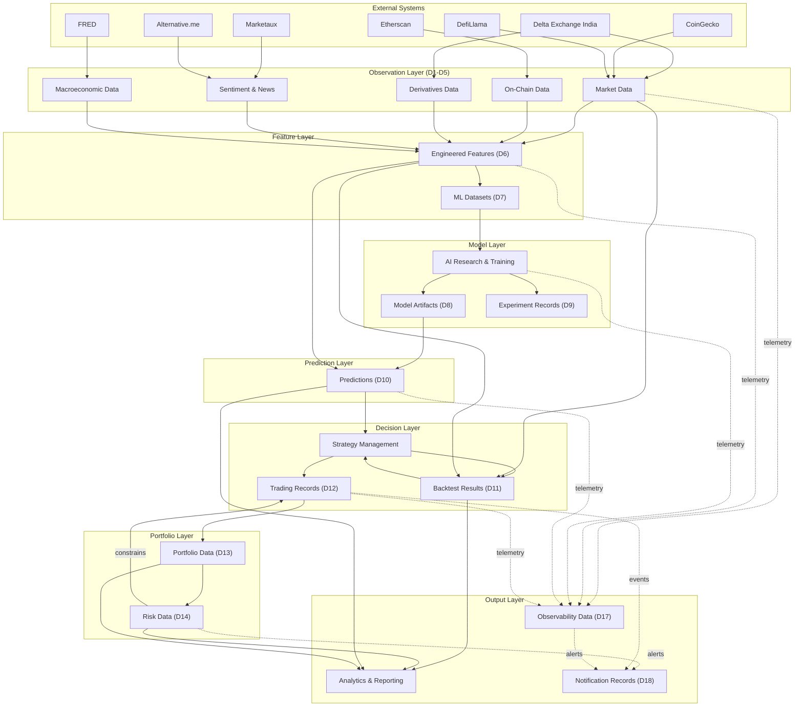

# High-Level Data Architecture

## Document Information

**Document:** High-Level Data Architecture

**Scope:** Logical data lifecycle, domains, and classification

**Status:** Draft

---

## 1. Data Domains

The platform's information is organized into logical data domains. Each domain is
defined by its purpose, owning bounded context, lifetime, consumers, and producers.

### D1 — Market Data

- **Purpose:** Represents the observable state of markets — trades, order books,
  candles, funding rates, and aggregated market statistics.
- **Owner:** Market Data context.
- **Lifetime:** Persistent. Raw market data is retained as a permanent historical
  archive for backtesting and research.
- **Producers:** External data providers (via the Market Data Collector); exchange
  feeds.
- **Consumers:** Feature Engineering, Backtesting, Prediction, Portfolio Management,
  Analytics & Reporting.

### D2 — On-Chain Data

- **Purpose:** Represents blockchain-level activity — transactions, blocks, addresses,
  and network metrics — used to understand fundamental network conditions.
- **Owner:** Market Data context.
- **Lifetime:** Persistent. On-chain history is retained for long-term analysis.
- **Producers:** Etherscan and other blockchain data providers.
- **Consumers:** Feature Engineering, Analytics & Reporting, Research.

### D3 — Derivatives Data

- **Purpose:** Represents derivatives market information — funding rates, open
  interest, and perpetual futures data — used to gauge positioning and leverage.
- **Owner:** Market Data context.
- **Lifetime:** Persistent.
- **Producers:** Delta Exchange India and other derivatives venues.
- **Consumers:** Feature Engineering, Risk Management, Prediction, Analytics.

### D4 — Sentiment & News Data

- **Purpose:** Represents external sentiment signals — news articles, sentiment
  scores, and fear/greed indices — used as analytical context.
- **Owner:** Market Data context.
- **Lifetime:** Long-lived. Sentiment data is retained for feature reproducibility;
  point-in-time snapshots are emphasized over live values.
- **Producers:** Marketaux, Alternative.me Fear & Greed Index, and other sentiment
  providers.
- **Consumers:** Feature Engineering, Prediction, Analytics & Reporting.

### D5 — Macroeconomic Data

- **Purpose:** Represents external economic conditions — interest rates, monetary
  aggregates, and economic indicators — used for macro context in analysis.
- **Owner:** Market Data context.
- **Lifetime:** Long-lived and slowly changing.
- **Producers:** FRED and other macroeconomic providers.
- **Consumers:** Feature Engineering, Prediction, Analytics & Reporting.

### D6 — Engineered Features

- **Purpose:** Represents derived, computed representations of raw data that are
  consumed by models and analytics.
- **Owner:** Feature Engineering context.
- **Lifetime:** Versioned and persistent. Features are retained per definition
  version so historical values remain reproducible.
- **Producers:** Feature Engineering pipelines (from raw and processed data).
- **Consumers:** AI Research & Training, Prediction, Backtesting.

### D7 — Machine Learning Datasets

- **Purpose:** Represents curated, versioned collections of features and targets
  prepared for model training and evaluation.
- **Owner:** Feature Engineering context.
- **Lifetime:** Versioned and persistent. Datasets are immutable once created.
- **Producers:** Feature Engineering pipelines.
- **Consumers:** AI Research & Training, Backtesting.

### D8 — Model Artifacts

- **Purpose:** Represents trained model weights, configuration, and metadata
  required to serve or reproduce a model.
- **Owner:** AI Research & Training context.
- **Lifetime:** Versioned and persistent. Artifacts are immutable and retained for
  reproducibility and rollback.
- **Producers:** AI Research & Training pipelines.
- **Consumers:** Prediction Service, AI Research & Training (reproducibility),
  Monitoring.

### D9 — Experiment Records

- **Purpose:** Represents the complete documentation of training experiments —
  configuration, datasets, parameters, and results.
- **Owner:** AI Research & Training context.
- **Lifetime:** Persistent and append-only.
- **Producers:** AI Research & Training workflows.
- **Consumers:** Research, Analytics & Reporting, Monitoring.

### D10 — Predictions

- **Purpose:** Represents probabilistic forecast outputs — distributions, intervals,
  and scenarios — produced by models.
- **Owner:** Prediction context.
- **Lifetime:** Persistent. Predictions are retained with full provenance for
  evaluation and audit.
- **Producers:** Prediction Service.
- **Consumers:** Strategy Management, Backtesting, Risk Management, Portfolio
  Management, Analytics & Reporting, Monitoring.

### D11 — Backtest Results

- **Purpose:** Represents the outputs of historical simulations — equity curves,
  metrics, and execution logs.
- **Owner:** Backtesting context.
- **Lifetime:** Persistent and immutable. Backtests must be reproducible.
- **Producers:** Backtesting Engine.
- **Consumers:** Strategy Management, Research, Analytics & Reporting, Monitoring.

### D12 — Trading Records

- **Purpose:** Represents the complete lifecycle of orders and executions — for
  both paper trading and live trading.
- **Owner:** Trading Execution context.
- **Lifetime:** Persistent. Trading records are retained for audit, reconciliation,
  and analysis.
- **Producers:** Trading Execution Service; paper trading simulation.
- **Consumers:** Portfolio Management, Risk Management, Analytics & Reporting,
  Notifications, Monitoring.

### D13 — Portfolio Data

- **Purpose:** Represents the authoritative state of portfolios — holdings,
  positions, balances, and valuation.
- **Owner:** Portfolio Management context.
- **Lifetime:** Persistent with time-series history for performance analysis.
- **Producers:** Portfolio Management Service; Trading Execution updates.
- **Consumers:** Risk Management, Strategy Management, Analytics & Reporting.

### D14 — Risk Data

- **Purpose:** Represents risk metrics, limit definitions, and scenario
  assessments.
- **Owner:** Risk Management context.
- **Lifetime:** Persistent. Risk metrics are time-stamped for trend analysis;
  limit and scenario definitions persist for governance.
- **Producers:** Risk Engine.
- **Consumers:** Strategy Management, Trading Execution, Portfolio Management,
  Analytics & Reporting, Notifications.

### D15 — Reference Data

- **Purpose:** Represents slowly changing descriptive information — instruments,
  venues, symbols, and configuration — that provides context for all other data.
- **Owner:** Market Data context (market reference data); Identity & Access and
  Administration contexts (domain reference data).
- **Lifetime:** Long-lived, versioned, and change-controlled.
- **Producers:** Administration & Operations, Market Data.
- **Consumers:** All contexts.

### D16 — Identity & Access Data

- **Purpose:** Represents users, roles, permissions, sessions, and access audit
  records.
- **Owner:** Identity & Access Management context.
- **Lifetime:** Persistent; sessions are short-lived, accounts and audit records
  are long-lived.
- **Producers:** Identity & Access Management.
- **Consumers:** All contexts (authorization decisions).

### D17 — Observability Data

- **Purpose:** Represents system logs, metrics, traces, and monitoring events that
  describe platform behavior and health.
- **Owner:** Administration & Operations context.
- **Lifetime:** Retention is bounded by operational policy — rolling windows with
  archival of significant events.
- **Producers:** Every context (telemetry emission).
- **Consumers:** Administration & Operations, Monitoring, Notifications.

### D18 — Notification Records

- **Purpose:** Represents notifications, preferences, and delivery state.
- **Owner:** Notifications context.
- **Lifetime:** Retention is bounded by operational policy.
- **Producers:** Notifications Service.
- **Consumers:** Administration & Operations, Analytics (usage patterns).

---

## 2. Data Lifecycle

Data flows through a defined lifecycle as it moves from external observation to
analytical insight and operational action.

```
Raw
 ↓
Validated
 ↓
Normalized
 ↓
Stored
 ↓
Features
 ↓
Dataset
 ↓
Model
 ↓
Prediction
 ↓
Execution
 ↓
Analytics
```

| Stage | Description |
|---|---|
| **Raw** | Unprocessed records as received from external sources. Preserved immutably for audit and reprocessing. |
| **Validated** | Records checked for completeness, consistency, and correctness. Invalid records are quarantined and reported. |
| **Normalized** | Records transformed into canonical platform representations with consistent schemas, units, and identifiers. |
| **Stored** | Curated data persisted in the appropriate storage tier with retention and lifecycle policies. |
| **Features** | Derived representations computed consistently from stored data, versioned by definition. |
| **Dataset** | Versioned feature collections assembled and validated for training or evaluation. |
| **Model** | Trained artifacts produced from datasets, registered with full metadata. |
| **Prediction** | Probabilistic forecasts produced by models from features, with provenance. |
| **Execution** | Decisions translated into orders — simulated or live — producing trading records. |
| **Analytics** | Aggregated insights, reports, and dashboards derived from all upstream data. |

**Lifecycle rules:**

- Data may enter the lifecycle at multiple stages (e.g., model artifacts are produced
  without passing through raw data stages).
- Each stage is a transformation boundary with defined validation rules.
- Point-in-time correctness is preserved throughout — historical values are never
  silently overwritten.
- Lineage is tracked so every downstream artifact can be traced to its source inputs.

---

## 3. Data Classification

| Class | Description | Domains |
|---|---|---|
| **Raw** | Unprocessed records as received from external sources; immutable. | D1, D2, D3, D4, D5 (pre-validation) |
| **Processed** | Records that have been validated, normalized, and curated. | D1–D5 (post-validation), D15, D16 |
| **Derived** | Data computed from other data through defined transformations. | D6, D7, D9, D11, D12, D13, D14 |
| **Reference** | Slowly changing descriptive data providing context and stability. | D15, D16 |
| **Operational** | Data that records and supports the operation of the platform itself. | D16, D17, D18 |
| **Analytical** | Data produced for analysis and decision support. | D10, D11, D13, D14 |
| **Experimental** | Data produced by research activities with non-production status. | D7 (research copies), D9, research-only artifacts |

**Classification rules:**

- A domain may span multiple classes at different lifecycle stages (e.g., market data
  is Raw at ingestion, Processed after validation).
- Derived data always records its source lineage.
- Operational and Analytical data are retained under different policies.
- Experimental data is isolated from production data and clearly identified.

---

## 4. Data Relationships

**Market data is the foundation.** Domains D1–D5 (market, on-chain, derivatives,
sentiment, macro) are the platform's primary observation inputs. They are produced
externally and consumed by Feature Engineering, which is the principal transformation
layer.

**Features are the bridge.** The Feature Engineering context transforms all
observation domains (D1–D5) into Engineered Features (D6). Features are the only
representation of market information that models consume — no model touches raw
data directly. This creates a strict dependency: the validity of all downstream
analytical outputs rests on feature consistency.

**Datasets enable models.** Machine Learning Datasets (D7) are assembled from
features. Datasets feed the model lifecycle — training produces Model Artifacts
(D8) and Experiment Records (D9).

**Models produce predictions.** The Prediction context consumes models and features
to produce Predictions (D10), the central analytical artifact of the platform.

**Predictions drive decisions.** Predictions feed Strategy Management, which
produces execution intents that become Trading Records (D12) — either simulated
or live. Trading Records update Portfolio Data (D13), which feeds Risk Data (D14).

**Risk constrains execution.** Risk Data (D14) is both derived from portfolio and
market state and a controlling input to execution. Risk metrics close the loop:
execution behavior influences portfolio state, which influences risk, which
constrains future execution.

**Reference and operational data contextualize everything.** Reference Data (D15)
identifies instruments and configuration; Identity & Access Data (D16) governs who
may access what; Observability Data (D17) records how the platform behaves;
Notification Records (D18) capture user communications.

**Analytics aggregates all domains.** Analytics & Reporting consumes outputs from
every analytical domain and produces consolidated decision-support information.

**Key relationship summary:**

```
Observation (D1–D5) → Features (D6) → Datasets (D7) → Models (D8–D9)
                                                         ↓
Observability (D17) ← all domains                        Predictions (D10)
                                                         ↓
Analytics (all domains) ← Backtests (D11) ← Strategies ← Execution (D12)
                                                         ↓
                                              Portfolio (D13) → Risk (D14)
                                                         ↓
                                             constrains future execution
```

---

## 5. Mermaid Data Flow Diagram



---

## 6. Future Expansion

The logical data architecture is designed to accommodate growth without redesign.

**Additional data providers:**

- New providers attach to the Observation Layer as additional producers within the
  Market Data domain. Each provider is an adapter behind the same normalization
  contract; downstream domains (features onward) are unaffected because they consume
  normalized data, never provider-specific formats.

**Additional exchanges:**

- New execution venues integrate through the Trading Records domain. Execution
  records are normalized into the same order lifecycle representation used for
  existing venues, and market data from new venues enters through the Market Data
  domain. Strategy, Portfolio, and Risk domains consume normalized records and
  require no change.

**Additional assets and markets:**

- New asset classes and markets extend the Reference Data domain. Because features,
  datasets, and predictions are keyed by instrument identity resolved through
  reference data, adding an asset does not alter the data lifecycle — it adds
  instances within existing domains.

**New analytical capabilities:**

- New analytics capabilities (alternative prediction methods, advanced risk models)
  are introduced as new consumers of existing domains or as producers within
  existing domains. They consume the same normalized, versioned data; no upstream
  redesign is required.

**New data categories:**

- Entirely new information categories (e.g., alternative data types) join as new
  observation domains feeding the Feature Engineering layer, following the
  established raw → validated → normalized → features lifecycle. The rest of the
  architecture is unaffected.

**General expansion principle:**

- The architecture decouples producers from consumers at every layer: observation
  domains are consumed through normalized contracts, features are consumed through
  versioned datasets, and models are consumed through registered artifacts. As long
  as new elements comply with existing domain contracts, expansion requires no
  platform redesign.
