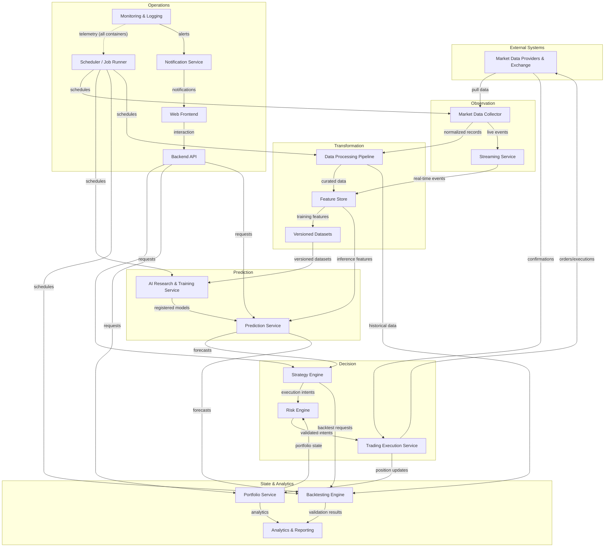

# Solution Architecture

## Document Information

**Document:** Solution Architecture

**Scope:** How logical containers collaborate to deliver end-to-end functionality

**Status:** Draft

**Related documents:** SystemContext.md (C4 Level 1), ContainerArchitecture.md (C4
Level 2), DomainModel.md (Bounded Contexts), DataArchitecture.md (Data Domains)

---

## 1. Solution Overview

The platform operates as an end-to-end quantitative research and decision-support
system spanning five operational phases: **observation**, **transformation**,
**prediction**, **decision**, and **operations**.

**Observation** begins when the Market Data Collector retrieves information from
external systems — exchange market data, on-chain data, sentiment, and macroeconomic
indicators. All collected data is normalized and published to the Message Broker,
then validated and curated by the Data Processing Pipeline into the platform's
historical stores.

**Transformation** converts raw observations into analysis-ready representations.
The Feature Store computes versioned features consistently across historical and
live data. For research, curated features are assembled into versioned datasets.

**Prediction** produces probabilistic forecasts. The AI Research & Training Service
develops and evaluates models against versioned datasets; approved models are
registered and deployed to the Prediction Service, which serves both batch and
real-time forecasts to consumers.

**Decision** translates predictions into action within controlled boundaries. The
Strategy Engine consumes forecasts, portfolio state, and risk metrics to produce
execution intents; the Risk Engine validates every intent against limits; the
Trading Execution Service executes intents — simulated fills for paper trading or
venue submission for live trading — and reports results to the Portfolio Service.

**Operations** provides continuous governance. The Scheduler orchestrates recurring
workloads, the Monitoring & Logging Service captures telemetry from every
container, and the Notification Service delivers alerts to users.

All user-facing access flows through the Backend API, protected by the
Authentication Service, and is presented through the Web Frontend.

---

## 2. Core Operational Workflows

### 2.1 Historical Data Ingestion

1. The Scheduler triggers a collection job for a configured data source.
2. The Market Data Collector requests historical records from the external provider,
   handling pagination, rate limits, and retries.
3. Collected records are normalized and published to the Message Broker.
4. The Data Processing Pipeline consumes the records, validates completeness and
   consistency, quarantines invalid records, and persists curated data.
5. Raw records are archived to Object Storage; curated records are stored in the
   Relational Database.
6. Data quality reports are recorded for operational review.

### 2.2 Live Data Streaming

1. The Market Data Collector maintains persistent subscriptions to live provider
   feeds.
2. Live events are normalized and published to the Message Broker with low latency.
3. The Streaming Service distributes events to subscribed consumers — the Feature
   Store for live feature computation and the Prediction Service for real-time
   inference.
4. Consumers process events independently; backpressure is absorbed by the broker.

### 2.3 Feature Generation

1. The Data Processing Pipeline or Streaming Service delivers data events to the
   Feature Store.
2. The Feature Store computes features using versioned feature definitions,
   ensuring historical and live computation are identical.
3. Feature values are stored with lineage metadata — source data version, feature
   definition version, and computation timestamp.
4. Features are served on demand to training and inference consumers.

### 2.4 Dataset Creation

1. A researcher defines a dataset specification — feature set, time range,
   frequency, and target definitions.
2. The Feature Store assembles the dataset from versioned features, applying
   validation checks for completeness and consistency.
3. The dataset is versioned, documented, and registered for use.
4. Approved datasets are referenced by experiments and backtests; datasets are
   immutable once created.

### 2.5 Model Training

1. The Scheduler triggers a training job, or a researcher initiates one manually.
2. The AI Research & Training Service loads the referenced dataset and training
   configuration.
3. Training executes with tracked configuration, dataset version, and resource
   usage; results and artifacts are captured continuously.
4. On completion, the model artifact is stored in Object Storage and registered in
   the Relational Database with full experiment metadata.
5. Evaluation results are computed against hold-out data and recorded.

### 2.6 Model Evaluation

1. Evaluation runs against held-out data using defined statistical metrics —
   calibration, sharpness, resolution, and error measures.
2. Candidate models are compared against baselines under identical conditions.
3. Results are recorded in the experiment record and published to Analytics.
4. Models meeting acceptance criteria are promoted to the model registry for
   serving consideration.

### 2.7 Prediction Serving

1. Approved models are registered and deployed to the Prediction Service.
2. For batch inference, scheduled jobs consume features and produce forecasts.
3. For real-time inference, the Prediction Service consumes live features and
   produces forecasts on demand.
4. All predictions are persisted with full provenance — model version, feature
   version, inputs, and timestamp.
5. Predictions are published to the Message Broker and served to consumers through
   the Backend API.

### 2.8 Paper Trading

1. A trader defines a strategy through the Web Frontend; the Strategy Engine
   registers it in the Paper Trading lifecycle state.
2. The Strategy Engine consumes forecasts and produces execution intents.
3. The Risk Engine validates each intent against risk limits.
4. The Trading Execution Service simulates fills using market data, producing
   execution records with no venue interaction.
5. Execution records update the Portfolio Service; performance is tracked and
   available to the trader.

### 2.9 Live Trade Execution

1. A strategy is promoted to live trading after successful validation and explicit
   approval.
2. Execution intents are produced by the Strategy Engine and validated by the Risk
   Engine — this gate is mandatory and cannot be bypassed.
3. The Trading Execution Service submits orders to the venue, manages lifecycle,
   and handles failures with defined retry and fallback semantics.
4. Execution confirmations and account data are reconciled; portfolio state is
   updated.
5. Execution events are logged, monitored, and delivered to notifications.

### 2.10 Monitoring and Alerting

1. Every container emits metrics, logs, and traces to the Monitoring & Logging
   Service.
2. The Monitoring & Logging Service processes telemetry, detects anomalies against
   defined thresholds, and maintains operational dashboards.
3. Alert conditions trigger notifications to operators and users through the
   Notification Service.
4. Operators respond to incidents, and operational records feed continuous
   improvement.

---

## 3. Communication Patterns

| Pattern | Used for | Why appropriate |
|---|---|---|
| **Synchronous (request/response)** | User-facing operations — queries, configuration changes, strategy management, report generation. | Callers require immediate results; request/response provides natural correlation and error feedback. |
| **Asynchronous (message-based)** | Data flow between producers and consumers — ingestion, feature computation, prediction distribution, execution events. | Decouples producer throughput from consumer capacity; absorbs load spikes; tolerates consumer unavailability. |
| **Event-driven (publish/subscribe)** | Live market events, prediction publication, execution updates, telemetry. | Multiple consumers react independently to the same event; consumers scale and evolve without producer changes. |
| **Scheduled (job orchestration)** | Recurring workloads — data collection, training, backtests, report generation, maintenance. | Time-based workloads have no natural caller; scheduling centralizes timing, sequencing, and failure handling. |

**Pattern selection principles:**

- If a caller needs an immediate result, use synchronous.
- If data must flow between independent systems, use asynchronous.
- If multiple consumers need the same information, use event-driven.
- If work is time-based or recurring, use scheduled.
- Safety-critical paths (risk validation before execution) remain synchronous and
  mandatory.

---

## 4. Background Processing

The following operations run as background jobs or scheduled tasks rather than
within user request paths:

| Workload | Trigger | Rationale |
|---|---|---|
| Historical data collection | Scheduled (per source) | Long-running, provider-bound, no user interaction required. |
| Raw data archival and retention | Scheduled | Bulk data movement; must not compete with request traffic. |
| Data quality validation | Event-driven on ingestion + scheduled re-validation | Continuous verification without blocking ingestion. |
| Dataset assembly and validation | Scheduled + on-demand | Compute-intensive; requested by research workflows. |
| Model training | Scheduled + on-demand | Long-running, resource-intensive; must not affect serving. |
| Model evaluation runs | Event-driven on training completion | Heavy computation triggered by training outcomes. |
| Batch prediction runs | Scheduled | Periodic forecast production without real-time constraints. |
| Backtest execution | Scheduled + on-demand | Long-running simulations; parallelizable. |
| Walk-forward validation | Scheduled | Extensive sequential simulation; must run off the request path. |
| Paper trading simulation loop | Scheduled / event-driven | Continuous strategy evaluation independent of user interaction. |
| Order reconciliation | Scheduled | Periodic comparison of local and venue state. |
| Risk scenario and stress runs | Scheduled | Periodic deep risk analysis beyond real-time limits. |
| Report and analytics generation | Scheduled | Aggregation over large data volumes. |
| Notification digest assembly | Scheduled | Batched user communication. |
| Retention and maintenance jobs | Scheduled | Data lifecycle enforcement. |
| Telemetry aggregation and alert evaluation | Continuous + scheduled | Real-time anomaly detection with periodic deep analysis. |

**Design rules for background processing:**

- Background jobs are orchestrated by the Scheduler; no container schedules its own
  recurring work.
- Jobs are idempotent where possible, allowing safe retries after failure.
- Job execution state and history are recorded for operational visibility.
- Heavy workloads are isolated from user-facing request paths.
- Resource contention is managed by defining execution windows and concurrency
  limits per job class.

---

## 5. Mermaid Solution Flow Diagram

**Flow legend:** Observation → Transformation → Prediction → Decision → State &
Analytics, with the Operations layer orchestrating, monitoring, and presenting.

---

## 6. Architecture Decisions

### Key Assumptions

1. All user-facing access flows through the Backend API and Web Frontend; no direct
   container access by users.
2. The Message Broker is the backbone for all asynchronous data flow; point-to-point
   connections between containers are avoided.
3. Risk validation is a mandatory synchronous gate on every execution path —
   simulated and live — and cannot be bypassed.
4. The Scheduler is the single orchestrator of all recurring workloads.
5. Telemetry is emitted by every container; observability is a platform-wide
   requirement, not an optional feature.
6. Paper trading and live trading share the Trading Execution Service because order
   lifecycle mechanics are common; they may split if requirements diverge.
7. The platform operates with modest concurrency in early milestones; scaling
   headroom is provided by the architecture, not by initial provisioning.
8. External systems are unreliable by assumption — collection, streaming, and
   execution handle outages, rate limits, and data inconsistencies gracefully.

### Trade-offs

| Decision | Trade-off | Resolution |
|---|---|---|
| Mandatory risk gate on all execution | Adds latency to every order path. | Safety and control precedence is non-negotiable for a trading platform; latency is managed through contract design, not by removing the gate. |
| Event-driven data flow | Adds infrastructure and eventual consistency to data pipelines. | Decoupling and resilience outweigh the cost; consistency requirements are defined per data domain. |
| Centralized scheduling | All timing logic lives in one container, a single point of orchestration. | Provides uniform job visibility and governance; scheduler reliability is addressed by operational controls. |
| Logical container boundaries ahead of physical deployment | Early milestones may co-deploy containers, deferring isolation benefits. | Boundaries are established now so that extraction later is mechanical, not architectural. |
| Shared message backbone | Broker becomes a critical dependency. | Justified by the decoupling it provides; broker availability is treated as a platform availability requirement. |

### Future Extension Points

1. **Additional execution venues:** Venue adapters are added inside the Trading
   Execution Service; strategy, risk, and portfolio contracts remain unchanged.
2. **Additional data providers:** Provider adapters are added inside the Market Data
   Collector; downstream consumers are unaffected.
3. **New prediction methodologies:** New model types are introduced through the
   research-to-serving pipeline without changing consumers of predictions.
4. **Advanced risk models:** New risk models join the Risk Engine as pluggable
   capabilities behind the same validation contract.
5. **Operational scalability:** Containers can be physically extracted, partitioned,
   or replicated independently as scale grows — the logical boundaries support it.
6. **Analytical expansion:** New analytics capabilities are added as consumers of
   existing data contracts or as peers of existing analytical containers.
7. **Multi-tenancy:** Authentication and API layers can evolve to support
   organizational tenancy without changing domain containers.
