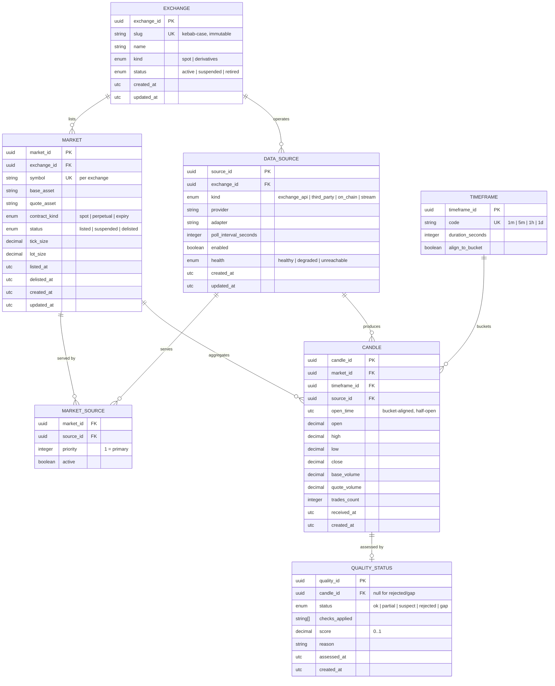

# Market Data Domain Model

## Document Information

**Document:** Market Data Domain — Core Domain Entities and Business Rules

**Scope:** Bounded Context BC2 (Market Data) — exchange, market, candle, timeframe,
data source, and data quality entities

**Status:** Draft

**Related documents:** DomainModel.md (BC2 definition), DataArchitecture.md (D1–D5),
RepositoryStructure.md (boundaries and naming), configs/environment.example.md (provider
configuration catalog)

---

## 1. Context and Scope

The Market Data bounded context acquires, normalizes, stores, and distributes market
information from external systems. It is the platform's **single acquisition point**
for external data — no other bounded context integrates with external providers
directly (DomainModel.md, Assumption 6).

This document defines the **core domain model** of that context: the entities needed
to describe where data comes from (exchanges, markets, data sources) and the primary
data artifact (candles), together with the quality bookkeeping required to trust it.

**Platform consumers of this domain:**

| Consumer                         | Consumes                      | Primary need                         |
| -------------------------------- | ----------------------------- | ------------------------------------ |
| BC3 Feature Engineering          | Candles, curated markets      | Raw and curated series for features  |
| BC7 Backtesting                  | Historical candles            | Auditable historical simulation      |
| BC8 Trading Execution            | Market and candle state       | Reconciliation and execution context |
| BC5 Prediction                   | Live candle streams           | Real-time inference inputs           |
| BC13 Administration & Operations | Data source and quality state | Collection health and scheduling     |

**Out of scope for this document:**

- Exchange integration adapters (infrastructure concern).
- On-chain, sentiment, macro, and DeFi metrics (sibling concepts, see §8).
- Orders, trades, order books, and funding rates (future entities within BC2).
- Persistent storage schema, API contracts, and transport formats.

---

## 2. Design Principles

| Principle                 | Rule                                                                                   |
| ------------------------- | -------------------------------------------------------------------------------------- |
| **UTC everywhere**        | All timestamps are UTC. Consumers normalize only for display.                          |
| **Decimal, never float**  | All prices and volumes are arbitrary-precision decimals.                               |
| **Immutable facts**       | Candles are immutable once accepted; corrections create new records.                   |
| **Provenance**            | Every candle records exactly one contributing data source.                             |
| **Database-agnostic**     | Types below are conceptual; physical mapping (e.g., SQL `numeric`) is a later concern. |
| **Identities are opaque** | IDs are globally unique identifiers; natural keys exist as alternative unique keys.    |
| **Domain owns truth**     | Source credentials, API details, and transport live in infrastructure adapters.        |
| **No shared domain**      | This model is owned exclusively by BC2; other contexts receive data through contracts. |

---

## 3. Entities

### 3.1 Exchange

**DDD classification:** Aggregate root (reference entity).

**Purpose:** Identifies a trading venue from which market data is acquired and
normalized. Exchange is reference data: it exists before any data is collected and
changes rarely. Operational details (credentials, rate limits, endpoints) are **not**
domain concerns and are owned by infrastructure adapters.

**Fields:**

| Field          | Type                                   | Constraints                                         |
| -------------- | -------------------------------------- | --------------------------------------------------- |
| `exchange_id`  | UUID                                   | Required, immutable, primary identity               |
| `slug`         | String (≤32)                           | Required, unique, immutable, lowercase `kebab-case` |
| `name`         | String (≤128)                          | Required, human-readable                            |
| `kind`         | Enum: `spot`, `derivatives`            | Required                                            |
| `status`       | Enum: `active`, `suspended`, `retired` | Required, default `active`                          |
| `homepage_url` | String (URL, ≤512)                     | Optional                                            |
| `created_at`   | Timestamp (UTC)                        | Required, set on creation                           |
| `updated_at`   | Timestamp (UTC)                        | Required, updated on change                         |

**Validation rules:**

1. `slug` matches `^[a-z0-9]+(?:-[a-z0-9]+)*$`.
2. `name` is non-empty after trimming.
3. `updated_at >= created_at`.
4. A `retired` exchange cannot be reactivated; a new record is required instead.

**Relationships:**

- An Exchange **has many** Markets (1—N, strict).
- An Exchange **has many** Data Sources (1—N, strict) — at least one active source
  is required while `status = active`.

**Business rules:**

1. An exchange may only be `retired` when no active markets or sources reference it.
2. Kind is immutable — a venue that changes spot/derivatives behavior is modeled as
   a new exchange record.
3. Exchange identity travels with all derived data; candles of a market are
   implicitly attributed to the market's exchange.

---

### 3.2 Market (Trading Pair)

**DDD classification:** Aggregate root (reference entity).

**Purpose:** Describes a tradeable instrument on an exchange — a trading pair
(e.g., `ETH/USDT` on a spot venue) or a derivative contract. It is the **key**
dimension for all price data: every candle belongs to exactly one market.

**Fields:**

| Field                       | Type                                    | Constraints                                        |
| --------------------------- | --------------------------------------- | -------------------------------------------------- |
| `market_id`                 | UUID                                    | Required, immutable, primary identity              |
| `exchange_id`               | UUID                                    | Required, immutable, FK → Exchange                 |
| `symbol`                    | String (≤64)                            | Required, exchange-native symbol (e.g., `ETHUSDT`) |
| `base_asset`                | String (≤16)                            | Required, uppercase ticker (e.g., `ETH`)           |
| `quote_asset`               | String (≤16)                            | Required, uppercase ticker (e.g., `USDT`)          |
| `contract_kind`             | Enum: `spot`, `perpetual`, `expiry`     | Required                                           |
| `status`                    | Enum: `listed`, `suspended`, `delisted` | Required, default `listed`                         |
| `tick_size`                 | Decimal (>0)                            | Required, smallest price increment                 |
| `lot_size`                  | Decimal (>0)                            | Required, smallest order quantity                  |
| `listed_at`                 | Timestamp (UTC)                         | Optional, venue listing time                       |
| `delisted_at`               | Timestamp (UTC)                         | Optional, set when delisted                        |
| `created_at` / `updated_at` | Timestamp (UTC)                         | Required, as in Exchange                           |

**Validation rules:**

1. `base_asset != quote_asset` (case-insensitive comparison).
2. `symbol` is unique **per exchange** — the pair `(exchange_id, symbol)` is a
   unique alternative key.
3. `tick_size > 0` and `lot_size > 0`.
4. `delisted_at` is set **iff** `status = delisted`.
5. `delisted_at >= listed_at` when both present.

**Relationships:**

- A Market **belongs to** exactly one Exchange (N—1).
- A Market **has many** Candles (1—N, strict).
- A Market **has many** Data Sources (N—M, through a market-source assignment with
  per-market priority; see §3.5).

**Business rules:**

1. A market may be `delisted` only when its instrument no longer trades on the venue.
2. Candles are never collected for a `suspended` or `delisted` market.
3. The same logical pair on different venues (e.g., `ETH/USDT` on two exchanges) is
   modeled as **two** markets — markets are always exchange-scoped.
4. Base and quote assets are plain tickers; asset identity and metadata (contract
   addresses, decimals) belong to a future reference-data extension.

---

### 3.3 Timeframe

**DDD classification:** Value object (persisted as reference data for joins and
validation).

**Purpose:** Defines the time bucket a candle aggregates — its duration and its
calendar-alignment rule. Timeframes are immutable, shared, and few (e.g., `1m`,
`5m`, `1h`, `1d`). They are value objects by identity (two timeframes with the
same code are the same timeframe) but are persisted as reference records so
candles can relate to them.

**Fields:**

| Field              | Type               | Constraints                                                        |
| ------------------ | ------------------ | ------------------------------------------------------------------ |
| `timeframe_id`     | UUID               | Required, persistent identity for joins                            |
| `code`             | String (≤16)       | Required, unique, canonical (e.g., `1m`, `1h`, `1d`)               |
| `duration_seconds` | Integer (positive) | Required; e.g., 60, 300, 3600, 86400                               |
| `align_to_bucket`  | Boolean            | Required, default `true` — open times snap to UTC calendar buckets |

**Validation rules:**

1. `code` matches `^[0-9]+[smhdw]$` (second, minute, hour, day, week).
2. `duration_seconds` matches the code value exactly (e.g., `1h` → `3600`).
3. Timeframes are immutable once defined.

**Relationships:**

- A Timeframe **is used by** many Candles (1—N).

**Business rules:**

1. When `align_to_bucket = true`, a candle `open_time` is always an exact multiple
   of `duration_seconds` from the UTC epoch — never an arbitrary offset.
2. The candle interval is **half-open**: `[open_time, open_time + duration_seconds)`.
   The first tick belongs to the bucket in which it occurs; the close time is always
   derived (`open_time + duration`), never stored.

---

### 3.4 Candle (OHLCV)

**DDD classification:** Entity — an immutable market fact (part of the Market
aggregate's collection of facts).

**Purpose:** The canonical price aggregation artifact: open, high, low, close, and
volume for one market over one timeframe bucket. Candles are the platform's primary
historical data unit and the feedstock for feature engineering, backtesting, and
prediction.

**Fields:**

| Field                             | Type            | Constraints                                           |
| --------------------------------- | --------------- | ----------------------------------------------------- |
| `candle_id`                       | UUID            | Required, immutable, primary identity                 |
| `market_id`                       | UUID            | Required, immutable, FK → Market                      |
| `timeframe_id`                    | UUID            | Required, immutable, FK → Timeframe                   |
| `open_time`                       | Timestamp (UTC) | Required, immutable, bucket-aligned                   |
| `open` / `high` / `low` / `close` | Decimal (≥0)    | Required                                              |
| `base_volume`                     | Decimal (≥0)    | Required, volume in base asset                        |
| `quote_volume`                    | Decimal (≥0)    | Required, volume in quote asset                       |
| `trades_count`                    | Integer (≥0)    | Optional; trade count if the source provides it       |
| `source_id`                       | UUID            | Required, immutable, FK → Data Source (provenance)    |
| `received_at`                     | Timestamp (UTC) | Required, when the platform first accepted the record |
| `created_at`                      | Timestamp (UTC) | Required, record creation                             |

**Validation rules (per-candle invariants):**

1. `0 <= low <= min(open, close) <= max(open, close) <= high`.
2. All prices and volumes are non-negative decimals.
3. `open_time` is aligned to the timeframe bucket (§3.3 Rule 1).
4. `quote_volume > 0` implies `base_volume > 0` (consistency smoke check).
5. `received_at >= open_time` (a bucket cannot be received before it opens).
6. The pair `(market_id, timeframe_id, open_time)` is **unique** — one candle per
   market, timeframe, and bucket.

**Relationships:**

- A Candle **belongs to** one Market (N—1) and one Timeframe (N—1).
- A Candle **is attributed to** exactly one Data Source (N—1, provenance).
- A Candle **has at most one** Data Quality Status record (1—0..1).

**Business rules:**

1. **Immutability.** A candle never changes after acceptance. Corrections (bad
   source data, retroactive venue adjustments) are modeled as **replacement
   candles** with the same `(market_id, timeframe_id, open_time)` key, a new
   `candle_id`, and a `REJECTED` status on the superseded record — the unique key
   applies to the latest accepted version.
2. **Range integrity at ingestion.** Records violating the O/H/L/C ordering
   invariant are rejected at the boundary and recorded as quality failures —
   never stored.
3. **No extrapolation.** A candle is closed only by the clock; partial buckets are
   materialized on demand for streaming and never backfilled as closed candles.
4. **Gap detection.** Missing buckets are detected by comparing consecutive
   `open_time` values for a `(market, timeframe)` series; detected gaps raise a
   `GAP` quality record (§3.6).

---

### 3.5 Data Source

**DDD classification:** Entity (configuration aggregate root).

**Purpose:** Describes a configured acquisition channel for market data — which
provider kind, adapter, and cadence produce candles for markets. Multiple sources
may serve the same market (priority-based failover), but **each accepted candle
names exactly one source** for provenance.

**Fields:**

| Field                       | Type                                                      | Constraints                                                 |
| --------------------------- | --------------------------------------------------------- | ----------------------------------------------------------- |
| `source_id`                 | UUID                                                      | Required, immutable, primary identity                       |
| `exchange_id`               | UUID                                                      | Required, immutable, FK → Exchange                          |
| `kind`                      | Enum: `exchange_api`, `third_party`, `on_chain`, `stream` | Required                                                    |
| `provider`                  | String (≤64)                                              | Required — provider identifier (e.g., `delta`, `coingecko`) |
| `adapter`                   | String (≤128)                                             | Required — infrastructure adapter class/name                |
| `poll_interval_seconds`     | Integer (≥1)                                              | Optional; polling cadence when applicable                   |
| `enabled`                   | Boolean                                                   | Required, default `true`                                    |
| `health`                    | Enum: `healthy`, `degraded`, `unreachable`                | Required, default `healthy`                                 |
| `created_at` / `updated_at` | Timestamp (UTC)                                           | Required, as in Exchange                                    |

**Market–Source assignments (join):**

| Field       | Type         | Constraints                              |
| ----------- | ------------ | ---------------------------------------- |
| `market_id` | UUID         | FK → Market                              |
| `source_id` | UUID         | FK → Data Source                         |
| `priority`  | Integer (≥1) | Required; 1 = primary, higher = fallback |
| `active`    | Boolean      | Required, default `true`                 |

**Validation rules:**

1. `priority` values are unique **per market** (no two sources share a rank).
2. A source may serve any number of markets; a market may be served by any number
   of sources, but **at least one** active source is required per listed market.
3. A source is assigned only to markets of exchanges the source belongs to.

**Relationships:**

- A Data Source **belongs to** one Exchange (N—1).
- A Data Source **serves** many Markets (N—M via assignment with priority).
- A Data Source **contributes** many Candles (1—N).

**Business rules:**

1. **Secrets never live here.** Credentials, API keys, and endpoints belong to
   infrastructure configuration (`configs/environment.example.md`), never to the
   domain model.
2. Failover: when the primary source for a market degrades, the highest-priority
   healthy source takes over; candles remain attributed to whichever source
   actually produced them.
3. A source cannot be disabled or deleted while it owns accepted candles — its
   provenance records must stay resolvable. Deletion is modeled as
   `enabled = false` + `health = unreachable`.

---

### 3.6 Data Quality Status

**DDD classification:** Entity (audit record; part of the Candle aggregate).

**Purpose:** Records the quality of an accepted or attempted candle. Quality is
first-class because downstream contexts must be able to exclude, weight, or
investigate data they consume.

**Fields:**

| Field            | Type                                                | Constraints                                                                                 |
| ---------------- | --------------------------------------------------- | ------------------------------------------------------------------------------------------- |
| `quality_id`     | UUID                                                | Required, immutable, primary identity                                                       |
| `candle_id`      | UUID                                                | Optional, FK → Candle; null when the record describes a rejected attempt                    |
| `status`         | Enum: `ok`, `partial`, `suspect`, `rejected`, `gap` | Required                                                                                    |
| `checks_applied` | String[]                                            | Required, list of executed checks (e.g., `ohlcv_order`, `volume_smoke`, `bucket_alignment`) |
| `score`          | Decimal (0–1)                                       | Required; 1.0 = fully trusted                                                               |
| `reason`         | String (≤512)                                       | Optional; human-readable failure/flag detail                                                |
| `assessed_at`    | Timestamp (UTC)                                     | Required, when the assessment ran                                                           |
| `created_at`     | Timestamp (UTC)                                     | Required                                                                                    |

**Validation rules:**

1. `status = ok` implies `score = 1.0`.
2. `score < 1.0` requires at least one non-`ok` check or a `reason`.
3. `rejected` and `gap` records never reference a persisted candle
   (`candle_id = null`); `ok`, `partial`, and `suspect` always do.

**Relationships:**

- A Data Quality Status **describes** at most one Candle (0..1—1).
- A Data Quality Status may stand alone as a **gap record** for a
  `(market_id, timeframe_id, open_time)` slot that produced no candle.

**Business rules:**

1. Every accepted candle carries a quality record; acceptance and assessment are
   one logical step.
2. Downstream consumers may filter on `status`/`score`; the domain mandates that
   such candles retain full provenance regardless of score.
3. `gap` records are keyed by the missing `(market, timeframe, open_time)` slot and
   are the input to collection retry decisions.

---

## 4. Entity Relationship Diagram

---

## 5. Relationships Summary

| From        | To             | Cardinality | Semantics                                       |
| ----------- | -------------- | ----------- | ----------------------------------------------- |
| Exchange    | Market         | 1 — N       | A venue lists many markets                      |
| Exchange    | Data Source    | 1 — N       | A venue is accessed through one or more sources |
| Market      | Data Source    | M — N       | Priority-based source assignment per market     |
| Market      | Candle         | 1 — N       | Candles are the market's facts                  |
| Timeframe   | Candle         | 1 — N       | Each candle uses one timeframe                  |
| Data Source | Candle         | 1 — N       | Each candle is attributed to exactly one source |
| Candle      | Quality Status | 1 — 0..1    | At most one assessment per accepted candle      |

---

## 6. Aggregate and Cross-Entity Invariants

1. **No orphan facts.** A candle exists only if its market, timeframe, and source
   exist and were active at `open_time`.
2. **Single attribution.** A candle names exactly one `source_id`; assignments with
   multiple sources do not split candle ownership.
3. **Bucket uniqueness.** `(market_id, timeframe_id, open_time)` is the candle
   identity key for a series.
4. **Series continuity.** For a `(market, timeframe)` series, valid time deltas
   between consecutive candles equal the timeframe duration; anything else raises
   a `gap` record.
5. **No quarter/bucket drift.** With `align_to_bucket`, `open_time % duration == 0`
   relative to the UTC epoch holds for every stored candle.
6. **Trust boundary.** Rejected or gapped slots are journaled as quality records,
   never silently skipped.
7. **Provenance durability.** Source deactivation (Rule 3.5.3) preserves resolvable
   attribution for all previously accepted candles.

---

## 7. Glossary

| Term                   | Definition                                                                       |
| ---------------------- | -------------------------------------------------------------------------------- |
| **Exchange**           | A trading venue whose data the platform acquires and normalizes.                 |
| **Trading pair**       | An instrument quoted on an exchange (base vs. quote asset).                      |
| **Base asset**         | The asset being traded in a pair (e.g., `ETH` in `ETH/USDT`).                    |
| **Quote asset**        | The asset used to price the base (e.g., `USDT`).                                 |
| **OHLCV**              | Open, high, low, close prices and volume — the canonical candle fields.          |
| **Candle**             | Aggregated OHLCV for one market over one timeframe bucket.                       |
| **Timeframe**          | The bucket definition (duration + alignment) of a candle series.                 |
| **Half-open interval** | Bucket `[open_time, open_time + duration)`; close time is derived, never stored. |
| **Bucket alignment**   | Rule that open times snap to UTC calendar multiples of the duration.             |
| **Data source**        | A configured acquisition channel (provider kind + adapter).                      |
| **Adapter**            | Infrastructure component translating a provider's format into domain facts.      |
| **Provenance**         | The recorded origin (`source_id`) of each accepted fact.                         |
| **Quality status**     | Assessment record describing trust in a candle or a gap.                         |
| **Gap**                | A missing bucket detected for a market/timeframe series.                         |

---

## 8. Future Extension Points

The model is deliberately narrow. Each listed direction extends the design without
restructuring it:

1. **New exchanges.** Added as Exchange + Data Source records; adapters are
   infrastructure and never touch the domain.
2. **New asset classes.** Base/quote tickers generalize; asset metadata (addresses,
   decimals) arrives as a reference-data extension alongside Market.
3. **Sibling market facts.** Trades, order books, funding rates, and aggregated
   stats enter as new fact entities sharing the `(market, timeframe, open_time)`
   keying discipline and provenance rules of Candle.
4. **Non-exchange sources.** On-chain, sentiment, macro, and DeFi metrics reuse
   Data Source, Quality Status, and the UTC/Decimal/immutability conventions
   without new concepts.
5. **Reference data expansion.** Asset registry, contract metadata, and venue
   properties become their own reference entities referencing Exchange/Market.
6. **Collection scale.** Per-source collectors (suggested in DomainModel.md §7)
   split BC2 physically while the model stays intact.
7. **Swap/replacement handling.** Candle replacement plumbing (§3.4 Rule 1)
   already anticipates venue-adjusted retroactive fixes.
8. **Retention & archival.** Quality records plus `received_at` support tiered
   retention policies when storage economics demand it.

---

## 9. Conceptual Mapping Guidance

The entities above map to implementation artifacts as follows (types and structure
only — no code here):

- **Persistence.** Each entity and the `Market—Source` assignment becomes a table
  with UUID keys; `Decimal` maps to fixed-precision numeric columns; timestamps map
  to timezone-aware UTC columns; enums map to constrained values. The
  `(market_id, timeframe_id, open_time)` identity becomes a composite unique
  constraint on the candle table.
- **API contracts.** Exchange, Market, Timeframe, and Data Source surface as
  reference/configuration resources; Candle and Quality Status surface as series
  and assessment resources. Cross-context consumers receive candles through
  contracts, never direct database access.
- **Serving semantics.** Timeframe codes, quality statuses, and enum values in
  §3 are contract-level constants; they change only through versioned contract
  evolution (RepositoryStructure.md §3).

All documents follow the repository convention: changes to this model update the
related architecture documents in the same change (RepositoryStructure.md §5.12).
